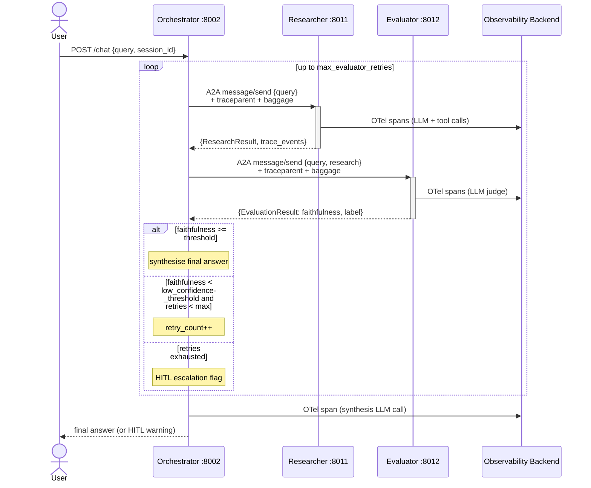

```mermaid
sequenceDiagram
    actor User
    participant O as Orchestrator :8002
    participant R as Researcher :8011
    participant E as Evaluator :8012
    participant B as Observability Backend

    User->>O: POST /chat {query, session_id}

    loop up to max_evaluator_retries
        O->>+R: A2A message/send {query}<br/>+ traceparent + baggage
        R->>B: OTel spans (LLM + tool calls)
        R-->>-O: {ResearchResult, trace_events}

        O->>+E: A2A message/send {query, research}<br/>+ traceparent + baggage
        E->>B: OTel spans (LLM judge)
        E-->>-O: {EvaluationResult: faithfulness, label}

        alt faithfulness >= threshold
            Note over O: synthesise final answer
        else faithfulness < low_confidence_threshold and retries < max
            Note over O: retry_count++
        else retries exhausted
            Note over O: HITL escalation flag
        end
    end

    O->>B: OTel span (synthesis LLM call)
    O-->>User: final answer (or HITL warning)
```
