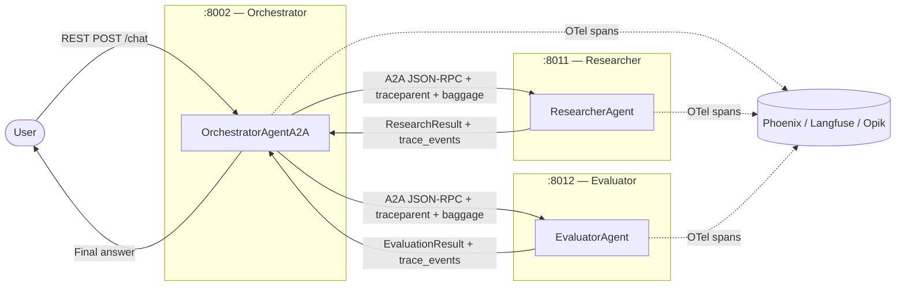

```mermaid
graph LR
    U([User])

    subgraph O2[":8002 — Orchestrator"]
        O[OrchestratorAgentA2A]
    end

    subgraph R2[":8011 — Researcher"]
        R[ResearcherAgent]
    end

    subgraph E2[":8012 — Evaluator"]
        E[EvaluatorAgent]
    end

    B[(Phoenix / Langfuse / Opik)]

    U -->|REST POST /chat| O
    O -->|"A2A JSON-RPC + traceparent + baggage"| R
    R -->|"ResearchResult + trace_events"| O
    O -->|"A2A JSON-RPC + traceparent + baggage"| E
    E -->|"EvaluationResult + trace_events"| O
    O -->|Final answer| U

    O -. OTel spans .-> B
    R -. OTel spans .-> B
    E -. OTel spans .-> B
```
