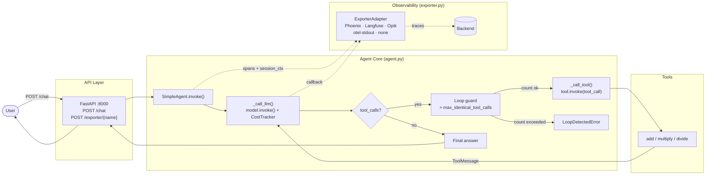

```mermaid
flowchart LR
    U([User])

    subgraph API["API Layer"]
        BE["FastAPI :8000\nPOST /chat\nPOST /exporter/{name}"]
    end

    subgraph Core["Agent Core  (agent.py)"]
        invoke["SimpleAgent.invoke()"]
        call_llm["_call_llm()\nmodel.invoke() + CostTracker"]
        check{"tool_calls?"}
        loop_guard["Loop guard\n> max_identical_tool_calls"]
        call_tool["_call_tool()\ntool.invoke(tool_call)"]
        final["Final answer"]
        loop_err["LoopDetectedError"]
    end

    subgraph Tools["Tools"]
        T["add / multiply / divide"]
    end

    subgraph Obs["Observability  (exporter.py)"]
        E["ExporterAdapter\nPhoenix · Langfuse · Opik\notel-stdout · none"]
        OB[(Backend)]
    end

    U -->|POST /chat| BE
    BE --> invoke
    invoke --> call_llm
    call_llm --> check
    check -->|yes| loop_guard
    loop_guard -->|count ok| call_tool
    loop_guard -->|count exceeded| loop_err
    call_tool --> T
    T -->|ToolMessage| call_llm
    check -->|no| final
    final --> BE --> U

    invoke -. spans + session_ctx .-> E
    call_llm -. callback .-> E
    E -. traces .-> OB
```
