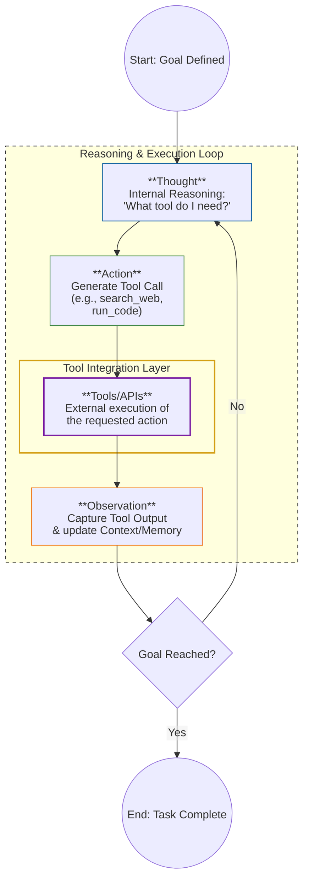
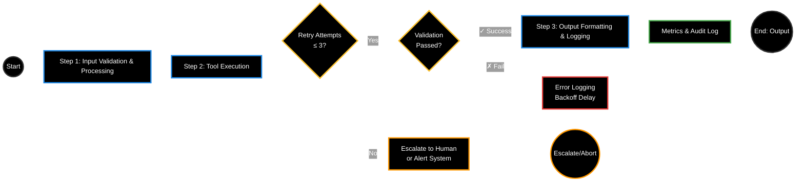
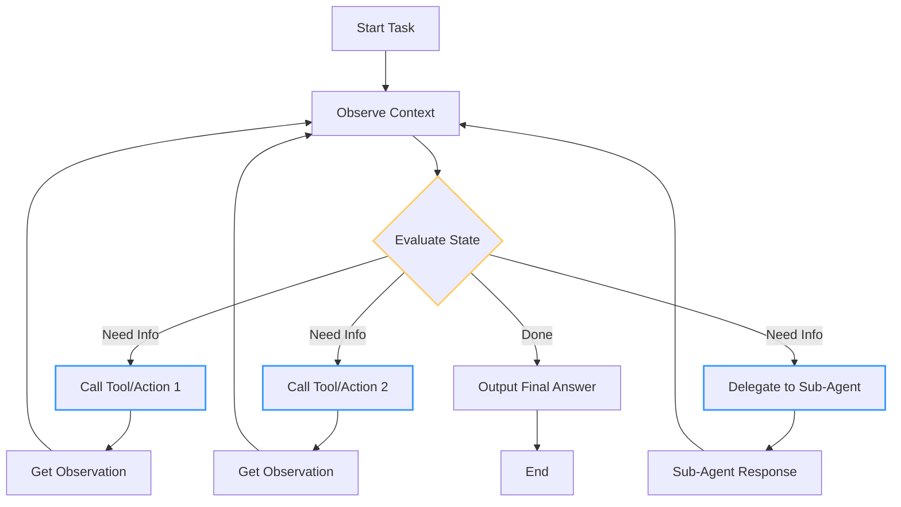

# What is an AI Agent?

An AI agent is a piece of software that use AI to complete a task of behalf of users.
As a **"Digital Brain"** with 3 peripheral components:

* Memory <Context> : Stores past interactions, knowledge, and context to inform future decisions.
* Planning <Execution> : to break the task into smaller steps
* Tools <Interaction> : to interact with the external world, such as APIs, databases, or other software systems.

it can learn, adapt and have different levels of autonomy.

--- 

## ReAct - The internal Reasoning Loop

[The ReAct pattern](https://arxiv.org/abs/2210.03629) describes how an agent operates in an **iterative loop of thought
**, **action**, and **observation** until an exit condition is met.

* **Thought**: The model reasons about the task and it decides what to do next. The model evaluates all of the
  information that it's gathered in order to determine whether the user's request has been fully answered.

* **Action**: Based on its thought process, the model takes one of two actions:
    * If the task isn't complete, it selects a tool and then it forms a query to gather more information.
    * If the task is complete, it formulates the final answer to send to the user, which ends the loop.

* **Observation**: The model receives the output from the tool and it saves relevant information in its memory. Because
  the model saves relevant output, it can build on previous observations, which helps to prevent the model from
  repeating itself or losing context.

----

## Deterministic Workflow vs. Dynamic Orchestration

* Deterministic Workflow: A fixed sequence of steps that the agent follows to complete a task. This approach is
  straightforward and easier to debug but may not be flexible enough for complex or unpredictable tasks.

* Dynamic Orchestration: The agent dynamically decides which steps to take based on the current context and information.
  This allows for greater flexibility and adaptability but can be more challenging to design and debug.

## Multi-Agent Coordination

When tasks are too complex, some coordination patterns are used to manage multiple agents working together:

* **The Coordinator Pattern (Dynamic)**: A central agent (the Orchestrator) acts as the router. It receives the user's
  goal, breaks it down, and assigns sub-tasks to specialized worker agents (e.g., a "Researcher Agent" and a "Coder
  Agent").
* **Sequential/Parallel Workflows**: Used when the steps are predictable. Information flows linearly from one agent to
  the next, or multiple agents work on the same problem at once to compare results.
* **Iterative Refinement**: An "Actor Agent" produces a draft, and a "Reviewer Agent" provides feedback, looping until
  the goal is met.

[Reference: Google Cloud: Design Patterns for Agentic AI](https://docs.cloud.google.com/architecture/choose-design-pattern-agentic-ai-system#workflows-that-require-dynamic-orchestration)
