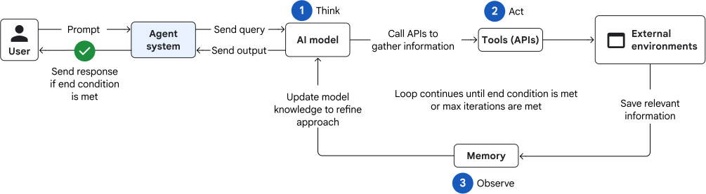
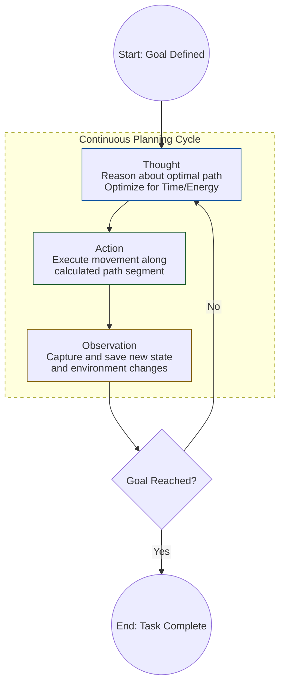

# What is an AI Agent?

An AI agent is a piece of software that use AI to complete a task of behalf of users.
As a **"Digital Brain"** with 3 peripheral components:

* Memory <Context> : Stores past interactions, knowledge, and context to inform future decisions.
* Planning <Execution> : to break the task into smaller steps
* Tools <Interaction> : to interact with the external world, such as APIs, databases, or other software systems.

it can learn, adapt and have different levels of autonomy.

--- 
## ReAct - The internal Reasoning Loop 

[The ReAct pattern](https://arxiv.org/abs/2210.03629) describes how an agent operates in an **iterative loop of thought**, **action**, and **observation** until an exit condition is met.

* **Thought**: The model reasons about the task and it decides what to do next. The model evaluates all of the information that it's gathered in order to determine whether the user's request has been fully answered.

* **Action**: Based on its thought process, the model takes one of two actions:
    * If the task isn't complete, it selects a tool and then it forms a query to gather more information.
    * If the task is complete, it formulates the final answer to send to the user, which ends the loop.

* **Observation**: The model receives the output from the tool and it saves relevant information in its memory. Because the model saves relevant output, it can build on previous observations, which helps to prevent the model from repeating itself or losing context.

----
