# Arize Phoenix — Evaluation

## Overview

[Arize Phoenix](https://github.com/Arize-ai/phoenix) is an open-source observability platform for LLM applications. It
supports
OpenTelemetry-native tracing via the OpenInference instrumentation layer, and can be run
entirely locally without an account or API key.

---

## Local Installation

### 1. Start the Docker container

```bash
cd infra/phoenix/
docker compose up
```

This runs `arizephoenix/phoenix:latest` with:

- Port `6006` — web UI at http://localhost:6006

The container persists trace data in a named volume (`phoenix_data`) across restarts.

### 2. Install the SDK

```bash
pip install arize-phoenix openinference-instrumentation-langchain
```

In the current implementation, the dependencies are managed using requirements.txt in the root of the project.
The above command is only needed if you want to use Phoenix outside of the project.

### 3. Connecting to the agent

Use `exporter="phoenix"` in `AgentConfig` / `MultiAgentConfig`:

The Exporter Adapter calls `LangChainInstrumentor` to automatically instrument all LLM and tool calls. `phoenix_register()` creates an OpenTelemetry `TracerProvider` configured to send spans to the Phoenix backend.

```python
def _build_phoenix(config: MultiAgentConfig) -> ExporterAdapter:
    _uninstrument_langchain()
    base = os.getenv("PHOENIX_COLLECTOR_ENDPOINT", "http://localhost:6006")
    project = config.phoenix_project_name
    os.environ["OTEL_TRACES_SAMPLER"] = "traceidratio"
    os.environ["OTEL_TRACES_SAMPLER_ARG"] = str(config.sampling_rate)
    tracer_provider = phoenix_register(
        project_name=project,
        endpoint=f"{base.rstrip('/')}/v1/traces",
        resource=PhoenixResource(_otel_resource_attrs(project)),
    )
    LangChainInstrumentor().instrument(tracer_provider=tracer_provider)
    log.info(f"Exporter: phoenix initialised (project={project} endpoint={base} sampling={config.sampling_rate:.2f})")
    return _PhoenixAdapter()
```

The agent calls `phoenix.otel.register()` to create a `TracerProvider` pointed at the
Docker container's OTLP endpoint, then passes it to `LangChainInstrumentor().instrument()`.
Every `model.invoke()` and `tool.invoke()` call produces a span automatically — no per-call
callback is needed.

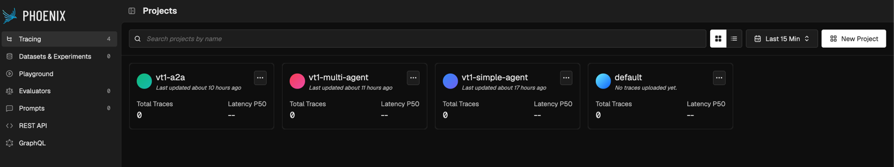
### 5. Verifying traces appear

Open http://localhost:6006 and check that a new trace appears under the configured project name after invoking the agent. 
The trace should contain spans for each LLM and tool call, with attributes set according to the OpenInference specification.

---

## Known Limitations (Wire Protocol, Semantic Conventions, OTel Compliance)

> **Two dimensions to distinguish:**
> - **Wire protocol (OTLP):** whether the tool accepts standard OTel spans over OTLP transport
> - **Semantic conventions:** *which attribute namespace* is used on those spans — OTel GenAI (`gen_ai.*`),
    OpenInference (`llm.*`, Arize's own spec), or tool-proprietary. These are independent of the wire protocol.
>
> **Spec references:**
> - OTel semantic conventions: https://github.com/open-telemetry/semantic-conventions
> - OTel GenAI semantic conventions: https://github.com/open-telemetry/semantic-conventions-genai
> - OpenInference specification: https://github.com/Arize-ai/openinference

| Area                                    | Dimension                | Status                                                                                                                                                                                                                                                                                                                             | Detail                                                                                                                                                                                                                                                                                                                                                                                                                                                                             |
|-----------------------------------------|--------------------------|------------------------------------------------------------------------------------------------------------------------------------------------------------------------------------------------------------------------------------------------------------------------------------------------------------------------------------|------------------------------------------------------------------------------------------------------------------------------------------------------------------------------------------------------------------------------------------------------------------------------------------------------------------------------------------------------------------------------------------------------------------------------------------------------------------------------------|
| OTLP wire protocol                      | Wire                     | ✅ Native                                                                                                                                                                                                                                                                                                                           | Uses OTLP/HTTP `/v1/traces` — fully OTel-standard transport                                                                                                                                                                                                                                                                                                                                                                                                                        |
| OpenInference span attributes           | Semantic (OpenInference) | ✅ Auto                                                                                                                                                                                                                                                                                                                             | `LangChainInstrumentor` automatically sets `openinference.span.kind`, `llm.model_name`, `llm.token_count.prompt/completion/total`, `input.value`, `output.value`, `llm.input_messages`, `llm.output_messages`. OpenInference is **Arize's own specification** — predates OTel GenAI semconv and uses a different namespace. These attributes are Phoenix-native; an OTLP backend that does not know OpenInference will ingest the spans correctly but display raw attribute names. |
| OTel GenAI semconv (`gen_ai.*`)         | Semantic (OTel GenAI)    | ⚠️ Not supported natively                                                                                                                                                                                                                                                                                                          | Phoenix does not yet have native backend support for parsing `gen_ai.*` attributes without an intermediate mapping processor ([issue #10622](https://github.com/Arize-ai/phoenix/issues/10622) [CITE-PHOENIX-GENAI-ISSUE]). `LangChainInstrumentor` emits OpenInference names (`llm.*`), not `gen_ai.*`, so this gap does not affect this project directly. `set_token_cost_attributes()` does write `gen_ai.usage.input_tokens` / `gen_ai.usage.output_tokens`, but the LLM span is already closed at that point — they land on the parent span and are not consumed by Phoenix. |
| OTel Resource attributes | Resource | ✅ Set | `resource=Resource(otel_resource_attrs(project))` passed to `register()` (requires `phoenix.otel >= 0.16.0` to import `Resource` from `phoenix.otel`). Phoenix merges it with its own project tag. Resulting resource: `service.name`, `service.version=0.1.0`, `deployment.environment`, `phoenix.project.name`. |
| `session.id`                            | ✅ Supported              | Set via `phoenix.otel.using_session(session_id)` context manager (consolidated import, requires `>= 0.16.0`) — propagated to all child spans via OTel context propagation, no per-call metadata needed.                                                                                                                            |
| `cost.usd` span attribute               | ⚠️ Timing issue          | `set_token_cost_attributes()` is called from `CostTracker.record()` after `model.invoke()` returns. The LLM span created by `LangChainInstrumentor` is already closed at that point, so `cost.usd` is written to the parent span (or a no-op span if no parent exists). Cost is not visible on the LLM span in the Phoenix UI.     |
| Exception recording                     | ⚠️ Partial               | `record_exception(exc)` and `span.set_status(ERROR)` are called in the orchestrator for guard errors (`LoopDetectedError`, `PIIExposureError`) via `src/otel_utils.py`. However, the simple agent's `LoopDetectedError` is not caught before re-raise — it lands on whatever span is active, which may not be the most useful one. |
| Span events for guard triggers          | ⚠️ Missing               | Internal `TraceEvent` records (loop detected, PII, HITL escalation) are never emitted as OTel span events — guard firings are invisible in Phoenix's trace detail view.                                                                                                                                                            |
| Sampling rate                           | ✅ Configured             | `OTEL_TRACES_SAMPLER=traceidratio` and `OTEL_TRACES_SAMPLER_ARG=<rate>` set via `os.environ.setdefault()` before `register()` is called. OTel SDK picks these up at TracerProvider construction.                                                                                                                                   |
| `otel-stdout` LangChain instrumentation | ✅ Fixed                  | `_build_otel_stdout()` calls `LangChainInstrumentor().instrument(tracer_provider=provider)` and passes the full resource. LLM and tool spans appear in stdout with correct resource attributes.                                                                                                                                    |
| **UI authentication**                   | ⚠️ Disabled by default   | Authentication is off by default — suitable for local development or VPC-isolated deployments. It can be enabled by setting `PHOENIX_ENABLE_AUTH=True` and `PHOENIX_SECRET` (JWT signing key). Once enabled, all UI access and API calls require credentials. See [self-hosting authentication docs](https://arize.com/docs/phoenix/self-hosting/features/authentication). |
| **API / ingestion auth**                | ⚠️ Disabled by default   | When auth is enabled, two API key types are available: **system keys** (admin-created, used by automated agents and CI pipelines) and **user keys** (self-managed per user). Enabling auth stops all trace ingestion until at least one system key is created — plan for downtime on existing deployments.                          |
| **SSO / OAuth2 / LDAP**                 | ✅ Available (self-hosted) | When auth is enabled, Phoenix supports **OAuth2 / OpenID Connect** (Google, AWS Cognito, Microsoft Entra ID, Keycloak, any OIDC provider) and **LDAP** (Active Directory, OpenLDAP). Full RBAC is reserved for Arize AX.                                                                                                            |

---

## Three-pillar evaluation

### Community assessment (external perspective)

Source: Paul, K. (2026). *Top 5 LLM Observability Platforms for 2026*. Maxim AI. [CITE-MAXIM-TOP5]

**Strengths (as identified by independent review):**

- Strong open-source foundation with ELv2 license
- Built on OpenTelemetry standards for interoperability
- Deep ML observability roots extending to computer vision and traditional ML models
- Comprehensive trace visualisation and debugging tools
- Native integration with Amazon Bedrock and major cloud providers

**Limitations (as identified by independent review):**

- Evaluation capabilities feel secondary compared to purpose-built evaluation platforms
- Enterprise features require the paid Arize AX platform (separate product)
- Primary focus remains on observability rather than end-to-end LLM lifecycle coverage

> **Note:** These assessments align with findings in this project. The evaluation-secondary observation matches §V.4 (no
> native faithfulness scoring). The enterprise-features gap corresponds to the Phoenix vs Arize AX product boundary
> documented in the overview. The Bedrock integration claim was not tested in this evaluation (out of scope).

### Pillar 1: Integration and Instrumentation Capabilities (The "How")

**Setup friction — minimal.** Phoenix requires two steps: start the Docker container (`docker compose up`) and install the SDK. No account, no API key, no additional environment variables — the default endpoint `http://localhost:6006` is used out of the box. The only project-level configuration needed is the `project_name` argument passed to `phoenix_register()`, which maps to a named project in the UI.

**Zero per-call instrumentation.** `LangChainInstrumentor().instrument(tracer_provider=provider)` is called once at exporter initialisation. Every subsequent `model.invoke()` and `tool.invoke()` call is instrumented automatically — no callbacks, no decorators, no per-call metadata injection needed. This is the main advantage over callback-based approaches like Langfuse and Opik, which require per-call configuration.

**OTLP native transport.** Spans are sent via standard OTLP/HTTP to `/v1/traces`. This is the only tool in this evaluation that accepts raw OTel spans directly — Langfuse and Opik each require their own SDK-level instrumentation format. This means the same spans produced by `LangChainInstrumentor` can be forwarded to any other OTLP-compatible backend without changing any code.

**Sampling rate.** Configured via two environment variables set before `TracerProvider` construction: `OTEL_TRACES_SAMPLER=traceidratio` and `OTEL_TRACES_SAMPLER_ARG=<rate>`. The OTel SDK picks these up at init time. Sampling is consistent across all child spans within a trace.

**Project separation.** Each agent variant (`vt1-simple-agent`, `vt1-multi-agent`, `vt1-a2a`) sends to a separate named project via the `project_name` parameter. Projects are isolated in the UI — no cross-contamination of traces across experiments.

**Cross-process instrumentation (A2A v2) — no Phoenix-specific code required on sub-agents.** In the A2A distributed system, `protocol.call_agent()` injects the active OTel span context and `session.id` (promoted into W3C Baggage) into outgoing HTTP headers before each inter-service call. On the receiving side, `OTelContextMiddleware` extracts the context with standard OTel `extract(headers)` and calls `using_session()` with the session ID — so spans from the researcher and evaluator services appear as children of the orchestrator span. Because Phoenix accepts raw OTLP, this required no Phoenix-specific client code on the sub-agent services: standard W3C `traceparent` propagation was sufficient. In contrast, Langfuse and Opik require tool-specific headers (`opik_trace_id`, `opik_parent_span_id`) and SDK-specific objects on the receiving side to achieve the same result.

### Pillar 2: Capabilities (the "What")

#### Supported LLM providers and agent frameworks

Phoenix's OpenInference instrumentation covers a broad ecosystem out of the box. This project uses LangChain + OpenAI, which falls within the supported set.

**LLM providers** (auto-instrumented via `openinference-instrumentation-*` packages):

| Provider | Instrumentation package |
|---|---|
| OpenAI | `openinference-instrumentation-openai` |
| Anthropic | `openinference-instrumentation-anthropic` |
| Amazon Bedrock | `openinference-instrumentation-bedrock` |
| Google GenAI | `openinference-instrumentation-google-generativeai` |
| Groq | `openinference-instrumentation-groq` |
| MistralAI | `openinference-instrumentation-mistralai` |
| VertexAI | `openinference-instrumentation-vertexai` |
| LiteLLM | `openinference-instrumentation-litellm` |

**Agent frameworks** (auto-instrumented via `openinference-instrumentation-*` packages):

| Framework | Instrumentation package |
|---|---|
| LangChain / LangGraph | `openinference-instrumentation-langchain` *(used in this project)* |
| LlamaIndex | `openinference-instrumentation-llama-index` |
| CrewAI | `openinference-instrumentation-crewai` |
| AutoGen | `openinference-instrumentation-autogen` |
| DSPy | `openinference-instrumentation-dspy` |
| Haystack | `openinference-instrumentation-haystack` |
| Pydantic AI | `openinference-instrumentation-pydantic-ai` |

Each package hooks into the framework's LLM and tool calls and emits spans in the OpenInference format. Because Phoenix accepts standard OTLP, the same spans can also be forwarded to any other OTLP-compatible backend — the instrumentation is not Phoenix-exclusive.

---

#### Where OpenInference attributes surface in the Phoenix UI

Phoenix is the only tool in this evaluation that natively understands the OpenInference specification. The four places where this is visible:

**1. Span kind badge**
Every span row in the trace tree shows a colour-coded kind badge derived from `openinference.span.kind`. LLM calls appear with a green `llm` badge; tool calls with a `tool` badge. This enables kind-based filtering in the Spans tab without any manual configuration.

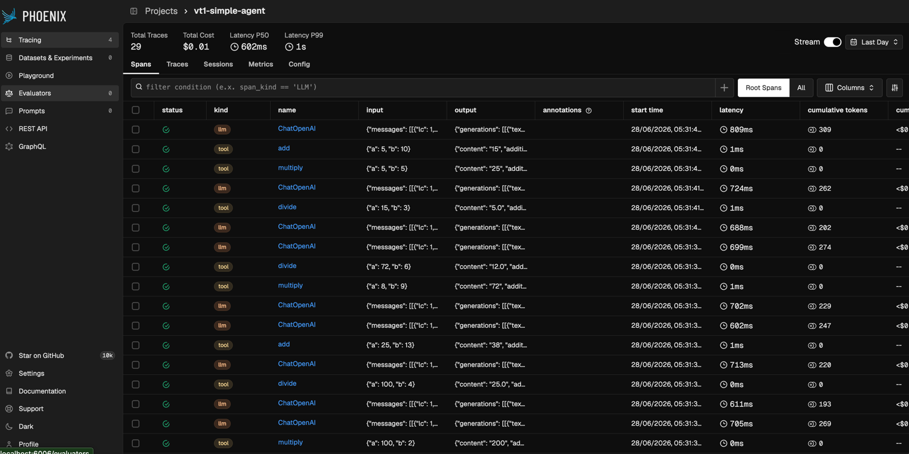

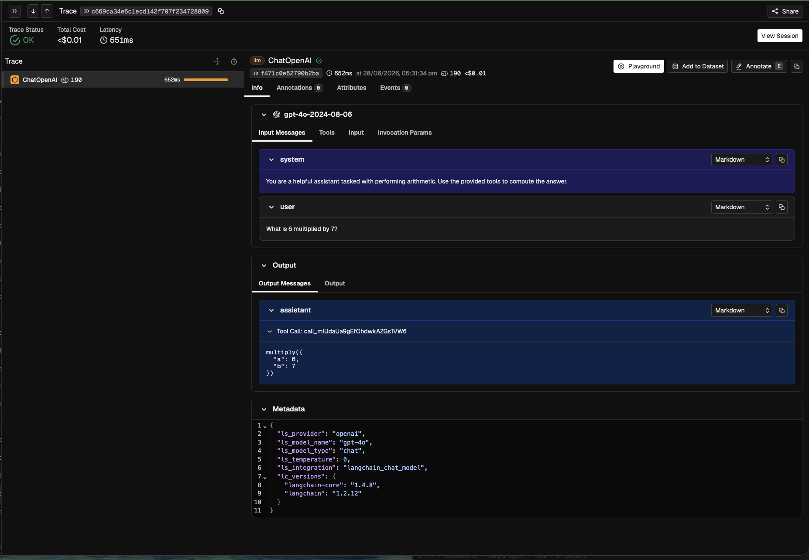

**2. Structured Input / Output Messages tabs**
Opening any LLM span reveals **Input Messages** and **Output Messages** tabs with role-labelled conversation turns (`system`, `user`, `assistant`) and tool call arguments rendered as formatted JSON. This is Phoenix consuming `llm.input_messages.*` and `llm.output_messages.*` from the OpenInference spec — not raw JSON strings, but a structured conversation view.

**3. Session grouping (Sessions tab)**
The **Sessions** tab groups traces by `session.id`, showing per-session p50/p99 latency, total tokens, total cost, and trace count. `session.id` is propagated to all child spans via `openinference.instrumentation.using_session()` — no per-call metadata is needed.

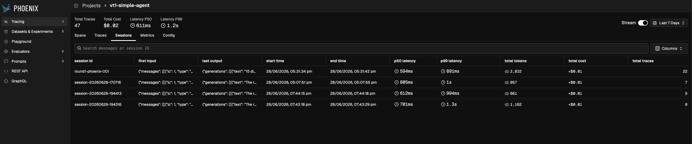

**4. Metrics dashboard — Token usage and LLM/Tool span charts**
The **Metrics** tab uses `llm.token_count.prompt/completion` (from the instrumentor) to populate the **Token usage** time-series chart split by prompt and completion tokens, and the **Top models by tokens** bar chart. The **LLM spans** and **Tool spans** count charts are also derived from `openinference.span.kind` — Phoenix knows to count only LLM-kind spans for the LLM chart and tool-kind spans for the tool chart.

All of these charts are pre-configured and require no dashboard setup — adding an exporter is sufficient to get a full operational view of the system: trace volume over time, error rate, latency percentiles (p50/p75/p90/p95/p99), cost split by model, token usage split by prompt/completion, and LLM span counts. This makes Phoenix immediately useful for diagnosing cost spikes, latency regressions, or error bursts without any manual instrumentation beyond `LangChainInstrumentor().instrument()`.

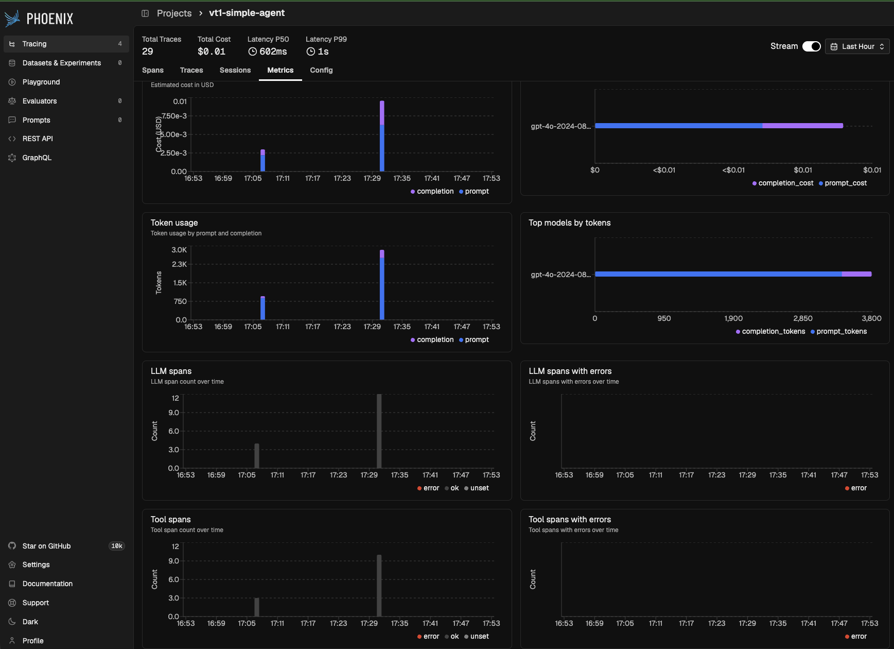

---

#### Span filtering and querying

The **Spans** tab provides a condition-based filter bar that accepts structured predicate expressions against any attribute on the span. Seven filter types are available out of the box:

| Filter type | Example expression | What it targets |
|---|---|---|
| span kind | `span_kind == 'LLM'` | OpenInference `openinference.span.kind` — isolate LLM, Tool, Chain, or Agent spans |
| token count | `cumulative_token_count.total > 1000` | Spans that consumed more than a threshold of tokens |
| annotation label | `annotations['Hallucination'].label == 'hallucinated'` | Human annotations attached in the Phoenix UI |
| evaluation label | `evals['Hallucination'].label == 'hallucinated'` | LLM-as-judge eval labels run via Phoenix Evaluators |
| evaluation score | `evals['Hallucination'].score < 1` | Numeric score from a Phoenix evaluator |
| metadata key | `metadata['topic'] == 'agent'` | Any key inside the LangChain `metadata` dict |
| substring | `'agent' in input.value` | Free-text search within `input.value` or `output.value` |

Multiple conditions can be combined. This enables targeted debugging — for example, `span_kind == 'LLM' AND evals['Hallucination'].score < 1` isolates LLM spans that a hallucination evaluator flagged, regardless of session or time range.

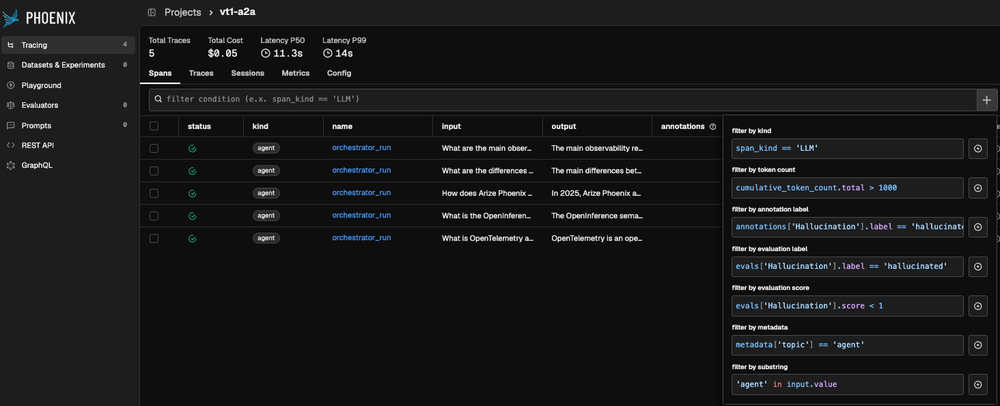

---

#### REST API and programmatic access

Phoenix exposes a versioned REST API (`/v1/`) and a GraphQL endpoint, both accessible directly from the left sidebar. The REST API covers the three primary data objects:

- **`/v1/traces`** — retrieve or delete traces by project and time range
- **`/v1/spans`** — query individual spans with filter expressions; supports the same condition syntax as the UI filter bar
- **`/v1/sessions`** — retrieve session-level aggregates (total tokens, cost, trace count, latency percentiles)

This allows external scripts to pull experiment data without going through the UI — useful for automated result extraction after a run. The GraphQL endpoint provides the same access with full schema introspection.

---

#### OpenInference attribute payload (Attributes tab — LLM span)

The following attributes are set automatically by `LangChainInstrumentor` on every LLM span and are part of the [OpenInference specification](https://github.com/Arize-ai/openinference). They are visible under the **Attributes** tab when a span is selected in Phoenix.

| Attribute | Value (example) | What it is |
|---|---|---|
| `openinference.span.kind` | `"LLM"` | Span type classifier. Phoenix uses this to colour-code spans (`llm` badge), drive the LLM/Tool span count charts, and enable `span_kind == 'LLM'` filter queries. |
| `input.value` | `{"messages": [[{...SystemMessage...}, {...HumanMessage...}]]}` | Full serialised input to the LLM call — the complete message list in LangChain's internal serialisation format. |
| `input.mime_type` | `"application/json"` | Declares that `input.value` is JSON, not plain text. Phoenix uses this to render the input as formatted JSON rather than a raw string. |
| `output.value` | `{"generations": [[{...AIMessage...}]], "llm_output": {...}, "type": "LLMResult"}` | Full serialised LLM response — the `LLMResult` object including the generation, finish reason, token usage, and model fingerprint. |
| `output.mime_type` | `"application/json"` | Same as `input.mime_type` — tells Phoenix the output is structured JSON. |
| `llm.token_count.prompt` | `173` | Number of prompt tokens consumed by this LLM call. Feeds the **Token usage** chart (prompt series) and the session-level token total in the Sessions tab. |
| `llm.token_count.completion` | `17` | Number of completion tokens generated. Feeds the **Token usage** chart (completion series). |
| `llm.token_count.total` | `190` | Sum of prompt + completion tokens. Shown in the span header (`190` token count) and the `cumulative tokens` column in the Spans list. |
| `llm.model_name` | `"gpt-4o-2024-08-06"` | Exact model version as returned by the API. Feeds the **Top models by cost / tokens** bar charts in the Metrics dashboard. |
| `llm.provider` | `"openai"` | Model provider. |
| `llm.system` | `"openai"` | LLM system identifier (same as provider for OpenAI). |
| `llm.input_messages` | `[{message: {role: "system", content: "..."}}, {message: {role: "user", content: "..."}}]` | Structured message list with `role` and `content` per turn. Phoenix renders this as the **Input Messages** tab, showing each role labelled separately. |
| `llm.output_messages` | `[{message: {role: "assistant", tool_calls: [{...multiply(a=6,b=7)...}]}}]` | Structured assistant response. Phoenix renders this as the **Output Messages** tab, showing tool call arguments as formatted JSON. |
| `llm.tools` | `[{tool: {json_schema: {function: {name: "add", ...}}}}, ...]` | JSON schemas of all tools passed to the model. Phoenix renders this as the **Tools** tab on the span. |
| `llm.invocation_parameters` | `{model: "gpt-4o", temperature: 0, stream: false, ...}` | All parameters passed to the model at call time (temperature, stop tokens, tools list). Visible under **Invocation Params** tab. |
| `session.id` | `"round1-phoenix-001"` | Session identifier propagated to all child spans via `using_session()`. Phoenix uses this for the **Sessions** tab grouping. |

**Non-OpenInference attributes** also present on the span (set by LangChain's internal callback, not the OpenInference spec):

| Attribute | What it is |
|---|---|
| `metadata.ls_provider`, `ls_model_name`, `ls_model_type`, `ls_temperature` | LangSmith-style tags emitted by the LangChain callback layer. Phoenix stores them under **Metadata** — not consumed by any Phoenix-native feature. |
| `metadata.lc_versions` | LangChain library versions for reproducibility. |

The full raw payload for this span is below.

```yaml
{
  "session": {
    "id": "round1-phoenix-001"
  },
  "input": {
    "value": {
      "messages": [
        [
          {
            "lc": 1,
            "type": "constructor",
            "id": [
              "langchain",
              "schema",
              "messages",
              "SystemMessage"
            ],
            "kwargs": {
              "content": "You are a helpful assistant tasked with performing arithmetic.\nUse the provided tools to compute the answer.",
              "type": "system"
            }
          },
          {
            "lc": 1,
            "type": "constructor",
            "id": [
              "langchain",
              "schema",
              "messages",
              "HumanMessage"
            ],
            "kwargs": {
              "content": "What is 6 multiplied by 7?",
              "type": "human"
            }
          }
        ]
      ]
    },
    "mime_type": "application/json"
  },
  "openinference": {
    "span": {
      "kind": "LLM"
    }
  },
  "output": {
    "value": {
      "generations": [
        [
          {
            "text": "",
            "generation_info": {
              "finish_reason": "tool_calls",
              "logprobs": null
            },
            "type": "ChatGeneration",
            "message": {
              "lc": 1,
              "type": "constructor",
              "id": [
                "langchain",
                "schema",
                "messages",
                "AIMessage"
              ],
              "kwargs": {
                "content": "",
                "additional_kwargs": {
                  "refusal": null
                },
                "response_metadata": {
                  "token_usage": {
                    "completion_tokens": 17,
                    "prompt_tokens": 173,
                    "total_tokens": 190,
                    "completion_tokens_details": {
                      "accepted_prediction_tokens": 0,
                      "audio_tokens": 0,
                      "reasoning_tokens": 0,
                      "rejected_prediction_tokens": 0
                    },
                    "prompt_tokens_details": {
                      "audio_tokens": 0,
                      "cached_tokens": 0
                    }
                  },
                  "model_provider": "openai",
                  "model_name": "gpt-4o-2024-08-06",
                  "system_fingerprint": "fp_35ed4b8624",
                  "id": "chatcmpl-Dvllm7pLLWpYwF8ZWUE69x2shF9KH",
                  "service_tier": "default",
                  "finish_reason": "tool_calls",
                  "logprobs": null
                },
                "type": "ai",
                "id": "lc_run--019f0edb-814a-7460-bc2f-f0a6e4730de8-0",
                "tool_calls": [
                  {
                    "name": "multiply",
                    "args": {
                      "a": 6,
                      "b": 7
                    },
                    "id": "call_mlUdaUa9gEfOhdwkAZGs1VW6",
                    "type": "tool_call"
                  }
                ],
                "usage_metadata": {
                  "input_tokens": 173,
                  "output_tokens": 17,
                  "total_tokens": 190,
                  "input_token_details": {
                    "audio": 0,
                    "cache_read": 0
                  },
                  "output_token_details": {
                    "audio": 0,
                    "reasoning": 0
                  }
                },
                "invalid_tool_calls": []
              }
            }
          }
        ]
      ],
      "llm_output": {
        "token_usage": {
          "completion_tokens": 17,
          "prompt_tokens": 173,
          "total_tokens": 190,
          "completion_tokens_details": {
            "accepted_prediction_tokens": 0,
            "audio_tokens": 0,
            "reasoning_tokens": 0,
            "rejected_prediction_tokens": 0
          },
          "prompt_tokens_details": {
            "audio_tokens": 0,
            "cached_tokens": 0
          }
        },
        "model_provider": "openai",
        "model_name": "gpt-4o-2024-08-06",
        "system_fingerprint": "fp_35ed4b8624",
        "id": "chatcmpl-Dvllm7pLLWpYwF8ZWUE69x2shF9KH",
        "service_tier": "default"
      },
      "run": null,
      "type": "LLMResult"
    },
    "mime_type": "application/json"
  },
  "llm": {
    "token_count": {
      "prompt_details": {
        "cache_read": 0,
        "audio": 0
      },
      "completion_details": {
        "audio": 0,
        "reasoning": 0
      },
      "prompt": 173,
      "completion": 17,
      "total": 190
    },
    "system": "openai",
    "tools": [
      {
        "tool": {
          "json_schema": {
            "type": "function",
            "function": {
              "name": "add",
              "description": "Adds `a` and `b`.\n\n    Args:\n        a: First integer.\n        b: Second integer.",
              "parameters": {
                "properties": {
                  "a": {
                    "type": "integer"
                  },
                  "b": {
                    "type": "integer"
                  }
                },
                "required": [
                  "a",
                  "b"
                ],
                "type": "object"
              }
            }
          }
        }
      },
      {
        "tool": {
          "json_schema": {
            "type": "function",
            "function": {
              "name": "multiply",
              "description": "Multiplies `a` and `b`.\n\n    Args:\n        a: First integer.\n        b: Second integer.",
              "parameters": {
                "properties": {
                  "a": {
                    "type": "integer"
                  },
                  "b": {
                    "type": "integer"
                  }
                },
                "required": [
                  "a",
                  "b"
                ],
                "type": "object"
              }
            }
          }
        }
      },
      {
        "tool": {
          "json_schema": {
            "type": "function",
            "function": {
              "name": "divide",
              "description": "Divides `a` by `b`.\n\n    Args:\n        a: Numerator.\n        b: Denominator (must not be zero).",
              "parameters": {
                "properties": {
                  "a": {
                    "type": "integer"
                  },
                  "b": {
                    "type": "integer"
                  }
                },
                "required": [
                  "a",
                  "b"
                ],
                "type": "object"
              }
            }
          }
        }
      }
    ],
    "provider": "openai",
    "input_messages": [
      {
        "message": {
          "content": "You are a helpful assistant tasked with performing arithmetic.\nUse the provided tools to compute the answer.",
          "role": "system"
        }
      },
      {
        "message": {
          "content": "What is 6 multiplied by 7?",
          "role": "user"
        }
      }
    ],
    "output_messages": [
      {
        "message": {
          "tool_calls": [
            {
              "tool_call": {
                "id": "call_mlUdaUa9gEfOhdwkAZGs1VW6",
                "function": {
                  "name": "multiply",
                  "arguments": {
                    "a": 6,
                    "b": 7
                  }
                }
              }
            }
          ],
          "role": "assistant"
        }
      }
    ],
    "model_name": "gpt-4o-2024-08-06",
    "invocation_parameters": {
      "model": "gpt-4o",
      "model_name": "gpt-4o",
      "stream": false,
      "temperature": 0,
      "_type": "openai-chat",
      "stop": null,
      "tools": [
        {
          "type": "function",
          "function": {
            "name": "add",
            "description": "Adds `a` and `b`.\n\n    Args:\n        a: First integer.\n        b: Second integer.",
            "parameters": {
              "properties": {
                "a": {
                  "type": "integer"
                },
                "b": {
                  "type": "integer"
                }
              },
              "required": [
                "a",
                "b"
              ],
              "type": "object"
            }
          }
        },
        {
          "type": "function",
          "function": {
            "name": "multiply",
            "description": "Multiplies `a` and `b`.\n\n    Args:\n        a: First integer.\n        b: Second integer.",
            "parameters": {
              "properties": {
                "a": {
                  "type": "integer"
                },
                "b": {
                  "type": "integer"
                }
              },
              "required": [
                "a",
                "b"
              ],
              "type": "object"
            }
          }
        },
        {
          "type": "function",
          "function": {
            "name": "divide",
            "description": "Divides `a` by `b`.\n\n    Args:\n        a: Numerator.\n        b: Denominator (must not be zero).",
            "parameters": {
              "properties": {
                "a": {
                  "type": "integer"
                },
                "b": {
                  "type": "integer"
                }
              },
              "required": [
                "a",
                "b"
              ],
              "type": "object"
            }
          }
        }
      ]
    }
  },
  "metadata": {
    "ls_provider": "openai",
    "ls_model_name": "gpt-4o",
    "ls_model_type": "chat",
    "ls_temperature": 0,
    "ls_integration": "langchain_chat_model",
    "lc_versions": {
      "langchain-core": "1.4.8",
      "langchain": "1.2.12"
    }
  }
}
```

---

**Note on `cost.usd`:** The Cost chart in the Metrics dashboard (dashboard-1) shows estimated cost over time. Phoenix computes this from `llm.token_count.*` using its own internal pricing table. It does **not** use the `cost.usd` attribute set by `set_token_cost_attributes()`. The latter lands on the parent span due to the LLM span being already closed when `CostTracker.record()` is called (see Known Limitations above).

### Pillar 3: Operational Considerations (the "Cost")

| Evaluation category | Criteria | Phoenix |
|---|---|---|
| License | Distinguish between MIT/Apache 2.0 and open-core (enterprise license keys required) | **ELv2** — self-hosting is free; commercial redistribution restricted. Enterprise features (RBAC, SSO, HIPAA compliance, dedicated support) require **[Arize AX](https://arize.com/docs/phoenix/resources/frequently-asked-questions/what-is-the-difference-between-phoenix-and-arize)**, the paid SaaS product built on top of Phoenix. |
| Deployment model | Local/Docker support vs. cloud SaaS only | ✅ Four options: **Docker** (self-hosted, used in this project), **CLI** (`phoenix serve` on port 6006), **Notebook** (`px.launch_app()`, no data persistence), and **[Phoenix Cloud](https://arize.com/docs/phoenix/environments)** (managed free tier at `app.phoenix.arize.com` with 10 GB storage). For enterprise deployments, Arize AX provides a fully managed SaaS alternative. |
| Performance overhead | Ingestion latency and impact on the agent's end-to-end response time | Near real-time ingestion — no observable latency impact on agent runs observed across all experiment sessions |
| Resource usage | Hardware requirements (PostgreSQL, ClickHouse, SQLite) | **SQLite** (default, used in this project) — zero setup, stores data in `~/.phoenix/`; suitable for local development and single-user deployments. For production and multi-user deployments, **PostgreSQL** is recommended: set `PHOENIX_SQL_DATABASE_URL` to switch backends. PostgreSQL enables concurrent access, standard backup tooling, and replication. See [self-hosting architecture docs](https://arize.com/docs/phoenix/self-hosting/architecture). |

* Observations from the experiments:

**Ingestion latency.** Spans appear in the Phoenix UI near real-time during a run. There is no observable delay between a query completing and its trace becoming visible in the Spans or Traces tab — useful for live debugging during development.

**UI responsiveness.** The interface remained responsive throughout all experiment runs, including the A2A v2 sessions where each trace contains 30–50 spans across three processes. No slowdowns were observed when navigating between the Spans, Traces, Sessions, and Metrics tabs under that load.

**Data persistence.** No data loss was observed after stopping and restarting the Docker container. Traces from all experiment sessions were still accessible after container restarts, confirming that Phoenix persists its SQLite store across restarts by default.

**UX limitation — time filter scope.** The time-range filter (e.g. "Last 15 Min") applies globally across all projects and all tabs, not just the current project view. Setting a filter from within a specific project screen still affects the global state. This can cause confusion when switching between projects with different experiment timestamps — traces appear to be missing until the filter is widened manually.

---

## Round 1 Results (Simple Agent)

Data source: `experiments/simple_agent/runs/round1-phoenix-001.json`

The simple agent ran 5 arithmetic queries of increasing complexity (1 to 3 tool calls). All 5 completed without errors.

| Metric | Value |
|---|---|
| Total latency (5 queries) | 8 536 ms |
| Avg latency per query | 1 707 ms |
| Total input tokens | 2 503 |
| Total output tokens | 329 |
| Total cost | $0.0175 |
| Errors | 0 |

**Latency scales with tool call count.** Q1 (single tool call) completed in 1 269 ms; Q5 (three tool calls) took 2 250 ms. This reflects the extra LLM round-trips needed to process each tool result and decide the next step. Input token counts also grow across queries as the conversation history accumulates in the prompt.

**Trace view shows the full ReAct loop.** Each query produces a trace with the correct span structure: `ChatOpenAI` (llm) → `multiply` or `divide` (tool) → `ChatOpenAI` (llm) → final answer. For Q5 with three tool calls, three `ChatOpenAI` spans appear in sequence. Screenshots of the trace view and sessions tab are shown in Pillar 2 above (points 1 and 3 under "Where OpenInference attributes surface").

**Session grouping works.** All 5 traces are grouped under session `round1-phoenix-001` in the Sessions tab, showing aggregate token counts and cost for the full run.

**Zero errors, no data loss.** All outputs matched expected values; no spans were dropped or missing.

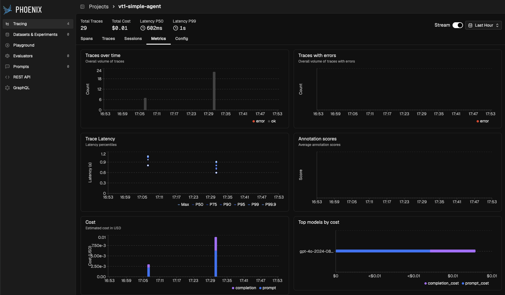

## Round 2 Results (Multi-Agent)

Data sources: `experiments/multi_agent/runs/round2-phoenix-001.json` and `experiments/multi_agent_a2a/runs/a2a-phoenix-002.json`

### Span metadata captured during Round 2 (multi-agent, research node)

Phoenix captures LangGraph execution metadata automatically via `LangChainInstrumentor`. The `metadata` section of a research-node span from session `round2-phoenix-001`:

```yaml
{
  "session_id": "round2-phoenix-001",
  "langgraph_step": 1,
  "langgraph_node": "research",
  "langgraph_triggers": ["branch:to:research"],
  "langgraph_path": ["__pregel_pull", "research"],
  "langgraph_checkpoint_ns": "research:b20e77f9-6ce5-0e39-a94c-24f192635761",
  "checkpoint_ns": "research:b20e77f9-6ce5-0e39-a94c-24f192635761",
  "ls_provider": "openai",
  "ls_model_name": "gpt-4o",
  "ls_model_type": "chat",
  "ls_temperature": 0,
  "ls_integration": "langchain_chat_model",
  "lc_versions": { "langchain-core": "1.4.8", "langchain": "1.2.12" }
}
```

Key attributes visible on the span:
- `langgraph_node` / `langgraph_step` / `langgraph_triggers` — which graph node ran and why
- `checkpoint_ns` — LangGraph state checkpoint UUID per node execution
- `ls_provider`, `ls_model_name`, `ls_temperature` — LangSmith-style model config tags emitted by the LangChain callback
- `lc_versions` — LangChain library versions for reproducibility

### v1 in-process results (`round2-phoenix-001`)

| Metric | Value |
|---|---|
| Total latency (5 queries) | 49 389 ms |
| Avg latency per query | 9 878 ms |
| Avg faithfulness | 0.80 |
| Total retries | 3 |
| HITL escalations | 1 |
| Total cost | $0.1089 |
| Errors | 0 |

Q3 (comparative — Phoenix vs Langfuse) triggered 3 retries + HITL escalation with faithfulness = 0.0. This is expected: the model's own training data about itself is not grounded in the retrieved sources, causing the evaluator to flag it as hallucinated on every retry.

**Span hierarchy — visible and correct.** The Spans list shows the full multi-agent pipeline as a tree: `LangGraph` (chain, root) → `research` (chain) → `ChatOpenAI` (llm) → `evaluate` (chain) → `ChatOpenAI` (llm) → `_route_after_evaluation` (chain) → `synthesize` (chain) → `ChatOpenAI` (llm). Each node role maps to a named chain span; each LLM call is a child `llm` span with token counts and cost.

**Session grouping works.** Session `round2-phoenix-001` groups all 5 query traces with aggregate totals: 5 traces, 19 112 tokens, $0.06, p50 latency 7.4s.

**Input/output on root span shows full AgentState.** The `LangGraph` root span's input captures the entire `AgentState` dict — including `messages`, `trace_events`, `research`, `evaluation`, `retry_count` fields — not just the query string. This is Phoenix capturing LangGraph's internal state handoff, which provides full execution context but makes the input field verbose.

**Guard events — not visible.** The Events tab on all spans shows 0 events. Guard triggers (`low_faithfulness`, `low_confidence`, `hitl_escalation`) are recorded in `AgentState.trace_events` but are not emitted as OTel span events — they are invisible in the Phoenix trace detail view. This is a known limitation (see Known Limitations above).

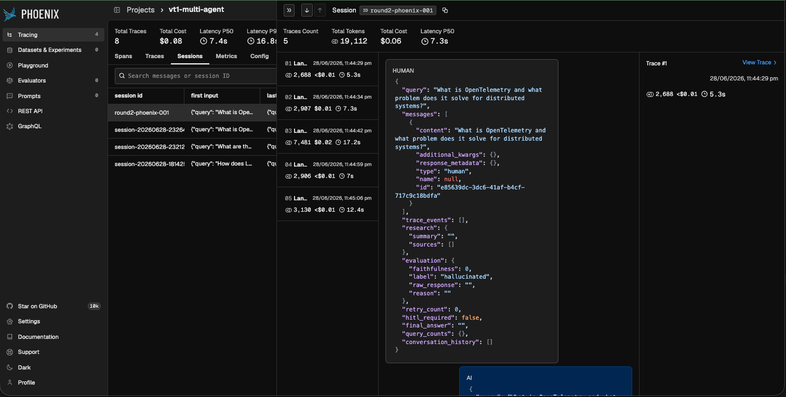

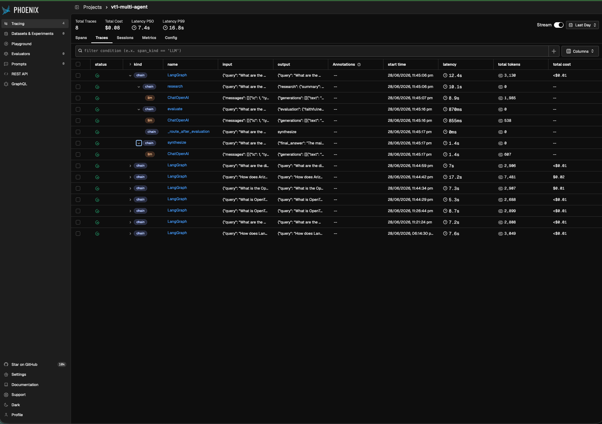

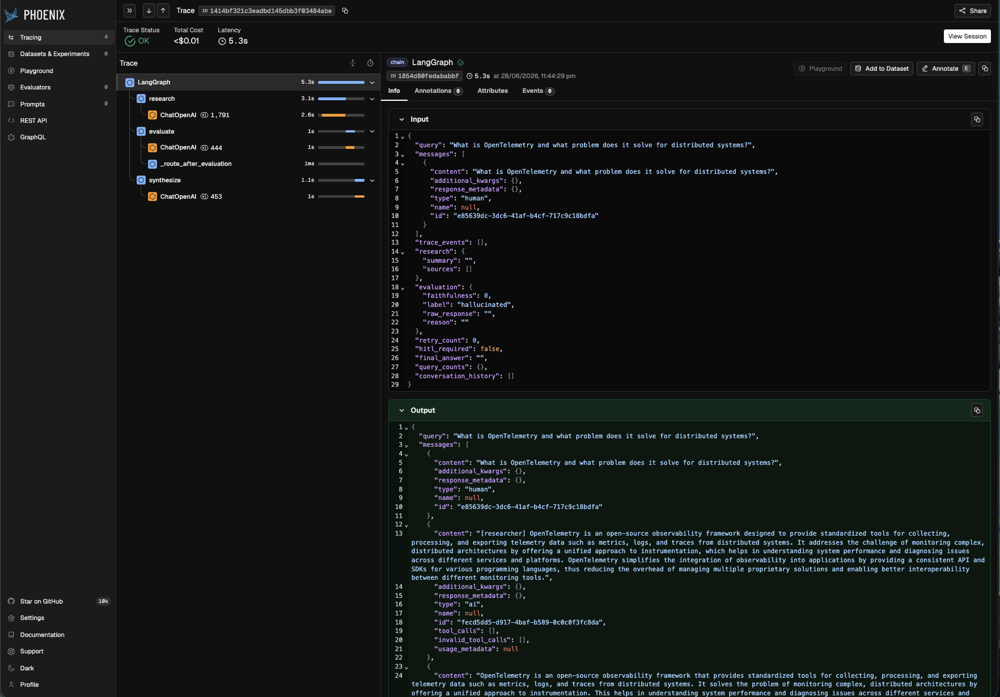

### v2 A2A distributed results (`a2a-phoenix-002`)

| Metric | Value |
|---|---|
| Total latency (5 queries) | 56 941 ms |
| Avg latency per query | 11 388 ms |
| Avg faithfulness | 0.96 |
| Total retries | 1 |
| HITL escalations | 0 |
| Total cost | $0.0737 |
| Errors | 0 |

**Cross-process span correlation works.** Each `orchestrator_run` span contains child spans from the researcher and evaluator processes (`a2a.server.request_handlers.*` → `ChatOpenAI`), connected via the W3C `traceparent` header injected by `protocol.call_agent()`. All 5 queries produced a single unified trace per query, not three separate traces.

**Root span status: OK.** The `orchestrator_run` root span shows `✅ OK` status, confirming that `StatusCode.OK` is set on successful completion.

**A2A SDK infrastructure spans visible.** The trace tree includes `a2a.client.transports.*` and `a2a.server.routes.*` spans from the A2A SDK between the orchestrator and the service-side LLM calls. These cannot be safely dropped without orphaning the `ChatOpenAI` children (see Known Limitations — A2A span nesting).

**Session grouping works.** The Sessions tab for project `vt1-a2a` shows exactly 5 sessions for the 5 queries, each containing the full cross-process trace.

**Guard events.** `guards_fired: ["low_faithfulness", "low_confidence"]` recorded in the JSON result, 1 retry triggered. Guard events are not emitted as OTel span events (same limitation as v1).

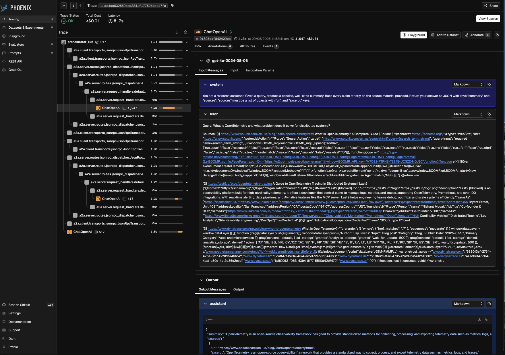

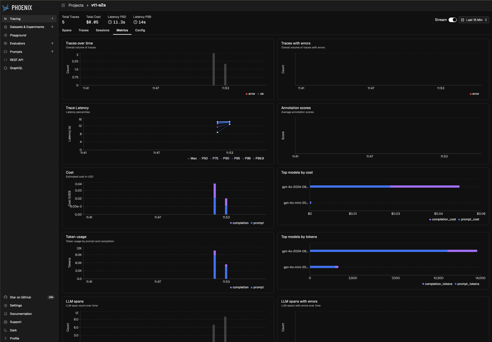
