# Langfuse — Evaluation

## Overview

Langfuse is an open-source LLM observability and evaluation platform. It stores traces,
spans, and evaluation scores in a Postgres + ClickHouse backend. The self-hosted version
is deployed via Docker Compose and requires creating a project in the UI to obtain API keys.

**Key documentation references:**

| Topic | Link |
|---|---|
| Data model (traces, observations, sessions, scores) | https://langfuse.com/docs/observability/data-model |
| Trace IDs and distributed tracing | https://langfuse.com/docs/observability/features/trace-ids-and-distributed-tracing |
| Sessions | https://langfuse.com/docs/observability/features/sessions |
| Tags | https://langfuse.com/docs/observability/features/tags |
| Self-host architecture | https://langfuse.com/handbook/product-engineering/architecture |
| OpenTelemetry / OTLP integration (endpoint, attribute mapping, collector config) | https://langfuse.com/integrations/native/opentelemetry |
| Observability for multi-agent systems (Oracle blog) | https://blogs.oracle.com/ai-and-datascience/observability-for-multi-agent-systems |

**SDK version used in this project:** `langfuse>=4.12.0`

---

## Local Installation

### 1. Start the server

```bash
docker compose -f infra/langfuse/docker-compose.yml up -d
```

This starts six containers:

| Container | Image | Purpose |
|---|---|---|
| `langfuse-web-1` | `langfuse/langfuse:3` | Web UI and API at http://localhost:3000 |
| `langfuse-worker-1` | `langfuse/langfuse-worker:3` | Background jobs (eval runs, exports) |
| `postgres-1` | `postgres:17` | Primary relational store (traces, scores, users) |
| `clickhouse-1` | `clickhouse/clickhouse-server` | Analytics store (high-volume span ingestion, dashboards) |
| `redis-1` | `redis:7` | Queue and cache for the worker |
| `minio-1` | `chainguard/minio` | Object storage for large payloads and media |

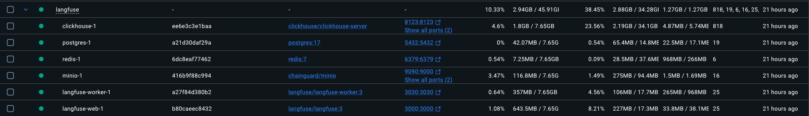

First startup downloads images and runs DB migrations. Subsequent starts are fast.

### 2. Create a project and get API keys

1. Open http://localhost:3000 and register a local account (any email/password).
2. Create a new project (e.g. `vt1-simple-agent`).
3. Go to **Settings → API Keys** and create a key pair.
4. Copy the **Public Key** and **Secret Key**.

### 3. Configure environment variables

Add to `.env`:
```
LANGFUSE_PUBLIC_KEY=pk-lf-...
LANGFUSE_SECRET_KEY=sk-lf-...
LANGFUSE_HOST=http://localhost:3000
```

### 4. Install the SDK

```bash
pip install langfuse
```

Dependencies are already in the project's `requirements.txt`. This step is only needed to use Langfuse outside this project.

### 5. Connecting to the agent

Use `exporter="langfuse"` in `AgentConfig` / `MultiAgentConfig`:

```python
from src.simple_agent.agent import build_agent
from src.simple_agent.config import AgentConfig

agent = build_agent(config=AgentConfig(exporter="langfuse"))
agent.invoke([HumanMessage(content="What is 6 * 7?")])
```

The `CallbackHandler` is instantiated in `_build_langfuse()` and passed to every `model.invoke()`
call via `RunnableConfig(callbacks=[...])`. Each tool call and LLM response appears as a
child span under the top-level trace in the Langfuse UI.

### 6. Verifying traces appear

After running the agent, open http://localhost:3000 → your project → **Traces**. You should
see one trace per `agent.invoke()` call with the full span tree visible on click.

---

## Known Limitations (Wire Protocol, Semantic Conventions, OTel Compliance)


| Area | Dimension | Status | Detail |
|---|---|---|---|
| OTLP wire protocol | Wire | ✅ Supported (v4) | Langfuse v4 exposes an OTLP endpoint at `/api/public/otel/v1/traces` (introduced in v3.22.0, improved in v4). Spans can be sent directly via standard OTLP/HTTP without the Langfuse SDK. In this project, the SDK-based `CallbackHandler` approach is used instead — the OTLP endpoint was not exercised. |
| OpenInference span attributes | Semantic (OpenInference) | ❌ Not supported | Langfuse does not interpret OpenInference attribute names (`llm.*`, `openinference.span.kind`). Attribute names follow Langfuse's own schema (`input`, `output`, `model`). |
| OTel GenAI semconv (`gen_ai.*`) | Semantic (OTel GenAI) | ❌ Not consumed | Langfuse does not natively interpret `gen_ai.request.model`, `gen_ai.usage.input_tokens`, etc. These are accepted as raw key-value pairs but do not drive any dashboard feature. |
| `session.id` | Session | ✅ First-class | Sessions are grouped natively in the Langfuse UI. In SDK v4, session ID is set via `langfuse.propagate_attributes(session_id=...)` — a context manager that stamps the session onto all child observations without per-call metadata injection. `_LangfuseAdapter.session_ctx()` wraps this. See https://langfuse.com/docs/observability/features/sessions |
| OTel Resource attributes | Resource | ✅ Supported (v4) | Langfuse v4 is OTel-based internally — `OTEL_SERVICE_NAME` is used in the A2A strategy to stamp `service.name` on all spans. Each process (orchestrator, researcher, evaluator) appears as a distinct service in trace `resourceAttributes` metadata. |
| Exception recording | OTel Compliance | ⚠️ Missing | `CallbackHandler` has no mechanism to record `span.record_exception()` or set span status to `ERROR`. An agent run that raises `LoopDetectedError` produces a trace indistinguishable from a successful one. |
| Span events for guard triggers | OTel Compliance | ❌ Not supported | Langfuse has no OTel-style span events. `TraceEvent` records for guard triggers (loop detection, PII, HITL escalation) cannot be attached to a Langfuse trace. |
| **UI authentication** | Security | ✅ Built-in | Email/Password login out of the box. OAuth social logins (Google, GitHub, Microsoft/Azure AD) included in the free self-hosted version via Auth.js. |
| **API / ingestion auth** | Security | ✅ API keys | Project-scoped public/secret key pairs created in the UI. Required by all SDK calls. |
| **SSO / RBAC** | Security | ⚠️ Paid | Enterprise SSO (Okta, SAML, automated workspace syncing) requires a paid plan. Free tier covers social logins only. |
| **PII / data masking** | Security | ✅ Built-in | Personal-data masking controls (masking, deletion, and retention policies) documented for the self-hosted version — not available in Phoenix or Opik (self-hosted). See https://github.com/orgs/langfuse/discussions/9264 |
| Token/cost span attributes | Semantic (cost) | ⚠️ Partial | Langfuse captures token counts from LangChain's `LLMResult` callback automatically (visible as `usage` on LLM spans). However, custom `cost.usd` from `CostTracker` is not attached. |
| Sampling rate | OTel Compliance | ⚠️ Unused | No sampler concept in the Langfuse SDK. `AgentConfig.sampling_rate` has no effect — all traces are always sent. |
| Span kind (`AGENT`, `TOOL`, `CHAIN`) | Semantic (OTel) | ⚠️ Implicit | Langfuse infers span types from LangChain callback event types, not from explicit OTel `openinference.span.kind` attributes. The hierarchy is correct but not OTel-attributable. |

---

## Three-pillar evaluation

### Community assessment (external perspective)

Source: Paul, K. (2026). *Top 5 LLM Observability Platforms for 2026*. Maxim AI. [CITE-MAXIM-TOP5]

**Strengths (as identified by independent review):**
- Fully open-source with MIT license for core features
- Self-hosting flexibility with production-ready deployments
- No LLM proxy requirement, reducing latency and data privacy concerns
- Extensive framework integrations (100+ libraries)
- Strong community support and active development

**Limitations (as identified by independent review):**
- Enterprise security features (SSO, RBAC) require a commercial license
- Framework support for newer AI development tools more limited than comprehensive platforms
- Self-hosting requires infrastructure management overhead
- Evaluation runs separate from observability, requiring context switching

> **Note:** The "evaluation separate from observability" limitation is confirmed: Langfuse's scoring UI is a distinct workflow from the trace view. The 6-container setup confirms the infrastructure overhead claim. The "no LLM proxy" strength is confirmed — the SDK uses callbacks with no man-in-the-middle layer.

### Pillar 1: Integration and Instrumentation Capabilities (The "How")

| Evaluation category | Criteria | Langfuse |
|---|---|---|
| Native libraries | Support for Python/TypeScript SDKs and popular agent frameworks (LangChain, CrewAI, Google ADK) | ✅ Python SDK (`langfuse`), TypeScript SDK. LangChain / LangGraph: ✅ `LangfuseCallbackHandler` (per-call, used in this project). CrewAI: ✅ via `@observe` decorator or callback. Google ADK: ⚠️ no native integration (manual `@observe`). 100+ integrations listed at [langfuse.com/integrations](https://langfuse.com/integrations). |
| Ingestion formats | Support for OpenInference and OpenTelemetry (OTel) standards | ⚠️ Partial. **Langfuse SDK format** (proprietary, used in this project): ✅ all LangChain events translated client-side by `CallbackHandler`. **OTLP `/api/public/otel/v1/traces`**: ✅ supported since v3.22.0 (not used in this project — see [proposed change 1](#proposed-improvements-not-yet-implemented)). **OpenInference semantic conventions** (`llm.*`, `openinference.span.kind`): ❌ not consumed or displayed. |
| Auto-instrumentation | Ability to capture agent spans, tool calls, and model parameters without manual decorators on every call | ❌ **No global auto-instrumentation.** `LangChainInstrumentor` is explicitly removed (`_uninstrument_langchain()`) to avoid OTel interference. Every `model.invoke()` must pass `RunnableConfig(callbacks=[handler])` explicitly. If a call is made without the callback, it produces no trace entry — there is no global patch to catch missed calls. |
| Data exporters | API/SDK access, JSON/CSV exports, or scheduled exports | ✅ Full REST API (`GET /api/public/traces`, `/observations`, etc.), Python SDK helpers (`langfuse.get_traces()`), CSV export from the UI, and JSON via the API. Webhook notifications are available but fire only on prompt management events, not on trace or metric thresholds. |

**Setup friction — moderate.** Langfuse requires more initial configuration than Phoenix. After starting the Docker Compose stack, a project must be created in the UI and a public/secret API key pair must be generated before any traces can be sent. The three env vars — `LANGFUSE_PUBLIC_KEY`, `LANGFUSE_SECRET_KEY`, and `LANGFUSE_HOST` — must all be present. `_build_langfuse()` calls `client.auth_check()` at initialisation time, so a missing or wrong key raises immediately rather than silently dropping spans.

**Callback-based instrumentation — per-call injection required.** Langfuse does not use `LangChainInstrumentor` or any OTel auto-instrumentation. Instead, a `LangfuseCallbackHandler` is instantiated by `_LangfuseAdapter.callback()` and passed to every `model.invoke()` call via LangChain's `RunnableConfig(callbacks=[handler])`. This is the main integration difference from Phoenix: **every LLM call needs the callback explicitly injected**. If a call is made without the callback, it produces no trace entry — there is no global patch catching missed calls.

```python
def _build_langfuse(config: AgentConfig) -> ExporterAdapter:
    from langfuse import Langfuse
    _uninstrument_langchain()           # remove OTel patch if previously active
    host = os.getenv("LANGFUSE_HOST", "http://localhost:3000")
    client = Langfuse(
        public_key=config.langfuse_public_key or None,
        secret_key=config.langfuse_secret_key or None,
        host=host,
    )
    client.auth_check()                 # raises early on wrong credentials
    return _LangfuseAdapter(client=client)
```

**How traces and spans are collected.** Each `LangfuseCallbackHandler` instance attached to a `model.invoke()` call records that call as an observation in Langfuse. LangChain emits callback events for every step — `on_llm_start`, `on_llm_end`, `on_tool_start`, `on_tool_end` — and the handler maps these to Langfuse's observation model (one observation per LLM call, one per tool call, nested under a root trace). Token counts are extracted from LangChain's `LLMResult` object at `on_llm_end` and stored as `usage` on the LLM observation.

**Session grouping — via `propagate_attributes()`.** In Langfuse v4, session IDs are stamped onto traces using `langfuse.propagate_attributes(session_id=...)` — a context manager that injects the session into all observations created within its scope. `_LangfuseAdapter.session_ctx()` wraps this:

```python
def session_ctx(self, session_id: Optional[str] = None):
    if not session_id:
        return nullcontext()
    return langfuse_propagate_attributes(session_id=session_id)
```

All `model.invoke()` calls made inside this context are grouped under the same session in the Langfuse UI — no per-call metadata injection is needed beyond the callback handler itself.

**SDK approach — no OpenInference attributes.** In this project, Langfuse is integrated via the SDK callback approach, not via its OTLP endpoint. Langfuse v4 does expose an OTLP endpoint at `/api/public/otel/v1/traces` (introduced in v3.22.0), but the SDK `CallbackHandler` path was chosen here because it maps more cleanly to Langfuse's observation model and requires no additional OTel pipeline configuration. Importantly, `LangChainInstrumentor` is explicitly unloaded (`_uninstrument_langchain()`) before Langfuse is initialised, to prevent Phoenix or otel-stdout instrumentation from interfering. As a consequence, no OpenInference attribute names (`openinference.span.kind`, `llm.token_count.*`, `llm.input_messages.*`) are emitted — Langfuse uses its own schema (`input`, `output`, `model`, `usage`).

**Langfuse v4 is OTel-based internally.** Although there is no OTLP transport, Langfuse v4 uses OpenTelemetry as its internal tracing engine. `propagate_attributes()` stamps attributes on OTel spans; `get_current_trace_id()` reads the active trace from the OTel context; `start_as_current_observation()` creates OTel-managed spans that Langfuse intercepts and exports to its own backend. This internal OTel usage is what enables cross-process trace correlation in the A2A v2 system (see below).

**No sampling.** The Langfuse SDK has no sampler concept. `AgentConfig.sampling_rate` has no effect — all traces are always sent regardless of the configured rate.

**Cross-process instrumentation (A2A v2).** In the distributed system, the `LangfuseTracingStrategy` uses a custom propagation mechanism:

1. `wrap_run()` opens a root `a2a_orchestrator_run` observation via `start_as_current_observation()`, reads the resulting trace ID with `lf.get_current_trace_id()`, and stores it in a `ContextVar`.
2. `outgoing_headers()` injects this trace ID as `x-langfuse-trace-id` into every outgoing A2A call, along with `x-a2a-session-id`.
3. On the sub-agent side, `incoming_context()` extracts `x-langfuse-trace-id` and enters `propagate_attributes(session_id=...)` so all LangChain observations in that request inherit the session.
4. `get_callback()` creates `CallbackHandler(trace_context=TraceContext(trace_id=...))` — this tells the SDK to attach the sub-agent's observations as children of the orchestrator's root trace, not as a new standalone trace.

This is Langfuse-specific, unlike Phoenix which uses standard W3C `traceparent`. Both sides must be Langfuse-aware — a sub-agent on a different backend would not interpret `x-langfuse-trace-id`.

---

#### Implementation scope: native SDK vs. OTel-native path

Langfuse v4 supports two distinct instrumentation paths. **This project uses the native SDK path exclusively.**

The initial integration was built using Langfuse's standard `CallbackHandler` SDK approach, which was the primary supported and documented method at the time of development. Langfuse's native OTLP endpoint (`/api/public/otel/v1/traces`, introduced in v3.22.0) was evaluated later in the development cycle. To maintain system stability, migrating the established callback architecture to a fully OTel-native auto-instrumentation pipeline is recorded as a proposed future improvement rather than applied as a current implementation change.

| Dimension | Native SDK path *(used in this project)* | OTel-native path *(not used)* |
|---|---|---|
| Instrumentation mechanism | `LangfuseCallbackHandler` injected per `model.invoke()` call | `LangChainInstrumentor` + OTLP to `/api/public/otel/v1/traces` |
| Missed calls | Any `model.invoke()` without explicit callback is invisible | None — global patch catches all LangChain calls |
| Sampling | Not supported; all traces always sent | Supported via `OTEL_TRACES_SAMPLER` |
| Attribute schema | Langfuse-proprietary (`input`, `output`, `model`, `usage`) | OpenInference (`llm.*`, `openinference.span.kind`) |
| Session propagation | `langfuse.propagate_attributes(session_id=...)` — Langfuse-specific | W3C Baggage + `BaggageSpanProcessor` — same mechanism as Phoenix |
| A2A context propagation | Custom `x-langfuse-trace-id` header (Langfuse-specific) | Standard W3C `traceparent` — interoperable with any OTel-aware service |

**Evaluation scope acknowledgment.** The limitations above — no global auto-instrumentation, per-call injection, no sampling, no OpenInference attributes, Langfuse-specific A2A propagation — reflect the SDK path chosen for this project, not fundamental platform constraints. Langfuse fully supports OTel-native instrumentation. Proposed change 1 below describes the migration steps.

---

#### Proposed improvements (not yet implemented)

The two changes below are identified as improvements over the current implementation but have not been applied. They require testing and experiment reruns to verify correctness.

---

**Proposed change 1 — OTLP-native instrumentation (simple agent + multi-agent)**

| | Current implementation | Proposed |
|---|---|---|
| Instrumentation | `LangfuseCallbackHandler` injected per-call | `LangChainInstrumentor` + OTLP to `/api/public/otel/v1/traces` |
| Per-call injection | Required — every `model.invoke()` needs the callback | Not required — auto-instrumentation patches all calls globally |
| Sampling | Not supported | Supported via `OTEL_TRACES_SAMPLER` |
| Attribute schema | Langfuse own schema (`input`, `output`, `model`, `usage`) | OpenInference (`llm.*`, `openinference.span.kind`) |
| Session propagation | `langfuse.propagate_attributes(session_id=...)` | W3C Baggage + `BaggageSpanProcessor` |

The migration would replace `_build_langfuse()` in `src/simple_agent/exporter.py` and `src/multi_agent/exporter.py`. Instead of creating a `Langfuse()` client and a `_LangfuseAdapter`, it would call `LangChainInstrumentor().instrument(tracer_provider=provider)` with a `TracerProvider` pointing to Langfuse's OTLP endpoint using Basic Auth (see [Langfuse OpenTelemetry integration docs](https://langfuse.com/integrations/native/opentelemetry) for endpoint details, attribute mapping, and collector configuration examples):

```
OTEL_EXPORTER_OTLP_ENDPOINT = http://localhost:3000/api/public/otel/v1/traces
OTEL_EXPORTER_OTLP_HEADERS  = Authorization=Basic <base64(pk-lf-...:sk-lf-...)>
```

This would make the Langfuse integration code structurally identical to the Phoenix integration. The open question before applying this is whether OpenInference attributes (`llm.token_count.*`, `llm.input_messages.*`) are correctly mapped to Langfuse's observation model in the UI — this needs to be verified with a test run.

---

**Proposed change 2 — W3C context propagation in A2A (multi-agent A2A v2)**

| | Current implementation | Proposed |
|---|---|---|
| Trace linking header | Custom `x-langfuse-trace-id` | Standard W3C `traceparent` |
| Sub-agent awareness | Must extract `x-langfuse-trace-id` explicitly | Standard OTel `extract(headers)` — no Langfuse-specific code |
| Session propagation | Custom `x-a2a-session-id` header + `ContextVar` | W3C Baggage (`session.id`) — same as Phoenix |
| Span nesting | `CallbackHandler(trace_context=TraceContext(trace_id=...))` | Automatic via OTel parent context |

This would replace the custom propagation in `src/multi_agent_a2a/tracing/langfuse.py` with the same W3C `traceparent` + Baggage mechanism that `src/multi_agent_a2a/tracing/phoenix.py` already uses. The result would be a single shared propagation path across all three tools, reducing the amount of tool-specific code in the A2A layer.

This change depends on Proposed change 1 being applied first — W3C span parenting only works when the Langfuse SDK is receiving spans via OTel. It also requires an experiment rerun to verify that sub-agent spans appear as children of the orchestrator trace in the Langfuse UI.

### Pillar 2: Capabilities (the "What")

#### Supported LLM providers and agent frameworks

Langfuse provides instrumentation through two mechanisms: the `CallbackHandler` for LangChain/LangGraph (used in this project), and the `@observe` decorator for any Python function. There are no separate per-provider packages — all LangChain-supported models are captured automatically once the `CallbackHandler` is injected.

**LangChain / LangGraph integration** (used in this project):

| Component | How it is captured |
|---|---|
| `ChatOpenAI` (LLM call) | `on_llm_start` / `on_llm_end` callbacks → Generation observation with input messages, output, token counts, model name, latency |
| Tool call (`multiply`, `divide`, etc.) | `on_tool_start` / `on_tool_end` callbacks → Span observation with input args and output |
| LangGraph node transitions | `on_chain_start` / `on_chain_end` → Span observation wrapping each node |
| Errors | `on_llm_error` / `on_tool_error` → observation `level: ERROR` + error message |

**Other supported integrations** (not used in this project):

| Framework | Integration |
|---|---|
| LlamaIndex | `LlamaIndexCallbackHandler` |
| CrewAI | `@observe` decorator or LangChain callback |
| OpenAI SDK (direct) | `@observe(as_type="generation")` |
| Any Python function | `@observe` decorator |
| 100+ integrations | https://langfuse.com/integrations |

---

#### Trace and observation hierarchy

In Langfuse, every `model.invoke()` at the root of a LangChain run creates a new **trace**. Nested LLM calls, tool invocations, and chain nodes become child **observations** (generations or spans) within that trace. This means trace names in the Traces list reflect the LangChain component name — "ChatOpenAI" — rather than the agent query or session label.

**Traces list view** — each row shows: trace name, input preview, output preview, observation depth, latency, token counts (`input → output (Σ total)`), per-trace cost, and environment tag. Clicking any trace opens the detail view with the full observation tree.

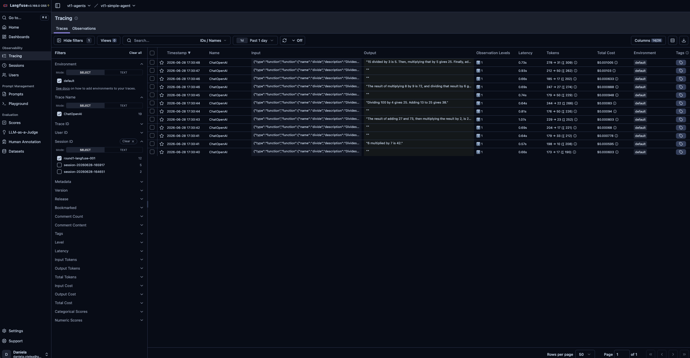

**Observation tree** — each node in the left panel shows the observation name, duration, token counts, and cost. The selected observation's detail (Input, Output as formatted JSON; Scores tab; Metadata) appears in the right panel.

From the A2A v2 researcher trace: the root observation is `a2a_orchestrator_run` (8.28 s total), with three `ChatOpenAI` generation children (3.69 s, 0.89 s, 1.56 s) and the A2A transport spans (`a2a.client.transports.jsonrpc.*`) visible alongside them. This makes the full distributed call chain readable in one trace.

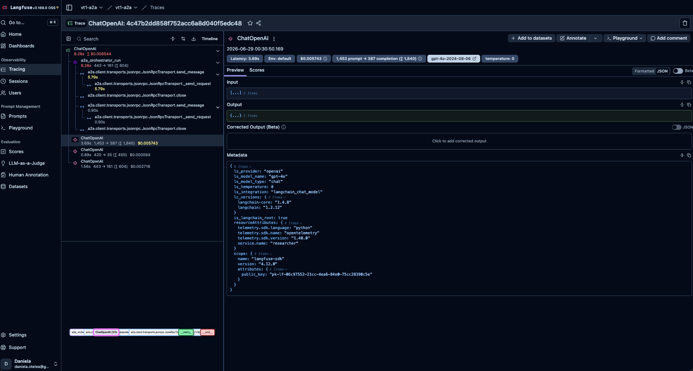

**Observation metadata.** Each generation observation carries a `Metadata` section populated by the `CallbackHandler` including: `ls_provider`, `ls_model_name`, `ls_model_type`, `ls_temperature`, `ls_integration` ("langchain_chat_model"), `is_langchain_root`, and `resourceAttributes` (`telemetry.sdk.*`, `service.name`). The `service.name` field ("researcher", "evaluator", "vt1-simple-agent") is stamped via `os.environ.setdefault("OTEL_SERVICE_NAME", ...)` at exporter init — visible confirmation that this one-liner in `_build_langfuse()` takes effect.

**Key structural difference from Phoenix.** In Phoenix, one entire agent run (all LLM + tool calls) is a single root trace with nested child spans. In Langfuse, each `model.invoke()` call that has `is_langchain_root: true` creates its own trace. For the simple agent's 5-query session, this produces 12 separate traces (some queries require 2–3 LLM round-trips). The session view re-groups them, but the Traces list alone does not show query-level grouping.

---

#### Token usage and cost attribution

Token counts and USD cost are captured automatically by the `CallbackHandler` from the `usage_metadata` attached to each LLM response. No manual instrumentation is required.

**Per-trace view** — each trace row in the Traces list shows a token badge (`input → output (Σ total)`) and a `Total Cost` column. Costs are calculated server-side using the model name reported by the API — no pricing configuration is required on the client.

**Cost dashboard** — the pre-built "Langfuse Cost Dashboard" (Dashboards → Cost) shows:
- Total Traces and Observations count
- Total costs time-series chart
- Cost by Model Name bar chart (shows exact model version: `gpt-4o-2024-08-06`)
- Cost by Environment donut chart
- Top 20 Use Cases (Trace) by Cost — aggregated by trace name
- Top 20 Use Cases (Observation) by Cost — aggregated by observation name

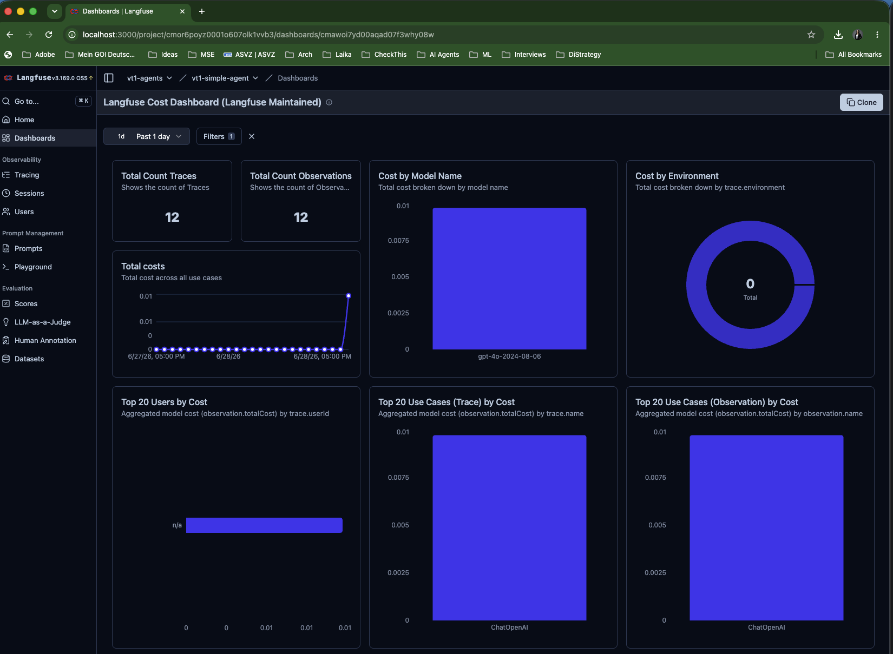

**Latency dashboard** — the pre-built "Langfuse Latency Dashboard" shows: P95 latency by use case (trace name), P95 latency by observation level, max latency by user, avg time to first token by prompt name, P95 latency by model, and avg output tokens per second by model.

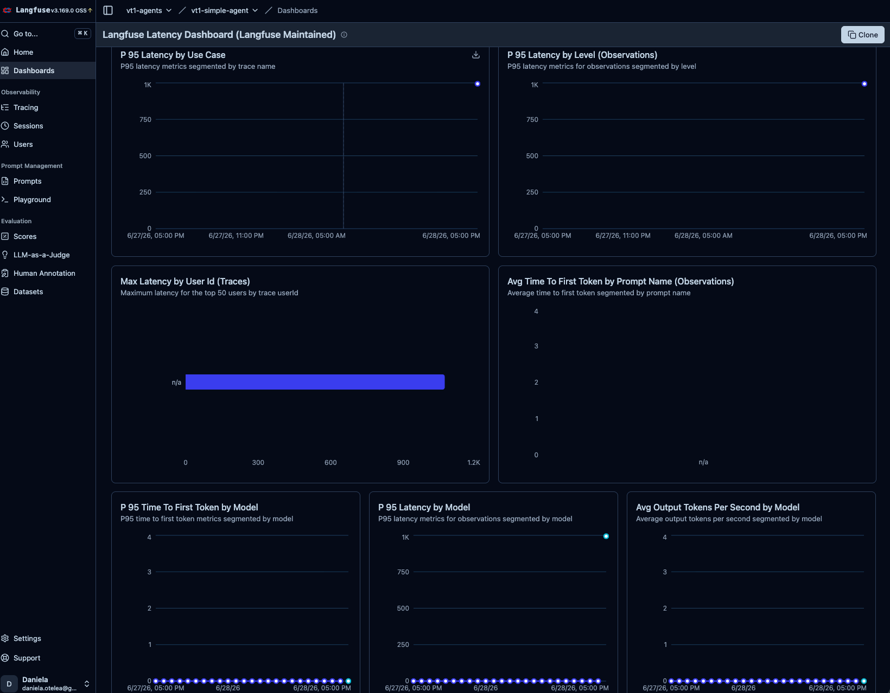

**Usage Management dashboard** — shows total trace count, total observation count, and numeric/categorical score counts over time, split by environment. In the simple agent round 1 session: 19 traces, 19 observations, **0 numeric scores, 0 categorical scores** — confirming that no evaluation scores were attached to this session.

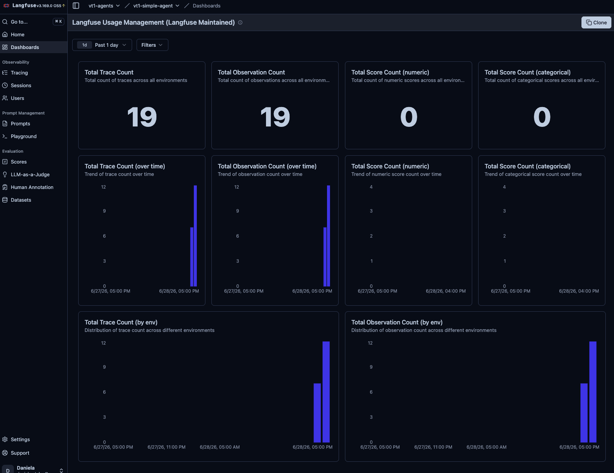

All three dashboards are Langfuse-maintained (cloneable via the "Clone" button) and update in near-real time as traces arrive. No dashboard configuration is required — activating the Langfuse exporter is sufficient to populate them.

---

#### Session grouping

Sessions are grouped in the **Sessions** tab by the `session_id` passed to `langfuse.propagate_attributes(session_id=...)` in `_LangfuseAdapter.session_ctx()`. The session view shows: total trace count, total cost, and the full input/output of each observation in the session scrollable in the centre panel.

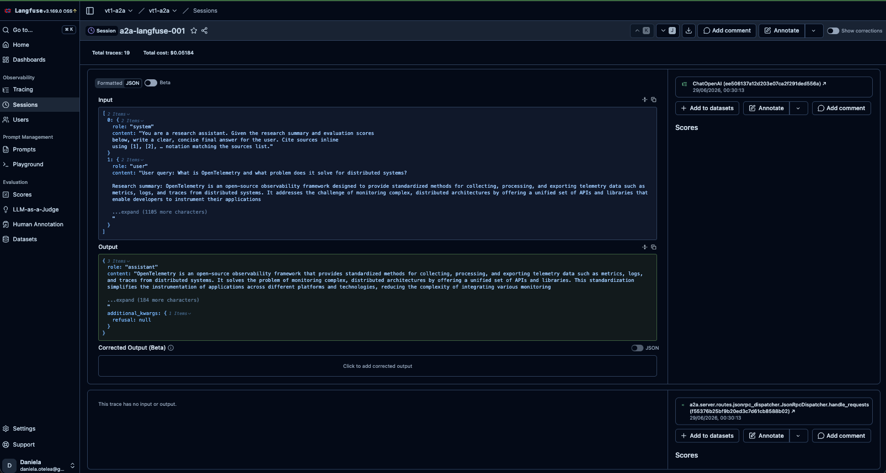

Unlike Phoenix's Sessions tab (which shows aggregated p50/p99 latency columns per session row), Langfuse's session view is a full-detail inspection view — each trace's content is directly visible without navigating away from the session page.

**Cross-service sessions (A2A v2).** In the A2A setup, orchestrator, researcher, and evaluator each run in separate processes. All three processes inject the same `session_id` via `propagate_attributes()`, so their traces appear together in the session view. The traces are listed as separate top-level entries (not nested under a single root trace), reflecting the distributed architecture.

---

#### LLM-as-judge evaluation scores

Langfuse has a first-class **Scores** system: numeric or categorical scores can be attached to any trace or observation either programmatically (`langfuse.score(trace_id=..., name=..., value=...)`) or via the UI annotation interface. The **LLM-as-a-Judge** menu item in the left sidebar provides a configuration UI for defining automated evaluation pipelines.

**Gap in this project.** The Usage Management dashboard from the simple agent round 1 session shows **Total Score Count (numeric): 0** and **Total Score Count (categorical): 0**. The multi-agent system's `EvaluatorAgent` computes faithfulness, completeness, and guardrail compliance scores internally as part of the LangGraph state, but these scores are not written back to Langfuse as Scores objects. This is a known gap: integrating `langfuse.score(trace_id=..., name="faithfulness", value=score)` after each evaluation step would make the scoring visible in the Scores tab and enable dashboard filtering by eval result.

---

#### Guard trigger visibility

The multi-agent system enforces four safety guards in `orchestrator.py`: `LoopDetectedError`, `PIIExposureError`, token explosion, and HITL escalation. These events are recorded in `AgentState.trace_events` (the in-process audit trail) but **are not automatically forwarded to Langfuse**.

In Phoenix, guard violations surface as error spans on the OTel trace because `LangChainInstrumentor` catches exceptions and sets the span status to ERROR. In Langfuse, because the `CallbackHandler` only intercepts LangChain callback events, a guard error raised *between* LLM calls (e.g., in the LangGraph routing node) does not produce a Langfuse observation. The traces simply end at the last successful LLM call without an error marker.

To make guard events visible in Langfuse, they would need to be explicitly logged as observations — e.g., using `langfuse.create_event(trace_id=..., name="guard_violation", input={"guard": "loop_detected"}, level="ERROR")`.

---

#### Cross-process trace correlation (A2A v2)

In the A2A v2 distributed system, each of the three processes (orchestrator, researcher, evaluator) initialises its own Langfuse SDK instance and sends traces independently. They are linked by a shared `session_id` propagated via `x-langfuse-trace-id` and `x-a2a-session-id` headers (see Pillar 1 for the full propagation mechanism).

The evaluator span detail shows the full LLM interaction — the evaluator's system prompt, the research summary passed as user input, and the structured JSON evaluation output — visible in the observation's Input and Output panes.


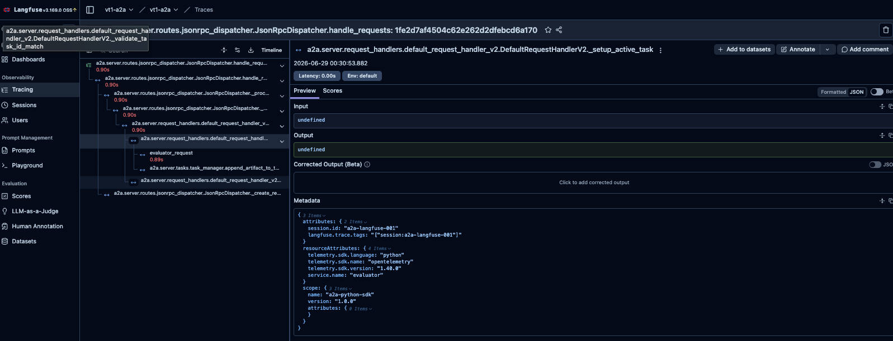

---

#### Trace filtering and querying

The **Traces** tab provides a structured left-panel filter sidebar. Available filter dimensions:

| Filter dimension | What it targets |
|---|---|
| Environment | `trace.environment` tag — separate dev, staging, prod runs |
| Trace Name | Component name (e.g., "ChatOpenAI") — select mode or free text |
| Session ID | Group all traces from a session — select or text search |
| User ID | `trace.userId` — filter by end user |
| Metadata | Any key in the `Metadata` dict |
| Latency | Min/max range in seconds |
| Input Tokens | Min/max token count |
| Output Tokens | Min/max token count |
| Total Tokens | Min/max total |
| Input Cost / Output Cost / Total Cost | USD range |
| Numeric Scores | Filter by attached score name + value range |
| Categorical Scores | Filter by attached score name + label |

Multiple filters can be combined. The session ID filter is the primary way to scope the view to a specific experiment run — as shown in the round 1 screenshot where filtering by `round1-langfuse-001` reduces from 19 to 12 traces (the 12 that belong to that session).

---

#### REST API and programmatic access

Langfuse exposes a versioned REST API (`/api/public/`) documented at https://langfuse.com/docs/api. The primary data objects:

- **`GET /api/public/traces`** — list traces with filter parameters (session, user, tags, time range)
- **`GET /api/public/observations`** — list observations (generations, spans, events) with filter parameters
- **`GET /api/public/sessions`** — list sessions with aggregate metrics
- **`POST /api/public/scores`** — attach evaluation scores to traces or observations programmatically
- **`GET /api/public/metrics/usage`** — aggregate token usage and cost over time

The Python SDK mirrors the REST API with `langfuse.get_traces()`, `langfuse.get_observations()`, and `langfuse.score()`. CSV export is also available from the Traces and Observations list views in the UI via the download button.

---

#### Observation metadata payload (Metadata tab — generation observation)

The following fields are populated automatically by `LangfuseCallbackHandler` on every generation observation. They are visible under the **Metadata** tab when an observation is selected in the trace detail view.

| Field | Example value | What it is |
|---|---|---|
| `ls_provider` | `"openai"` | LLM provider name as reported by the LangChain integration |
| `ls_model_name` | `"gpt-4o"` | Model identifier as configured in `ChatOpenAI(model=...)` |
| `ls_model_type` | `"chat"` | Model type — `"chat"` for chat-completion models |
| `ls_temperature` | `0` | Temperature value passed to the model |
| `ls_integration` | `"langchain_chat_model"` | LangChain integration type — identifies the callback origin |
| `is_langchain_root` | `true` | Marks this observation as the root of a LangChain run — determines whether a new Langfuse trace is created |
| `lc_versions.langchain-core` | `"1.4.8"` | LangChain core library version — useful for reproducibility |
| `lc_versions.langchain` | `"1.2.12"` | LangChain library version |
| `resourceAttributes.telemetry.sdk.language` | `"python"` | OTel resource attribute — SDK language |
| `resourceAttributes.telemetry.sdk.name` | `"opentelemetry"` | OTel resource attribute — SDK name |
| `resourceAttributes.telemetry.sdk.version` | `"1.40.0"` | OTel resource attribute — SDK version |
| `resourceAttributes.service.name` | `"researcher"` | OTel service name set via `OTEL_SERVICE_NAME` — distinguishes processes in the A2A setup |
| `scope.name` | `"langfuse-sdk"` | OTel instrumentation scope — identifies the Langfuse SDK as the instrumentation source |
| `scope.version` | `"4.12.0"` | Langfuse SDK version — confirms which SDK version produced the observation |

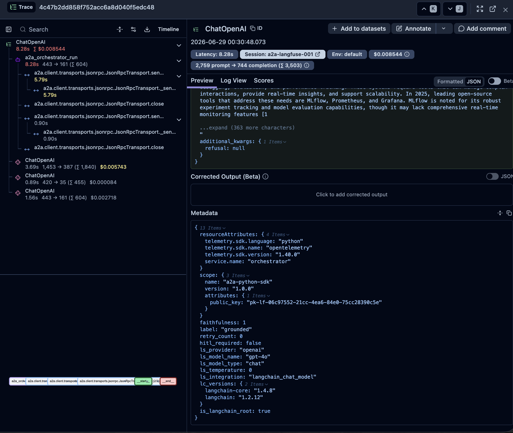

These are LangSmith-style metadata fields (`ls_*`) emitted by LangChain's internal callback machinery alongside the Langfuse-specific ones. They are not part of the OpenInference specification and are not displayed as typed attributes in the same way Phoenix does — they appear as a flat JSON dict in the Metadata tab rather than as named attribute rows.

The `resourceAttributes.service.name` field confirms that adding `os.environ.setdefault("OTEL_SERVICE_NAME", config.phoenix_project_name)` to `_build_langfuse()` takes effect: each process stamps its own name on all observations without any per-call configuration.

### Pillar 3: Operational Considerations (the "Cost")

| Evaluation category | Criteria | Langfuse |
|---|---|---|
| License | Distinguish between MIT/Apache 2.0 and open-core (enterprise license keys required) | **MIT** — the most permissive of the three tools. The full self-hosted version is free with no feature restrictions and no enterprise key required. [Langfuse Cloud](https://langfuse.com/pricing) offers Hobby (free), Pro, and Enterprise tiers — but the self-hosted codebase is identical to Cloud. |
| Deployment model | Local/Docker support vs. cloud SaaS only | **Docker Compose** (self-hosted, used in this project) — 6 containers: `langfuse-web`, `langfuse-worker`, `postgres`, `clickhouse`, `redis`, `minio`. First startup downloads images, runs DB migrations, and requires manual project and API key creation in the UI before the SDK can authenticate. Langfuse Cloud (`langfuse.com`) is the managed equivalent with identical features. No single-binary CLI option equivalent to `phoenix serve`. |
| Performance overhead | Ingestion latency and impact on the agent's end-to-end response time | **Async pipeline** — spans are queued (Redis → Worker → ClickHouse) rather than written synchronously. In practice this means a short delay (1–3 s) before a trace appears in the UI after a run completes, compared to Phoenix's near-instant display. No observable impact on agent end-to-end latency since ingestion is non-blocking from the SDK side. |
| Resource usage | Hardware requirements (PostgreSQL, ClickHouse, SQLite) | **Moderate footprint** — six containers as listed in Local Installation. PostgreSQL handles metadata; ClickHouse handles analytics; Redis queues ingestion jobs; MinIO stores large payloads; two Langfuse app containers (web + worker). Heavier than Phoenix (1 container, SQLite) but built for high trace volumes. |

**Observations from the A2A v2 experiment sessions:**

**Ingestion pipeline visibility.** In the Langfuse UI, traces from the A2A v2 sessions (orchestrator + researcher + evaluator) appeared within 2–3 seconds of the run completing — consistent with the async queue behaviour. The delay is predictable and does not affect debugging workflow.

**Dashboard analytics.** The built-in cost and usage dashboards (visible in `experiments/multi_agent_a2a/runs/screenshots/langfuse/`) aggregate token counts and USD cost across sessions automatically. This is a first-class feature not requiring any additional configuration — cost data is derived from model metadata attached by the `CallbackHandler`.

**Session grouping.** The session view correctly groups all traces from a single A2A run under one session ID. Researcher and evaluator spans appear as distinct top-level traces linked by session, reflecting the distributed architecture where each sub-agent process sends its own traces.

**UI responsiveness under A2A load.** Navigation between Sessions, Traces, and the individual span detail views remained fast across all sessions. The ClickHouse analytics backend handles the span-level queries without noticeable latency even with 30–50 spans per session.

---

## Round 1 Results (Simple Agent)

Data source: `experiments/simple_agent/runs/round1-langfuse-001.json`

The simple agent ran 5 arithmetic queries of increasing complexity (1 to 3 tool calls). All 5 completed without errors.

| Metric | Value |
|---|---|
| Total latency (5 queries) | 8 850 ms |
| Avg latency per query | 1 770 ms |
| Total input tokens | 2 504 |
| Total output tokens | 347 |
| Total cost | $0.0177 |
| Errors | 0 |

> **Cost note:** The `$0.0177` figure comes from `CostTracker`, which uses the pricing constants configured in `AgentConfig` ($5.00/$15.00 per million input/output tokens — the original gpt-4o list price). Langfuse's server-side cost calculation uses current model pricing for `gpt-4o-2024-08-06` ($2.50/$10.00 per million tokens), producing a ~2× lower figure ($0.009 in the session view). Both represent the same token usage; the difference is pricing constant only. The Langfuse-reported cost is more accurate for the model version actually used.

**Trace names do not reflect query content.** All 12 traces in the session are named "ChatOpenAI" — the LangChain component name, not the user query or agent step. The query itself is visible only by opening the trace and reading the `input` field. This is a discoverability limitation: the Traces list provides no quick scan of what each trace represents unless Session ID filtering is applied first.


**Per-trace cost and token counts visible in list view.** Each row in the Traces list shows `input → output (Σ total)` tokens and a `Total Cost` USD value computed server-side. Cost attribution works correctly out of the box — no pricing configuration is required on the client side, and the model version (`gpt-4o-2024-08-06`) is picked up automatically from the LLM response metadata.

**Cost dashboard pre-populated.** The Langfuse Cost Dashboard showed all 12 traces aggregated by model and environment immediately after the run — no dashboard configuration was needed.


**Latency dashboard.** P95 latency by use case, P95 by model, average time to first token, and average output tokens per second are all pre-computed in the Latency Dashboard without any additional setup.


**No evaluation scores.** The Usage Management dashboard shows 0 numeric and 0 categorical scores for this session, confirming that the simple agent run produces no Langfuse score objects. The EvaluatorAgent is not part of the simple agent pipeline, so this is expected.

## Round 2 Results (Multi-Agent)

Data sources: `experiments/multi_agent/runs/round2-langfuse-001.json` and `experiments/multi_agent_a2a/runs/screenshots/langfuse/`

### Observation metadata captured during Round 2 (multi-agent, research node)

Langfuse captures LangGraph execution metadata via the `CallbackHandler`. The `Metadata` section of a research-node generation from session `round2-langfuse-001`:

```json
{
  "ls_provider": "openai",
  "ls_model_name": "gpt-4o",
  "ls_model_type": "chat",
  "ls_temperature": 0,
  "ls_integration": "langchain_chat_model",
  "is_langchain_root": true,
  "lc_versions": { "langchain-core": "1.4.8", "langchain": "1.2.12" },
  "resourceAttributes": {
    "telemetry.sdk.language": "python",
    "telemetry.sdk.name": "opentelemetry",
    "telemetry.sdk.version": "1.40.0",
    "service.name": "vt1-multi-agent"
  },
  "scope": { "name": "langfuse-sdk", "version": "4.12.0" }
}
```

**Key gap: LangGraph node names are absent from trace names.** The field `langgraph_node` (present in Phoenix's span metadata as `langgraph_node: "research"`) does not appear in the Langfuse metadata. Every LangGraph node execution produces a trace named "ChatOpenAI" — the node name (`research`, `evaluate`, `synthesize`) is visible only in the LangGraph flow diagram rendered at the bottom of the trace detail view, not as the trace name or as a filterable metadata key.

### v1 in-process results (`round2-langfuse-001`)

| Metric | Value |
|---|---|
| Total latency (5 queries) | 45 615 ms |
| Avg latency per query | 9 123 ms |
| Avg faithfulness | 0.80 |
| Total retries | 3 |
| HITL escalations | 1 |
| Total cost | $0.1097 |
| Errors | 0 |

> **Cost note:** The `$0.1097` figure comes from `CostTracker` using $5.00/$15.00 per million tokens. Langfuse's session view reports ~$0.056 for the same run using current `gpt-4o-2024-08-06` pricing ($2.50/$10.00 per million tokens) — a ~2× difference in pricing constant, not in token usage. The Langfuse-reported cost is the more accurate figure.

Q3 (comparative — Phoenix vs Langfuse) triggered 3 retries and HITL escalation with faithfulness = 0.0 on every attempt. This matches the Phoenix round 2 result exactly: the model's own training data about itself is not grounded in the retrieved web sources, causing the evaluator to label every retry as hallucinated.

**Trace structure — one trace per LangGraph node, not one per query.** Each agent node (research, evaluate, synthesize) creates its own Langfuse trace named "ChatOpenAI". A 5-query run with no retries produces 15 traces (5 × 3 nodes). Q3's 3 retries added 4 more, for 19 total in session `round2-langfuse-001`. There is no single query-level trace — seeing the full pipeline requires the session page.

**Research node trace** — the `research` node trace shows the researcher's full system prompt and the web-sourced content in the Input pane, and the structured JSON summary (`{"summary": "...", "sources": [...]}`) in the Output pane. The LangGraph flow diagram (`__start__` → `research` → `__end__`) is visible at the bottom.

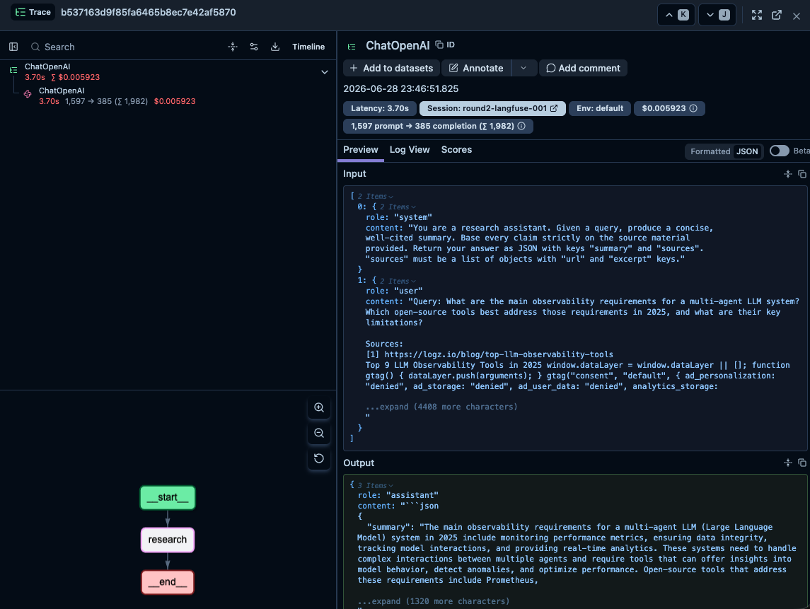

**Evaluate node trace** — the `evaluate` node trace shows the evaluator's judge prompt with the research summary injected as user content, and the structured JSON evaluation result (`{"faithfulness": 1.0, "label": "grounded", "reasoning": "..."}`) in the Output pane. The cost for the evaluator (`gpt-4o-mini`) is visible in the header badge: $0.000107 for 495 → 54 tokens.

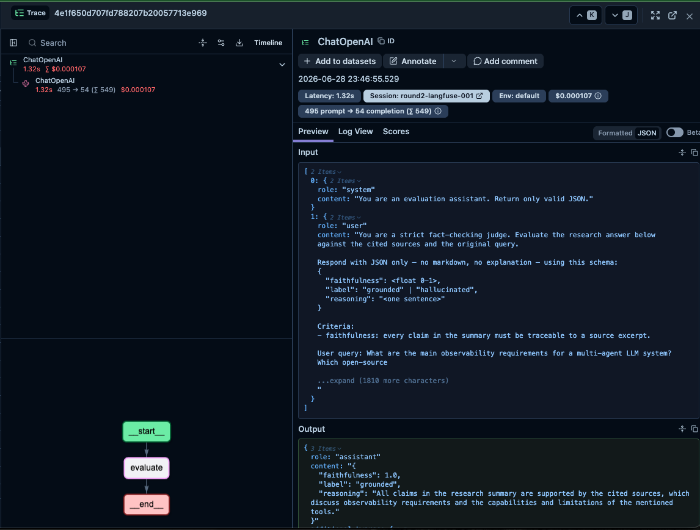

**Synthesize node trace** — the `synthesize` node trace shows the orchestrator's synthesis prompt with the research summary and evaluation scores, and the final user-facing answer in the Output pane.

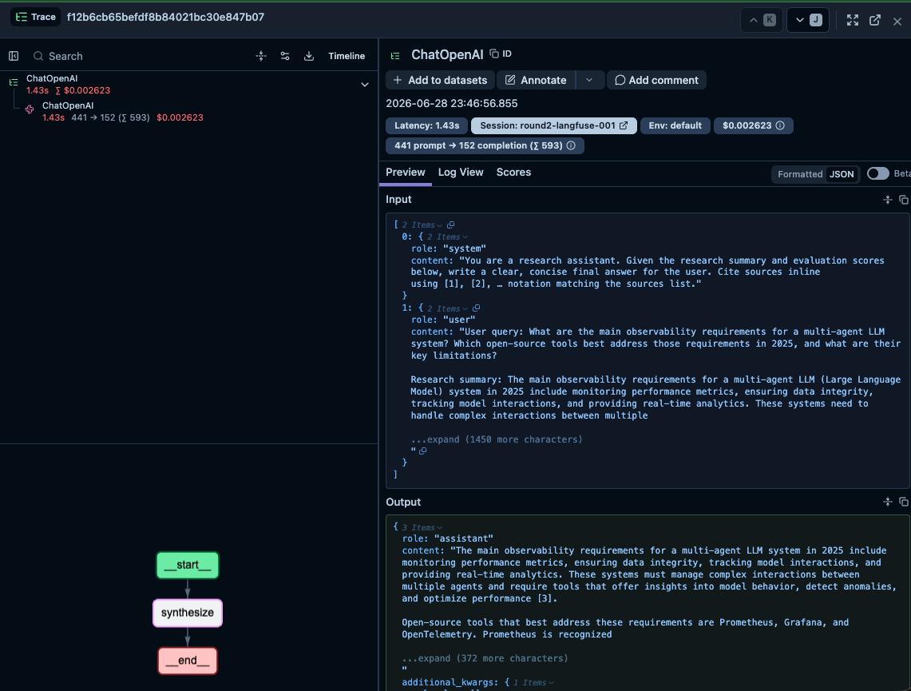

**Guard events — not visible.** Guard triggers (`low_faithfulness`, `low_confidence`, `hitl_escalation`) fired 7 times across Q3's retries, all recorded in `AgentState.trace_events`. None of these appear in the Langfuse trace view — no error observations, no warning markers. The traces for Q3's retried `research` and `evaluate` nodes look identical to successful ones. This confirms the guard visibility gap documented in Pillar 2.

**Session grouping works.** The Session badge (`Session: round2-langfuse-001`) is visible on each trace header and links back to the session view, where all 19 traces are listed together with the total cost.

### v2 A2A distributed results (`a2a-langfuse-001`)

| Metric | Value |
|---|---|
| Total traces in session | 19 |
| Total session cost | $0.05184 |
| Errors | 0 |

**Session groups all three processes.** The `a2a-langfuse-001` session correctly groups traces from the orchestrator, researcher, and evaluator processes — each running independently and sending traces to the same Langfuse project via its own SDK instance. The session view shows all 19 traces together with the full input/output content of each observation.


**Trace structure — three separate top-level traces per query (not one unified trace).** Unlike Phoenix where W3C `traceparent` nests all three service spans under one root trace, Langfuse's `x-langfuse-trace-id` propagation links sub-agent observations to the orchestrator trace as siblings in the session — not as children of a single root. Navigating the distributed call requires switching between traces in the session view rather than expanding a single trace tree.

**Researcher and evaluator span content fully visible.** The researcher trace shows the full research query, sourced content, and JSON summary. The evaluator trace shows the judge prompt with the research summary injected, and the JSON evaluation result. Both are inspectable directly from the session view.


**Cost and latency dashboards populated.** The pre-built Cost and Latency dashboards reflect A2A session data with no additional setup. Cost is broken down per model and per environment; latency metrics include P95 by use case and average TTFT by model.

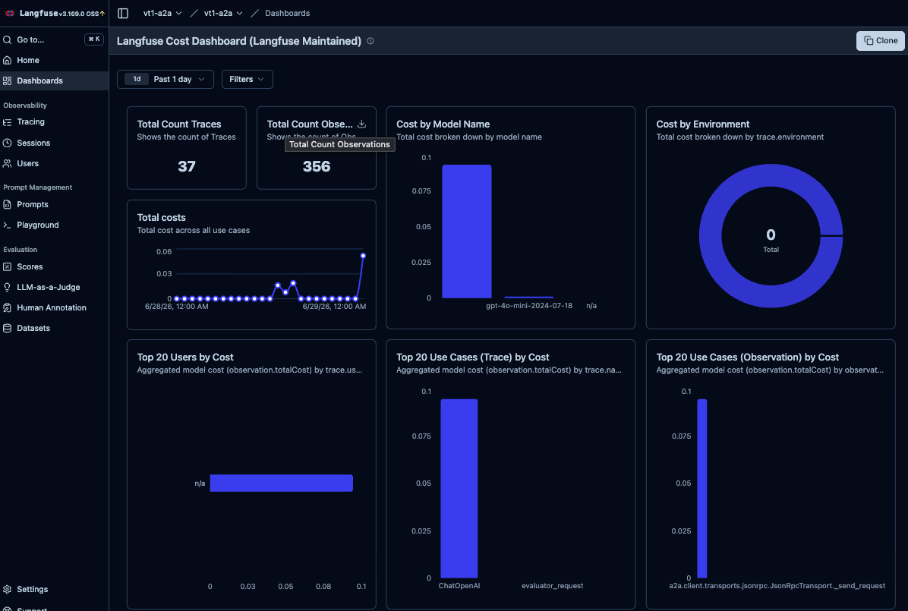

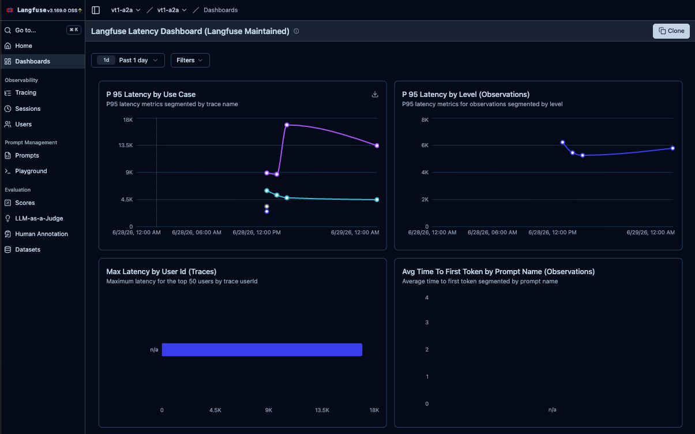

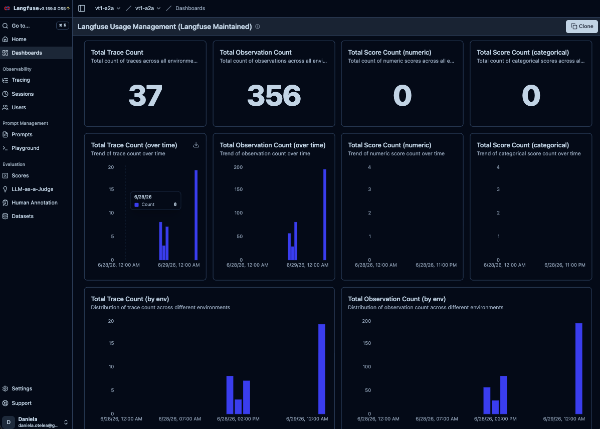
