# Comet Opik — Evaluation

## Overview

Comet Opik is an open-source LLM observability platform. It can be self-hosted locally via
Docker Compose. The SDK integrates with LangChain via an `OpikTracer` callback.

**Key documentation references:**

| Topic | Link |
|---|---|
| GitHub repository | https://github.com/comet-ml/opik |
| Tracing concepts (traces, spans, threads) | https://www.comet.com/docs/opik/tracing/concepts |
| Python SDK quickstart | https://www.comet.com/docs/opik/python-sdk-reference/overview |
| LangChain integration (`OpikTracer`) | https://www.comet.com/docs/opik/tracing/integrations/langchain |
| LangGraph integration (`track_langgraph`, `OpikTracer` callback) | https://www.comet.com/docs/opik/integrations/langgraph |
| Threads (sessions) | https://www.comet.com/docs/opik/tracing/log_traces#logging-threads |
| Distributed tracing | https://www.comet.com/docs/opik/tracing/advanced/log_distributed_traces |
| OpenTelemetry integration (OTLP endpoint, authentication) | https://www.comet.com/docs/opik/integrations/opentelemetry |
| Self-host architecture | https://www.comet.com/docs/opik/self-host/architecture |

**SDK version used in this project:** `opik>=2.1.4`

---

## Local Installation

### 1. Start the server - Local environment

Opik is distributed as a standalone repository with its own startup script — it is not bundled as a Docker Compose file inside this project. See `infra/opik/OPIK-SETUP.md` for the full setup walkthrough. The short form:

```bash
# Clone once (if not already present)
git clone https://github.com/comet-ml/opik.git /path/to/opik

# Start (eight containers, UI at http://localhost:5173)
cd /path/to/opik
./opik.sh

# Stop
./opik.sh --stop
```

The default `./opik.sh` command starts **eight containers**:

| Container | Image | Purpose |
|---|---|---|
| `backend` | `opik-backend` (Java 25 + Dropwizard) | REST API, authentication, business logic |
| `python-backend` | `opik-python-backend` (Flask + Gunicorn) | Evaluator execution and optimisation workflows |
| `frontend` | `opik-frontend` (Nginx + React) | Web UI reverse-proxied via Nginx |
| `mysql` | `mysql:8.4.2` | Primary relational store (metadata, users, traces index) |
| `clickhouse` | `clickhouse-server:25.3` | Analytics store (high-volume trace ingestion, dashboards) |
| `zookeeper` | `zookeeper:3.9.4` | ClickHouse cluster coordination |
| `redis` | `redis:7.2.4` | Queue and cache |
| `minio` | `minio/minio` | Object storage for large payloads (S3-compatible) |

Optional: a `guardrails-backend` container is available with `./opik.sh --guardrails`. The docker-compose also defines `jaeger` and `otel-collector` services (not started by default — these forward Opik's own application telemetry to external monitoring, not for receiving user agent traces).

- **Web UI** at http://localhost:5173
- **Backend API** at http://localhost:8080

Data is persisted in named volumes (`opik_mysql_data`, `opik_clickhouse_data`). No account
registration is needed for self-hosted mode.

> **Troubleshooting:** check `docker compose -f infra/opik/docker-compose.yml logs -f`
> if the UI doesn't load within 60s — the backend can take a minute on first launch.

### 2. Configure environment variables

No API key is needed for local self-hosted Opik. Just point the SDK at the local server:

Add to `.env`:
```
OPIK_URL_OVERRIDE=http://localhost:5173/api
OPIK_PROJECT_NAME_SIMPLE_AGENT=vt1-simple-agent
OPIK_PROJECT_NAME_MULTI_AGENT=vt1-multi-agent
```

Each agent reads its own project-name env var (`OPIK_PROJECT_NAME_SIMPLE_AGENT` / `OPIK_PROJECT_NAME_MULTI_AGENT`) and passes it to `OpikTracer(project_name=...)`. A2A runs use a third project (`vt1-a2a`) set via `OPIK_PROJECT_NAME_A2A`.

### 3. Install the SDK

```bash
pip install opik
```

### 4. Connecting to the agent

Use `exporter="opik"` in `AgentConfig` / `MultiAgentConfig`:

```python
from src.simple_agent.agent import build_agent
from src.simple_agent.config import AgentConfig

agent = build_agent(config=AgentConfig(exporter="opik"))
agent.invoke([HumanMessage(content="What is 6 * 7?")])
```

`opik.configure(use_local=True)` reads `OPIK_URL_OVERRIDE` and `OPIK_PROJECT_NAME` from
the environment. The `OpikTracer` callback is then passed to every `model.invoke()` call.

### 5. Verifying traces appear

Open http://localhost:5173 → **Projects** → `vt1-simple-agent` (or `vt1-multi-agent` for the multi-agent). Each `agent.invoke()` call should appear as a trace with LLM and tool spans visible in the trace detail view.

---

## Known Limitations (Wire Protocol, Semantic Conventions, OTel Compliance)

| Area | Dimension | Status | Detail |
|---|---|---|---|
| OTLP wire protocol | Wire | ⚠️ Supported (HTTP only, not used) | Opik exposes an OTLP/HTTP endpoint at `/api/v1/private/otel/v1/traces`. Authentication requires three headers: `Authorization` (API key), `projectName`, and `Comet-Workspace`. In this project, the `OpikTracer` callback approach is used instead — the OTLP endpoint was not exercised. See [Opik OTel integration docs](https://www.comet.com/docs/opik/integrations/opentelemetry). |
| OpenInference span attributes | Semantic (OpenInference) | ❌ Not supported | Opik does not interpret OpenInference attribute names (`llm.*`, `openinference.span.kind`). Attribute names follow Opik's own schema. |
| OTel GenAI semconv (`gen_ai.*`) | Semantic (OTel GenAI) | ❌ Not consumed | Opik does not natively interpret `gen_ai.request.model`, `gen_ai.usage.input_tokens`, etc. |
| Thread / session grouping | Session | ✅ First-class (2.x) | `OpikTracer(thread_id=session_id)` groups traces under a conversational thread in the UI. In SDK < 2.x, only `metadata={"session_id": ...}` was available (searchable field only, no UI grouping). |
| Cross-process span linking (A2A) | OTel Compliance | ✅ Implemented via `@opik.track` wrapper | Opik uses `opik_trace_id` + `opik_parent_span_id` headers (not W3C). The `_OpikAdapter.tracked()` method wraps the entire orchestrator run in `@opik.track`, creating an active Opik span throughout execution. This enables `opik_context.get_distributed_trace_headers()` to return valid headers for outgoing A2A calls. Sub-agent spans appear as children of the orchestrator's root trace — confirmed by A2A experiment results (5 traces, one per query, all sub-agent ChatOpenAI spans nested under `a2a_orchestrator_run`). This uses Opik-specific propagation rather than standard W3C `traceparent`. |
| OTel Resource attributes | Resource | ❌ Not applicable | No OTel Resource concept. Service name/version/environment are not attached to traces. Multiple A2A services are distinguished by separate Opik projects or by span metadata fields. |
| Exception recording | OTel Compliance | ⚠️ Missing | `OpikTracer` has no mechanism to flag a trace as errored via OTel status codes. A run that raises `LoopDetectedError` or `PIIExposureError` produces a trace indistinguishable from a successful one in the UI. |
| Span events for guard triggers | OTel Compliance | ❌ Not supported | Opik has no OTel-style span events. `TraceEvent` guard records (loop detection, PII, HITL escalation) cannot be attached to an Opik trace. |
| Token/cost span attributes | Semantic (cost) | ⚠️ Partial | `OpikTracer` captures token counts from LangChain's `LLMResult` callback. Custom `cost.usd` from `CostTracker` is not attached to spans. |
| Sampling rate | OTel Compliance | ⚠️ Unused | No sampler concept in the Opik SDK. `AgentConfig.sampling_rate` has no effect. |
| Span kind (`AGENT`, `TOOL`, `CHAIN`) | Semantic (OTel) | ⚠️ Implicit | Span types are inferred from LangChain callback event names, not from explicit OTel `openinference.span.kind` attributes. |
| **UI authentication** | Security | ❌ None (OSS) | Standard self-hosted Opik has no login screen. Single-tenant instance — anyone who can reach the deployment port can access the full dashboard and all telemetry data. Secure at the infrastructure level (e.g. NGINX Basic Auth reverse proxy). |
| **API / ingestion auth** | Security | ❌ None by default | No API key mechanism in the open-source edition. Ingestion endpoints are open to anyone on the network. |
| **SSO / RBAC** | Security | ❌ Enterprise only | Username/Password, SAML SSO, OIDC, Google/GitHub OAuth, and LDAP are all locked behind the Opik Enterprise paid plan. |

---

## Three-pillar evaluation

### Community assessment (external perspective)

**Strengths (as observed across documentation and community feedback):**
- Apache 2.0 licence with full feature availability in the self-hosted version
- No account or API key required for local self-hosted mode — lowest setup friction of the three tools
- First-class production features: alerting (Slack, PagerDuty, webhooks), CI/CD experiment hooks, annotation queues
- Native Kubernetes deployment and horizontal scaling via ClickHouse + Zookeeper
- Comet ML Cloud parity — self-hosted and cloud versions share the same feature set
- `@opik.track` decorator provides flexible manual instrumentation for any Python function

**Limitations (as observed across documentation and community feedback):**
- Most complex self-hosted footprint: 8 containers by default, Kubernetes-native design is not optimised for laptop development
- Slower cold start compared to Phoenix (single container) and Langfuse
- SSO, RBAC, and advanced security features locked behind the Enterprise plan
- No built-in PII/data masking in the self-hosted OSS version
- OTLP/LangChain auto-instrumentation path is less documented than the callback approach

> **Note:** The "complex footprint" observation is confirmed: `./opik.sh` starts 8 containers. The "no API key for local" strength is confirmed — `OPIK_URL_OVERRIDE` and `OPIK_PROJECT_NAME` are sufficient.

---

### Pillar 1: Integration and Instrumentation Capabilities (The "How")

#### Implementation scope: native SDK vs. OTel-native path

Opik supports two distinct instrumentation paths. **This project uses the native SDK path exclusively.**

The initial integration was built using Opik's `OpikTracer` callback SDK approach, which was the primary supported and documented method at the time of development. Opik's native OTLP endpoint (`/api/v1/private/otel/v1/traces`) was evaluated later in the development cycle. To maintain system stability, migrating the established callback architecture to an OTel-native pipeline is recorded as a proposed future improvement rather than applied as a current implementation change.

| Dimension | Native SDK path *(used in this project)* | OTel-native path *(not used)* |
|---|---|---|
| Instrumentation mechanism | `OpikTracer` injected per `model.invoke()` call | `OpenAIInstrumentor` or custom `LangChainInstrumentor` + OTLP to `/api/v1/private/otel/v1/traces` |
| Missed calls | Any `model.invoke()` without explicit tracer is invisible | None — auto-instrumentation patches calls globally |
| Sampling | Not supported; all traces always sent | Supported via `OTEL_TRACES_SAMPLER` |
| Attribute schema | Opik tool-specific schema | OpenInference or OTel GenAI semconv |
| Session propagation | `OpikTracer(thread_id=...)` per-call | W3C Baggage + `BaggageSpanProcessor` |
| A2A context propagation | Opik-specific `opik_trace_id` / `opik_parent_span_id` headers | Standard W3C `traceparent` — interoperable with any OTel-aware service |
| Auth for local self-hosted | No auth required | 3 headers required (`Authorization`, `projectName`, `Comet-Workspace`) |

**Note:** unlike Langfuse's OTLP path (where `LangChainInstrumentor` + OTLP is explicitly documented), Opik's OTel integration docs demonstrate OpenAI instrumentation only. A LangChain + OTLP path would require custom `TracerProvider` configuration and is not directly documented by Opik at the time of this evaluation.

**Evaluation scope acknowledgment.** The limitations above — no global auto-instrumentation, per-call injection, no sampling, no OpenInference attributes, Opik-specific A2A propagation — reflect the SDK path chosen for this project, not fundamental platform constraints. Opik supports OTel-native instrumentation.

---

| Evaluation category | Criteria | Comet Opik |
|---|---|---|
| Native libraries | Support for Python/TypeScript SDKs and popular agent frameworks (LangChain, CrewAI, Google ADK) | ✅ Python SDK (`opik`). LangChain / LangGraph: ✅ `OpikTracer` per-call callback (used in this project). OpenAI SDK: ✅ `opik.integrations.openai`. CrewAI: ✅ via `@opik.track` decorator. Google ADK: ⚠️ no native integration (manual `@opik.track`). Any Python function: ✅ `@opik.track` decorator. |
| Ingestion formats | Support for OpenInference and OpenTelemetry (OTel) standards | ⚠️ Partial. **Opik SDK format** (proprietary REST, used in this project): ✅ LangChain events translated client-side by `OpikTracer`. **OTLP `/api/v1/private/otel/v1/traces`**: ✅ supported (not used — see implementation scope below). **OpenInference semantic conventions** (`llm.*`, `openinference.span.kind`): ❌ not consumed or displayed. |
| Auto-instrumentation | Ability to capture agent spans, tool calls, and model parameters without manual decorators on every call | ❌ **No global auto-instrumentation.** `LangChainInstrumentor` is explicitly removed (`_uninstrument_langchain()`) to avoid OTel interference. Every `model.invoke()` must pass `RunnableConfig(callbacks=[tracer])` explicitly. If a call is made without the tracer, it produces no trace entry. |
| Data exporters | API/SDK access, JSON/CSV exports | ✅ REST API (`/api/v1/traces`, `/api/v1/spans`), Python SDK helpers, CSV export from the UI. Slack, PagerDuty, and generic webhook notifications available on Cloud; self-hosted availability unconfirmed. |

**Setup friction — lowest of the three.** Setting `OPIK_URL_OVERRIDE` and `OPIK_PROJECT_NAME` in `.env` is sufficient; `opik.configure(use_local=True)` reads these at import time. There is no `auth_check()` call — a wrong URL silently drops spans instead of raising an error at startup.

**`OpikTracer` callback — per-call injection required.** Like Langfuse's `CallbackHandler`, `OpikTracer` is injected per `model.invoke()` call. A new instance is created for each call via `_OpikAdapter.callback()`:

```python
def callback(self, session_id=None, **kwargs):
    return OpikTracer(
        project_name=self._project,
        thread_id=session_id or None,
        distributed_headers=kwargs.get("distributed_headers") or None,
    )
```

The `thread_id` parameter groups all traces from a session into the Threads view. If a call is made without the tracer, it produces no entry — there is no global patch catching missed calls.

**LangGraph integration option used — per-LLM-call callback (Option 2 variant).** Opik's [LangGraph integration docs](https://www.comet.com/docs/opik/integrations/langgraph) present two approaches:

| Option | How it works | When to use |
|---|---|---|
| **`track_langgraph(app, opik_tracer)`** (recommended) | Wraps the compiled graph once; all subsequent `app.invoke()` calls are automatically tracked | Static tracer with no per-session state |
| **`OpikTracer` via `config={"callbacks": [opik_tracer]}`** | Passes the tracer at each `app.invoke()` call | Different tracers per invocation |

This project uses **neither of these directly**. Instead, `OpikTracer` is injected at the individual `model.invoke()` level inside each LangGraph node — not at the graph's `invoke()` call. A new `OpikTracer(thread_id=session_id)` instance is created per node execution via `_OpikAdapter.callback(session_id)`, and passed as a LangChain callback to `model.invoke()`. This is a lower-level variant of Option 2.

The reason `track_langgraph` (Option 1) could not be used: `session_id` (the `thread_id` that groups traces into a conversation thread) is read from LangGraph's `RunnableConfig.configurable` at node execution time — it is not known when the graph is compiled or when `OrchestratorAgent.__init__` runs. A single `OpikTracer` instance wrapped at graph construction time cannot carry a dynamically determined `thread_id` per call. Creating a fresh `OpikTracer(thread_id=session_id)` inside each node is the only way to bind the correct session identity at the LLM call level.

**Session grouping — via `thread_id`.** Unlike Langfuse's `propagate_attributes()` context manager, Opik groups traces per-call: each `OpikTracer(thread_id=session_id)` attaches the trace to that thread at creation time. All calls within the same session pass the same `session_id` as `thread_id`, so all traces appear together in the **Threads** tab. No context manager or wrapper is required beyond the per-call parameter.

**Cross-process instrumentation (A2A v2).** The `_OpikAdapter.tracked()` method wraps the entire orchestrator run in `@opik.track`, creating an active Opik span for the full execution duration:

```python
@opik.track(name="a2a_orchestrator_run", project_name=project,
            capture_input=False, capture_output=False)
async def _tracked(*args, **kwargs):
    if _sid:
        opik_context.update_current_trace(thread_id=_sid)
    return await fn(*args, **kwargs)
```

With an active span in scope, `opik_context.get_distributed_trace_headers()` returns valid `opik_trace_id` and `opik_parent_span_id` headers when LangGraph routing nodes make outgoing A2A calls. Sub-agents receive these via `OTelContextMiddleware` and pass them to `OpikTracer(distributed_headers=...)`, which links their LLM spans as children of the orchestrator's root trace. The A2A experiment confirms this works: 5 traces (one per query), all sub-agent ChatOpenAI spans nested under `a2a_orchestrator_run` in one span tree.

This uses Opik-specific headers, not standard W3C `traceparent`. A sub-agent on a different backend would not interpret these headers.

**No resource attributes.** Opik has no OTel Resource concept. No `service.name`, `telemetry.sdk.*`, or environment attribute is attached to traces. In the A2A setup, orchestrator, researcher, and evaluator are distinguished by separate Opik projects and by span metadata fields — not by resource-level attributes.

---

### Pillar 2: Capabilities (the "What")

#### Supported LLM providers and agent frameworks

Opik captures LangChain/LangGraph traces via the `OpikTracer` callback. All LangChain-supported models are captured once the tracer is injected.

**LangChain / LangGraph integration** (used in this project):

| Component | How it is captured |
|---|---|
| `ChatOpenAI` (LLM call) | `on_llm_start` / `on_llm_end` → LLM call span with input messages, output, token counts, model name, latency |
| Tool call (`multiply`, `divide`, etc.) | `on_tool_start` / `on_tool_end` → tool call span with input args and output |
| LangGraph node transitions | `on_chain_start` / `on_chain_end` → chain span per node; `langgraph_node`, `langgraph_step`, `langgraph_path` extracted automatically from run metadata |
| Errors | `on_llm_error` / `on_tool_error` → span with error flag |

**Key positive differentiator vs. Langfuse.** Opik automatically extracts `langgraph_node`, `langgraph_step`, `langgraph_triggers`, and `langgraph_path` from LangChain's run metadata and stores them as span metadata fields. In Langfuse, `langgraph_node` is absent — node identity is only visible in the LangGraph flow diagram, not as a searchable metadata key. In Opik, filtering by `langgraph_node: synthesize` is possible directly from the Traces list metadata filter.

---

#### Trace and observation hierarchy

In Opik, each `model.invoke()` root call creates one **trace**. Nested LLM calls, tool invocations, and LangGraph chain transitions become child **spans** within that trace. This structure mirrors Langfuse's per-LLM-call trace model.

For the simple agent's 5-query session (`round1-opik-001`), this produces **13 traces** (some queries require 2–3 LLM round-trips, each creating a trace) and **16 LLM call spans** (some traces contain multiple nested spans). Trace names display the actual user query input — a **discoverability advantage over Langfuse**, where trace names are always "ChatOpenAI".

The Logs view provides three tabs:
- **Threads** — groups all traces from a session by `thread_id`, showing the full conversation as a scrollable message list with aggregate cost and message count
- **Traces** — lists individual root traces with input/output preview, duration, token count, and estimated cost
- **Spans** — flat list of all spans across all traces, filterable by type (`LLM call`, `tool call`, `chain`)

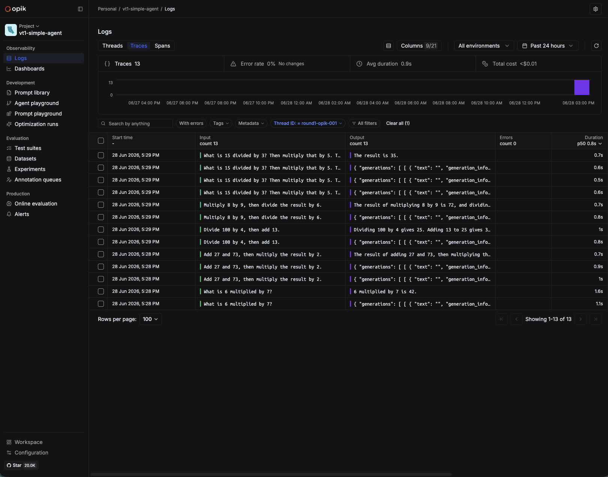

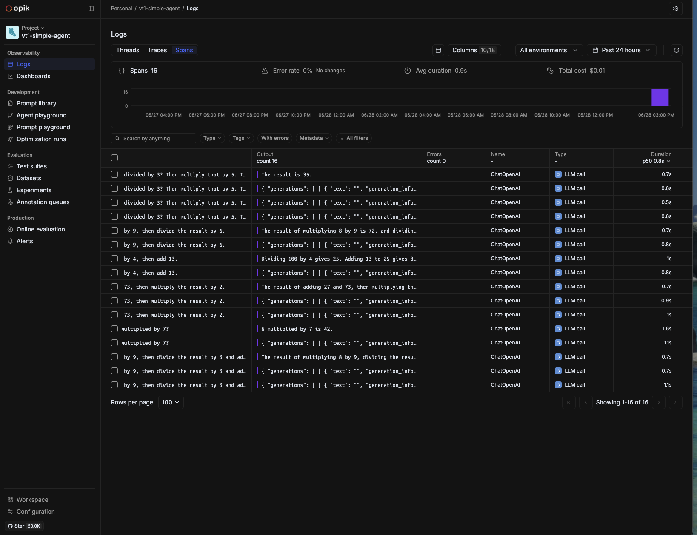

---

#### Token usage and cost attribution

Token counts are captured from LangChain's `LLMResult` callback automatically. The token payload includes the full OpenAI response breakdown: `completion_tokens`, `prompt_tokens`, `total_tokens`, plus `completion_tokens_details` (`accepted_prediction_tokens`, `audio_tokens`, `reasoning_tokens`, `rejected_prediction_tokens`) and `prompt_tokens_details` (`audio_tokens`, `cached_tokens`).

Opik computes an **estimated cost** server-side and displays it per trace and in the dashboard — visible as "Total estimated cost sum" in the Project Overview dashboard and as an "Estimated cost" column in the Traces list. Unlike Langfuse (which shows exact model-version pricing), Opik labels this as an estimate. Custom `cost.usd` from `CostTracker` is not attached to spans.

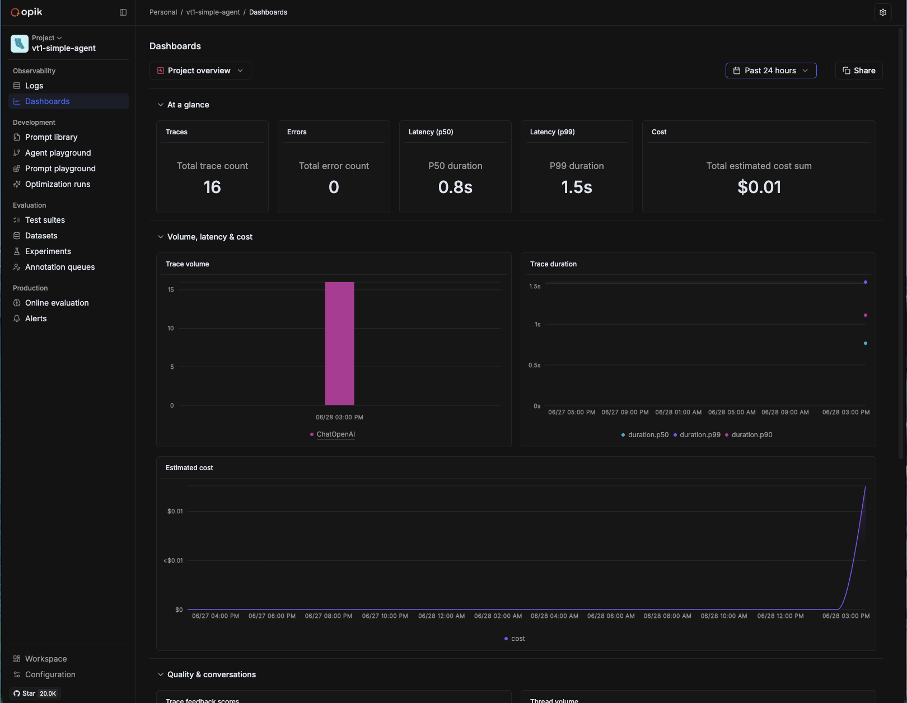

---

#### Session and thread grouping

The **Threads** tab groups all traces from a session by `thread_id` (see Pillar 1 for the grouping mechanism). The thread detail panel shows: total messages, total duration, total cost, and the full input/output of every message — including the model response, token usage breakdown, and `response_metadata` (model name, `system_fingerprint`, `finish_reason`).

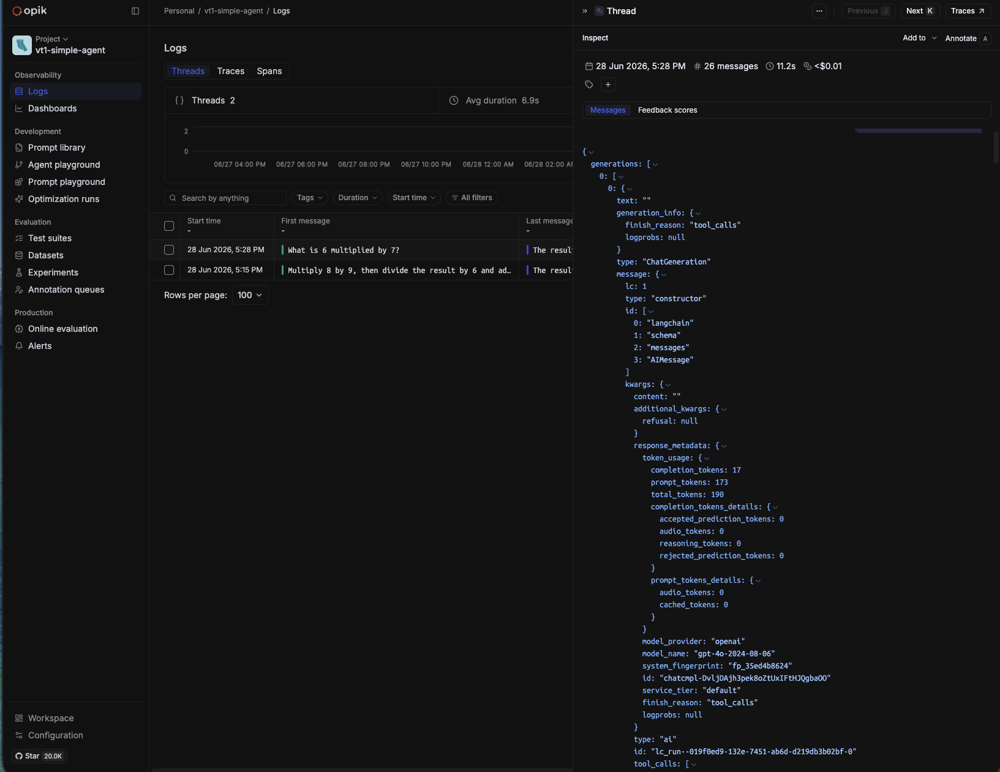

In this evaluation, Opik's Threads panel rendered the conversation as a chat-style message list, making it easy to follow the agent's reasoning sequence without navigating to individual traces.

---

#### LLM-as-judge evaluation scores

Opik has a **Feedback scores** system: numeric or categorical scores can be attached to any trace or span programmatically or via the UI annotation interface. The **Online evaluation** menu item provides configuration for automated LLM-as-a-judge pipelines running against incoming traces.

**Gap in this project.** No feedback scores are written to Opik in the current implementation. The `EvaluatorAgent` computes faithfulness, completeness, and guardrail compliance scores in the LangGraph state, but these are not sent to Opik's scores API. The Feedback scores tab on each trace is empty across all sessions. Integrating `opik.log_feedback_score(trace_id=..., name="faithfulness", value=score)` after each evaluation step would make scoring visible in the UI.

---

#### Guard trigger visibility

The multi-agent system enforces four safety guards: `LoopDetectedError`, `PIIExposureError`, token explosion, and HITL escalation. These are recorded in `AgentState.trace_events` but **are not forwarded to Opik**. Because the `OpikTracer` only intercepts LangChain callback events, a guard error raised between LLM calls produces no Opik span. The trace for a retried or HITL-escalated query is externally indistinguishable from a successful one — except where custom metadata fields (like `hitl_required: true`, `retry_count`, `faithfulness`) are explicitly written via `opik_context.update_current_trace()`, as done in the A2A `tracked()` wrapper.

The A2A experiment confirms this: Q3's HITL trace shows `hitl_required: true` and `retry_count: 3` in the span metadata — because the `tracked()` wrapper populates these fields explicitly. The v1 multi-agent (no `tracked()` wrapper) would not have this visibility.

---

#### Cross-process trace correlation (A2A v2)

Cross-process span linking is implemented via `_OpikAdapter.tracked()` — see Pillar 1 for the full mechanism.

**In this run:** 5 traces (one per query), each containing the full span tree — orchestrator `a2a_orchestrator_run` root and all `ChatOpenAI` LLM calls from orchestrator, researcher, and evaluator nested as children.

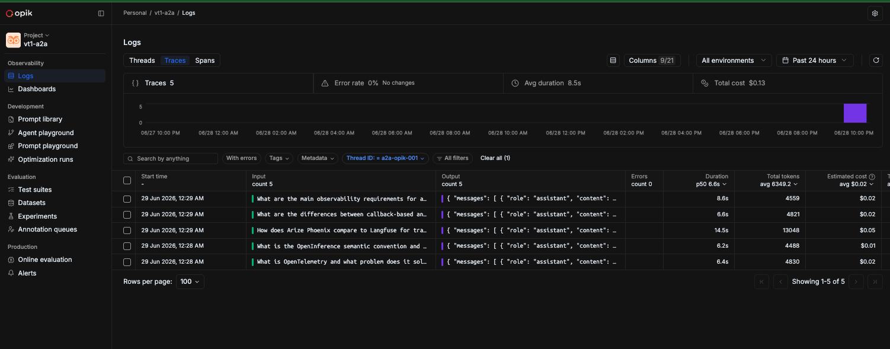

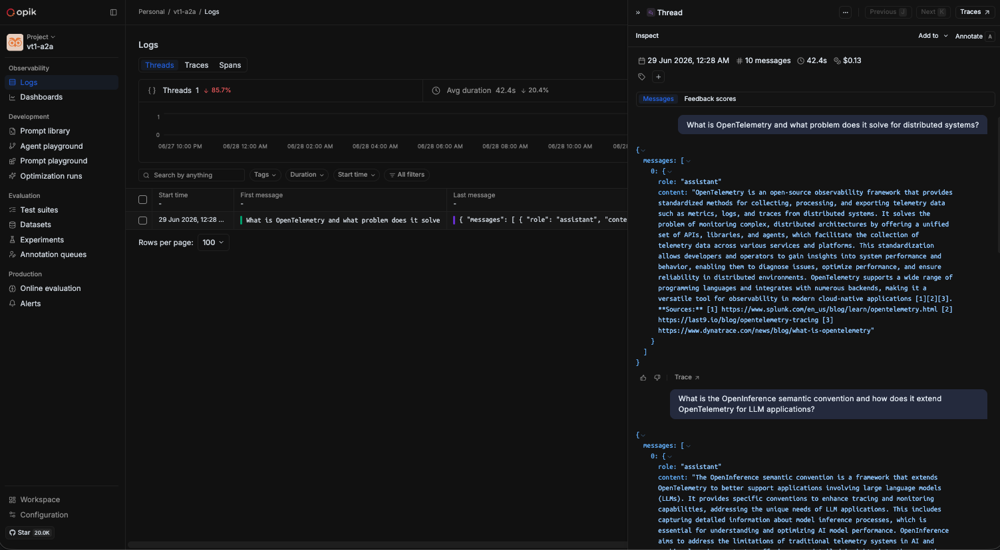

---

#### Trace filtering and querying

The Traces tab provides a filter bar with structured dimensions:

| Filter dimension | What it targets |
|---|---|
| Thread ID | Group traces by session |
| Tags | Custom tags attached at trace creation |
| Type | Span type (`LLM call`, `tool call`, `chain`) |
| Metadata | Any key in the span metadata (e.g., `langgraph_node`, `hitl_required`) |
| With errors | Filter to error-flagged traces only |

The metadata filter is particularly useful: because `langgraph_node` is present in span metadata (see Observation metadata payload), filtering by `langgraph_node: synthesize` returns only synthesise-step traces directly from the Traces list.

---

#### REST API access

Opik exposes a REST API at the same base URL as the UI (default `http://localhost:5173/api`). No authentication is required for self-hosted OSS mode — the same zero-friction setup as the SDK.

| Endpoint | Purpose |
|---|---|
| `GET /api/v1/traces` | List traces; supports `project_name`, `thread_id`, `metadata` filters |
| `GET /api/v1/traces/{traceId}` | Single trace with full span tree |
| `GET /api/v1/spans` | List spans across a project; filter by `type` (`llm`, `tool`, `chain`) |
| `POST /api/v1/feedback-scores` | Attach a feedback score (name + numeric value) to a trace or span |
| `GET /api/v1/projects` | List all projects in the workspace |
| `POST /api/v1/traces/search` | Search traces with structured metadata predicates |

**Integration gap for this project.** `POST /api/v1/feedback-scores` is the direct integration point for writing `EvaluatorAgent` scores (faithfulness, completeness) after each evaluation step. Currently the scores live in `AgentState` but are never POSTed to Opik. A two-line addition after `evaluator.invoke()` would make scores visible in the Feedback scores tab on each trace. This is the most impactful single improvement available without changing the instrumentation strategy.

---

#### Observation metadata payload

The following fields are populated automatically by `OpikTracer` on every LLM call span. They are visible in the span detail view under **Metadata** (YAML display) and **Token usage**.

| Field | Example value | What it is |
|---|---|---|
| `provider` | `openai` | LLM provider |
| `created_from` | `langchain` | Integration type — confirms this span originated from the LangChain callback path |
| `langgraph_node` | `synthesize` | LangGraph node name — automatically extracted from run metadata |
| `langgraph_step` | `3` | Step number in the LangGraph execution |
| `langgraph_path` | `["__pregel_pull", "synthesize"]` | Full execution path |
| `ls_provider` | `openai` | LangSmith-style provider field |
| `ls_model_name` | `gpt-4o` | Model identifier |
| `ls_model_type` | `chat` | Model type |
| `ls_temperature` | `0` | Temperature |
| `ls_integration` | `langchain_chat_model` | LangChain integration type |
| `usage.completion_tokens` | `206` | Output token count |
| `usage.prompt_tokens` | `434` | Input token count |
| `usage.completion_tokens_details.reasoning_tokens` | `0` | Reasoning token breakdown |
| `usage.prompt_tokens_details.cached_tokens` | `0` | Cached prompt token count |

The `langgraph_node` field is the key metadata differentiator from Langfuse. All `ls_*` fields are LangSmith-style metadata emitted by LangChain's internal callback machinery, visible in both Opik and Langfuse.

---

### Pillar 3: Operational Considerations (the "Cost")

| Evaluation category | Criteria | Comet Opik |
|---|---|---|
| License | Distinguish between MIT/Apache 2.0 and open-core | **Apache 2.0** — same as Phoenix. The full self-hosted version is free with no feature restrictions or enterprise key. [Comet Cloud](https://www.comet.com/site/pricing/) offers free, Team, and Enterprise tiers. |
| Deployment model | Local/Docker support vs. cloud SaaS only | **`./opik.sh`** (self-hosted, used in this project) — starts 8 containers by default (backend, python-backend, frontend, mysql, clickhouse, zookeeper, redis, minio). First startup downloads images, runs DB migrations. No project/API key setup required — project name set via env var, traces appear immediately. No single-binary CLI; Kubernetes-native design is the recommended production path. |
| Performance overhead | Ingestion latency and impact on agent end-to-end response time | **Batch async ingestion** — `OpikTracer` batches spans and POSTs them asynchronously to the backend. No observable impact on agent latency. A short delay (1–3 s) before traces appear in the UI is consistent with the Langfuse async pipeline. |
| Resource usage | Hardware requirements | **Highest default footprint in this evaluation.** The eight containers listed in the Local Installation section exceeded the Langfuse (6 containers) and Phoenix (1 container) deployments. Cold start on first launch was the longest of the three tools. |

**Observations from experiment sessions:**

**First trace.** Traces began arriving immediately after setting two env vars and starting `./opik.sh` — no project creation UI step was required.

**Estimated cost in dashboard.** The Project Overview dashboard shows a "Total estimated cost sum" computed server-side. This is displayed prominently alongside trace count, error count, and latency percentiles — making cost visible without any additional configuration.

**UI responsiveness.** Navigation between Threads, Traces, Spans, and the dashboard remained fast across all sessions. The ClickHouse analytics backend handles span-level queries without noticeable latency.

**A2A load.** The 5-trace A2A session (one per query, up to 8 spans per trace) was handled without any observable delay. Thread grouping and span tree rendering were immediate.

---

## Round 1 Results (Simple Agent)

Data source: `experiments/simple_agent/runs/round1-opik-001.json`

The simple agent ran 5 arithmetic queries of increasing complexity (1 to 3 tool calls). All 5 completed without errors.

| Metric | Value |
|---|---|
| Total latency (5 queries) | 11 218 ms |
| Avg latency per query | 2 244 ms |
| Total input tokens | 2 725 |
| Total output tokens | 307 |
| Total cost | $0.0182 |
| Errors | 0 |

> **Cost note:** The `$0.0182` figure comes from `CostTracker` using $5.00/$15.00 per million input/output tokens. Opik's estimated cost dashboard shows `$0.01` for the same session using current `gpt-4o-2024-08-06` pricing ($2.50/$10.00 per million tokens) — a ~2× difference in pricing constant, not in token usage.

**13 traces, query input visible.** Filtering the Traces tab by Thread ID `round1-opik-001` returns 13 traces. Unlike Langfuse (where trace names are always "ChatOpenAI"), Opik's Traces list shows the actual query input as the trace preview — making the 5 queries identifiable by eye without opening each trace.


**16 LLM call spans.** The Spans tab shows 16 LLM call spans (all named "ChatOpenAI") across the 5 queries — 3 queries required 2 LLM round-trips and one required 3 (Q5: divide → multiply → add). Span type, input preview, output, and duration are visible in the list without opening each span.


**Thread view shows full conversation.** The Threads tab groups all 13 traces under one thread entry for `round1-opik-001`. The right panel renders the full conversation as a message list — user queries, assistant responses, and tool call outputs — with per-message token usage visible inline. The `response_metadata` includes `model_name: "gpt-4o-2024-08-06"`, `system_fingerprint`, and `finish_reason`.


**Dashboard pre-populated.** The Project Overview dashboard shows the project-level aggregate — 16 total traces (across all test runs in the `vt1-simple-agent` project, not just this session), 0 errors, P50 latency (0.8 s), P99 latency (1.5 s), and estimated cost ($0.01). The session-filtered count (Thread ID `round1-opik-001`) is 13 traces. The dashboard totals the full project history. The "Estimated cost" time-series chart and trace volume chart update automatically as traces arrive.


**No feedback scores.** The Feedback scores tab on every trace is empty — expected, as the EvaluatorAgent is not part of the simple agent pipeline (see Pillar 2 for the integration gap).

---

## Round 2 Results (Multi-Agent)

Data sources: `experiments/multi_agent/runs/round2-opik-001.json` and `experiments/multi_agent_a2a/runs/a2a-opik-001.json`

### v1 in-process results (`round2-opik-001`)

| Metric | Value |
|---|---|
| Total latency (5 queries) | 43 504 ms |
| Avg latency per query | 8 701 ms |
| Avg faithfulness | 0.78 |
| Total retries | 3 |
| HITL escalations | 1 |
| Total cost | $0.1096 |
| Errors | 0 |

> **Cost note:** The `$0.1096` figure comes from `CostTracker` using $5.00/$15.00 per million tokens. Opik's estimated cost uses current `gpt-4o-2024-08-06` pricing ($2.50/$10.00 per million tokens), producing a ~2× lower figure.

Q3 (comparative — Phoenix vs Langfuse) triggered 3 retries and HITL escalation with faithfulness = 0.0 on every attempt — identical to Phoenix and Langfuse round 2 results. The model's own training data about itself is not grounded in the retrieved web sources.

**Trace structure — one trace per LangGraph node, not one per query.** Without the `@opik.track` wrapper, each node's `model.invoke()` creates its own trace. A 5-query run with no retries produces 15 traces (5 × 3 nodes). Q3's 3 retries brought the total to 19 — the same as the Langfuse v1 structure.

**LangGraph node names visible in metadata.** `langgraph_node` is captured automatically in span metadata (see Observation metadata payload in Pillar 2). The metadata payload for a synthesise-node span includes:

```yaml
provider: openai
created_from: langchain
session_id: round2-opik-001
langgraph_step: 3
langgraph_node: synthesize
langgraph_triggers:
  - branch:to:synthesize
langgraph_path:
  - __pregel_pull
  - synthesize
ls_provider: openai
ls_model_name: gpt-4o
ls_model_type: chat
ls_temperature: 0
ls_integration: langchain_chat_model
```

This makes it possible to filter traces by `langgraph_node: research` or `langgraph_node: evaluate` directly from the Traces metadata filter — a capability not available in Langfuse.

**Guard events — not visible in v1.** Guard triggers fired 7 times across Q3's retries (all recorded in `AgentState.trace_events`). None appear in the Opik trace view for v1 — no error spans, no metadata flags. The v1 implementation does not use the `tracked()` wrapper, so no `opik_context.update_current_trace()` call populates `hitl_required` or `retry_count` on the trace.

> *No trace/span screenshots are available for the v1 multi-agent Opik run. The metadata and token usage fields above are from `experiments/multi_agent/runs/screenshots/opik/metadata-per-span.yaml` and `token-usage-per-span.yaml`.*

### v2 A2A distributed results (`a2a-opik-001`)

| Metric | Value |
|---|---|
| Total traces in session | 5 |
| Total session cost (CostTracker) | $0.0872 |
| Avg faithfulness | 0.90 |
| Total retries | 3 |
| HITL escalations | 1 |
| Errors | 0 |

**5 traces — one per query.** The `@opik.track` wrapper in `_OpikAdapter.tracked()` creates a single root `a2a_orchestrator_run` trace per orchestrator call. All LLM spans from all three services (orchestrator, researcher, evaluator) appear as children within that trace. The A2A session produces 5 traces — compared to Langfuse's 19. This is structurally equivalent to Phoenix's single-root-trace model.


**Span tree for Q3 (HITL trace).** The HITL trace for Q3 shows `a2a_orchestrator_run` as the root (14.5 s, $0.05, 13 048 tokens), with 7 nested `ChatOpenAI` spans alternating between `gpt-4o-2024-08-06` (research) and `gpt-4o-mini-2024-07-18` (evaluate) — 3 research + 3 evaluate + 1 synthesize, reflecting the 3 retry cycles. The span metadata shows `faithfulness: 0.5`, `label: hallucinated`, `retry_count: 3`, `hitl_required: true` — populated explicitly via `opik_context.update_current_trace()` in the `tracked()` wrapper.

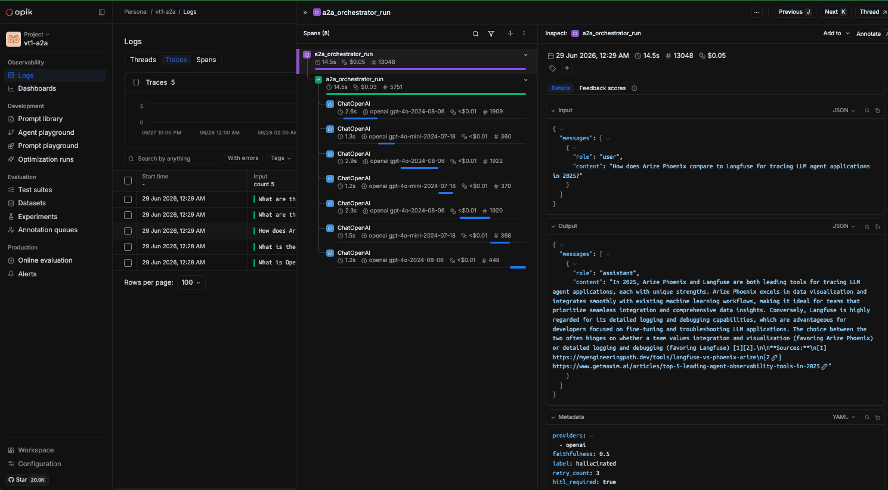

**Token usage breakdown.** The Token usage panel on the Q3 trace shows the full aggregated breakdown: 11 190 prompt tokens, 1 858 completion tokens, 13 048 total — with `original_usage.*` fields preserving the per-call OpenAI response token counts.

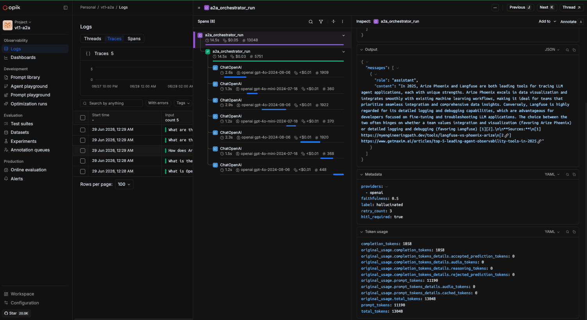

**Thread view shows full session conversation.** The Threads tab shows 1 thread (`a2a-opik-001`), 10 messages, 42.4 s, $0.13. The right panel renders all 5 queries and responses as a chat conversation — user queries in one style, assistant answers with inline sources in another.


**Q5 trace — successful run with `faithfulness: 1`.** For contrast with the Q3 HITL trace, Q5 ("What are the main observability requirements for a multi-agent LLM system?") completed in a single pass: root `a2a_orchestrator_run` (8.6 s, $0.02, 4 559 tokens), with 3 child ChatOpenAI spans — 1 research `gpt-4o` (3.5 s, 1 800 tokens), 1 evaluate `gpt-4o-mini` (1.5 s, 415 tokens), 1 synthesize `gpt-4o` (1.4 s, 544 tokens). The metadata pane shows `faithfulness: 1`, `label: grounded` — the minimal 3-span tree expected for a successful single-pass query.

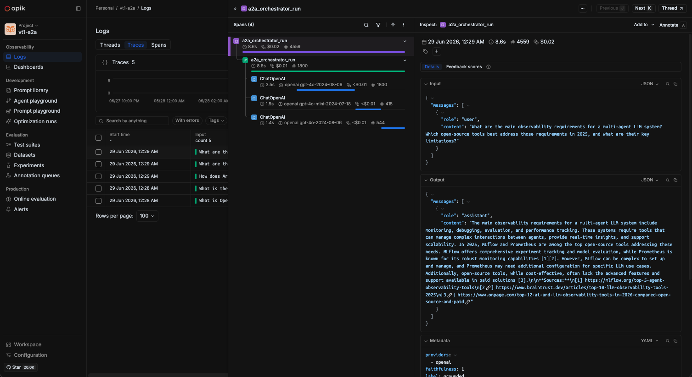

**LLM messages panel.** Selecting any ChatOpenAI span and switching to the Messages tab renders the raw LLM conversation: expandable System, Human, and AI sections with the exact prompt and response text. The header shows model (`openai gpt-4o-2024-08-06`), duration (3.3 s), token count (1 990), and estimated cost (<$0.01).

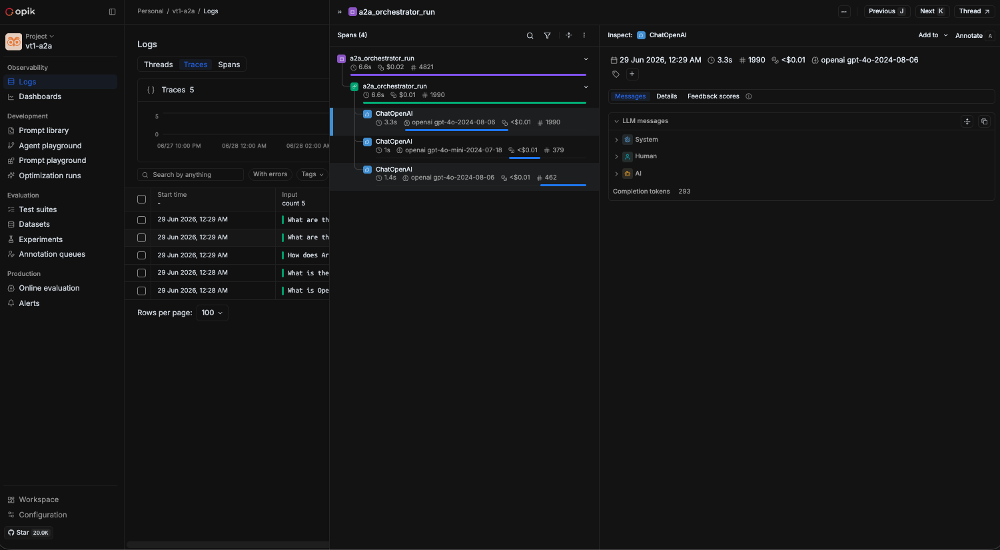

**A2A dashboard.** The `vt1-a2a` Project Overview dashboard (project total across all test runs): 16 traces, 0 errors, P50 7.9 s, P99 15.3 s, total estimated cost $0.29. The trace volume chart labels bars as `a2a_orchestrator_run` — confirming the `@opik.track` root span name flows through to dashboard aggregation. The trace duration chart shows P50, P99, and P90 percentile lines across the full session history.

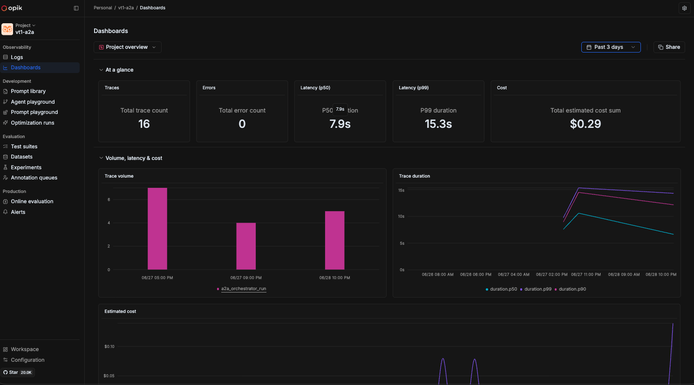
