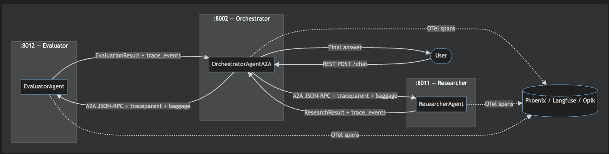
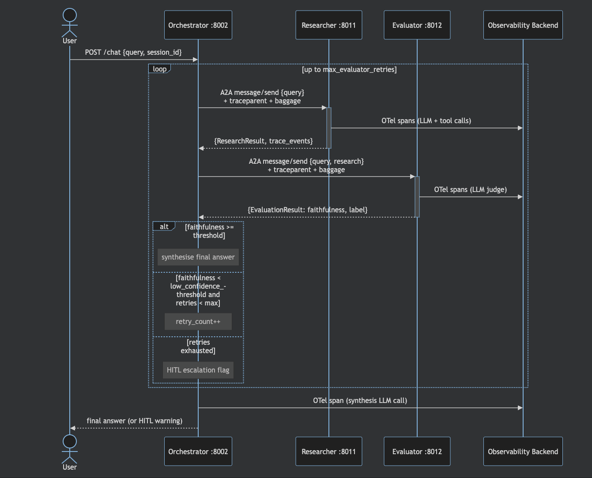

# Observability for AI Agents: Systematic Analysis and Evaluation of Open-Source Tooling

**MSE — Master of Science in Engineering - VT1**  
**Student:** Daniela Otelea
**Supervisor:** Dr. Militano Leonardo
**Semester:** FS 2026
**Submission:** 2026-06-30

---

## Abstract

LLM agents introduce non-deterministic, multi-step execution loops that standard monitoring tools are not designed to handle. This project evaluates three open-source observability platforms — Arize Phoenix, Langfuse, and Comet Opik — against a requirements framework built around six agent-specific properties: reasoning traceability, tool usage tracking, multi-agent coordination, performance and cost metrics, quality metrics (e.g. hallucination rate), and safety governance.

The evaluation runs in two rounds. Round 1 uses a single-agent ReAct loop with arithmetic tools. Round 2 uses a three-role Orchestrator→Researcher→Evaluator pipeline (v1), with a distributed variant (v2) that deploys agents as independent services over the Google Agent2Agent (A2A) protocol. All runs use identical agent implementations, OpenTelemetry instrumentation, and fixed query sets to keep the comparison fair across tools.

Keywords: LLM agents, observability, OpenTelemetry, Arize Phoenix, Langfuse, Comet Opik, multi-agent coordination, reasoning traceability, safety governance, A2A protocol, OpenInference, W3C Trace Context, W3C Baggage, OTel GenAI Semantic Conventions, evaluation framework, systematic analysis.

---

## I. Introduction

### I.1 Context

The deployment of LLM-powered agents in production systems has grown rapidly since 2023. Unlike conventional API calls, agents execute reasoning loops, invoke external tools, and coordinate with other agents, producing execution traces that are more complex than a single request/response pair. 
A single user query may generate multiple LLM calls, tool invocations, and inter-agent messages before producing a final answer.

The result is an observability gap. Engineering teams that rely on standard application monitoring — logs, latency histograms, error rates — quickly find they cannot answer the questions that matter most for agents: _Did the agent hallucinate? Which tool call caused the cost spike? Why did this session require three retries? Why did the agent loop?_

The gap is not just about tooling immaturity. Existing platforms were built for deterministic, request/response systems. Agents need something different: stochastic output quality metrics, reasoning-step traceability, multi-agent message correlation, and real-time safety guard visibility.

Industry analysts have recognized this as a production-blocking risk. Gartner predicts that by 2028, Explainable AI will drive LLM observability investments to 50% of secure GenAI deployment budgets [CITE-GARTNER] — positioning observability not as a nice-to-have but as a prerequisite for enterprise deployment, and directly linking the explainability of agent reasoning to investment prioritization.

### I.2 Problem Statement

The field is converging on OpenTelemetry (OTel) as the vendor-neutral instrumentation standard for LLM workloads, with the OpenTelemetry GenAI Semantic Conventions [CITE-OTEL-GENAI] defining a portable attribute schema. 
Multiple open-source observability platforms now claim OTel compliance. However, there is no systematic, reproducible evaluation of what these tools actually capture for multi-agent workloads, and no agreed definition of what "comprehensive agent observability" requires.

This project focuses on four concrete questions:

- **RQ1:** Which observable dimensions (reasoning, tools, coordination, cost, quality, safety) does each tool cover natively, and which require custom instrumentation?
- **RQ2:** Do all three tools produce comparable results given identical agent code and identical OTel instrumentation?
- **RQ3:** How does each tool handle the jump from a single-agent to a multi-agent distributed workload?
- **RQ4:** Do tools correctly correlate spans across service boundaries when agents are deployed as independent services?

Results are presented in §VI and discussed in §VII.

### I.3 Objective and Scope

To answer these questions, the project:

1. Defines a requirements framework for agent observability based on agent-specific execution properties.
2. Implements two progressively complex agent workloads as evaluation subjects.
3. Runs each workload against all three tools using a fixed, reproducible query set.
4. Scores each tool per pillar (Integration, Capability, Operability) and per observable dimension.
5. Derives practical guidelines and identifies remaining gaps in tools and standards.

**In scope:** Arize Phoenix, Langfuse, Comet Opik; LangChain ReAct and LangGraph-based agents; OTel/OTLP instrumentation; local Docker deployments; Google A2A protocol for distributed agent communication.

**Out of scope:** Proprietary platforms (LangSmith); cloud-only deployments; model fine-tuning; non-LLM agents; production traffic analysis.

---

## II. Background & Related Work

### II.1 AI Agent Architecture

AI agents are software systems that use AI to pursue goals and complete tasks on behalf of users. They show reasoning, planning, and memory and have a level of autonomy to make decisions, learn, and adapt. [CITE-AI-AGENT-GOOGLE]
Because of this autonomy, monitoring agents presents unique challenges:

**Non-determinism.** The same input may produce different tool call sequences across runs, because the LLM samples from a probability distribution at each step.
Traditional monitoring assumes reproducible behavior; agent monitoring cannot.

**Tool side-effects.** Each tool call interacts with an external system (search API, database, code executor). Latency, failure, and output quality vary per call. A complete trace must record tool input, output, latency, and whether the agent correctly interpreted the result.

**Iterative loops.** Agents may call tools in loops — either productively (multistep research) or pathologically (infinite loops from hallucinated tool arguments). Observability must detect loop patterns in real time, not only post-hoc.

This project studies three coordination patterns from the agent architecture literature:

| Pattern | Description | Implementation |
|---|---|---|
| Single agent (ReAct) | One LLM with tool access; Think→Act→Observe loop | `src/simple_agent/` |
| Orchestrator–sub-agent | Orchestrator delegates to specialised agents; synthesises results | `src/multi_agent/` |
| Distributed services (A2A) | Each agent deployed as an independent HTTP service; orchestrator calls over the network | `src/multi_agent_a2a/` |

The evaluator feedback loop (Orchestrator→Researcher→Evaluator→retry) is a sub-pattern of the orchestrator model. It is directly observable through trace attributes such as retry count, faithfulness score, and the HITL escalation flag.

### II.2 Emerging Standards

#### OpenTelemetry - The base layer for observability

OpenTelemetry (OTel) is the CNCF-graduated observability framework providing a vendor-neutral SDK, wire protocol (OTLP), and semantic convention schema [CITE-OTEL]. Three aspects matter for this project:

1. **Portability:** Phoenix accepts OTLP natively; Langfuse and Opik used their own SDK-level ingestion formats at the time of implementation (April 2026). All three can be targeted from the same agent code via the `ExporterAdapter` abstraction, but the actual wire format differed across tools — see §VII.2 for an evolution note on how this changed by submission.
2. **Semantic conventions:** the OTel GenAI Working Group publishes a `gen_ai.*` attribute schema (`gen_ai.request.model`, `gen_ai.usage.input_tokens`, etc.) [CITE-OTEL-GENAI]. None of the three tools natively consumes these attributes at the time of writing. Phoenix displays OpenInference attributes (`llm.*`) instead — a separate Arize-authored specification with a different namespace (see the OpenInference sub-section below).
3. **Distributed tracing:** OTel's W3C `traceparent` header [CITE-W3C-TRACE] links spans across process boundaries into a single trace tree. W3C `baggage` [CITE-W3C-BAGGAGE] carries application-level key-value pairs across those same boundaries — used in this project to propagate `session.id` to each sub-agent service in the A2A v2 scenario. Both are required for full distributed traceability in multi-agent deployments: `traceparent` alone produces a correct span tree but loses session context at every process boundary.

This project uses `openinference-instrumentation-langchain` for auto-instrumentation of LangChain calls, supplemented by manual span attributes for cost (`llm.token_count.*`, `gen_ai.usage.*`) and session grouping.

#### OpenInference - The domain-specific semantic convention layer
OpenInference is a semantic convention specification for AI application observability built on top of OpenTelemetry. It standardizes how LLM calls, agent reasoning steps, tool invocations, retrieval operations, and other AI-specific workloads are represented as distributed traces. [CITE-OPENINFERENCE]

#### W3C Trace Context and W3C Baggage

The two headers are defined by separate W3C specifications: Trace Context [CITE-W3C-TRACE] governs `traceparent` and `tracestate`; Baggage [CITE-W3C-BAGGAGE] governs the propagation format for arbitrary key-value pairs. The distinction is operational, not just architectural. An implementation that propagates only `traceparent` produces a correct span tree but empty session views — `session.id` never reaches the sub-agent processes. In this project, both headers are injected in a single `propagate.inject(carrier)` call and extracted on each receiving service by `OTelContextMiddleware` via `propagate.extract(request.headers)`.

#### The A2A Protocol

Google's Agent2Agent (A2A) protocol [CITE-A2A], released April 2025, defines a JSON-RPC standard for agent interoperability. Each agent exposes an Agent Card at `/.well-known/agent.json` describing its identity and capabilities. Communication follows a `message/send` RPC with typed task states (`WORKING → COMPLETED / FAILED`) and structured data artifacts. 
The A2A pattern is studied in Round 2 v2 of this project.

### II.3 Related Work

- **DHARMA [CITE-DHARMA]:** a framework for diagnostic hallucination rate monitoring in multi-agent pipelines; introduces TP/FP/FN governance metrics adopted in §III.
- **Vibe AIGC [CITE-VIBE]:** studies agentic workflows and highlights the observability gap in long-running autonomous tasks.
- **Anthropic Model Evaluation Guide [CITE-ANTHROPIC-EVAL]:** establishes criteria for evaluating LLM quality in downstream tasks; informs the faithfulness scoring methodology.
- **HITL latency studies:** document the cost of human-in-the-loop intervention; inform the HITL escalation threshold design in the Orchestrator.

---

## III. Observability Requirements for AI Agents

To evaluate the three platforms fairly, I first had to define what "observable" means for an agent workload — the signals that matter and that a platform needs to capture for the system to be diagnosable. Six dimensions emerged from this analysis, each corresponding to a class of signal that agents produce but that conventional monitoring tools were not designed to handle. They form the scoring criteria used in §VI.

### III.1 Reasoning Traceability

Between tool calls, agents produce text that reflects what the model is about to do next. In practice, what is observable is the prompt and completion captured for each LLM call.
What practitioners often call ‘agent reasoning’ is therefore an interpretation of those signals, not a direct measurement of the model’s internal process. 
We can observe the inputs and outputs of each step, but not the hidden reasoning itself. The most relevant observable signals are:

| Signal | Description | OTel attribute |
|---|---|---|
| LLM input/output | Full prompt and completion text | `llm.input_messages`, `llm.output_messages` |
| Reasoning depth | Number of reasoning steps per query | custom: `agent.reasoning_steps` |
| Context window evolution | Token count growth across steps | `gen_ai.usage.input_tokens` per span |
| Tool call intent | LLM's stated reasoning for each tool call | `llm.output_messages[0].tool_calls` |

A tool scores highly on this dimension if it captures per-step prompt/completion pairs and makes them queryable without requiring manual span attributes beyond what auto-instrumentation provides.

### III.2 Tool Usage Tracking

Every tool invocation must be recorded as a child span of the LLM call that triggered it.

| Signal | Description |
|---|---|
| Tool name, input arguments | What was called and with what |
| Output / result | Raw return value from the tool |
| Latency per call | Time from invocation to result |
| Error / exception | Stack trace if the tool raised |

For the simple agent (arithmetic tools), all three tools are expected to capture this correctly; the differences in how they structure and surface the resulting spans are documented in §VI.1. For the multi-agent Researcher (web search + page fetch), the signal volume is higher and tool-call correlation more complex.

### III.3 Multi-Agent Coordination

In multi-agent systems, inter-agent messages, delegation events, and shared state mutations must be traceable.

| Signal | Description |
|---|---|
| Agent role | Who emitted the span (`orchestrator`, `researcher`, `evaluator`) |
| Message handoffs | Serialised payload passed between agents |
| Retry events | Each retry attempt with reason and retry count |
| HITL escalation | `hitl_required=True` with triggering faithfulness score |

An agent-internal audit trail can record delegation, retry, and guard events directly in the agent state. This makes the data available even when no tracing backend is connected, which is also useful for testing. 
In the A2A v2 system, this alone is not enough. Cross-service span correlation also requires W3C context propagation so that sub-agent spans appear under the originating orchestrator span.

#### Multi-Turn Session Requirements

Production agent deployments are almost always multi-turn: a user sends multiple queries in sequence and the agent must maintain context across them. This introduces three concerns that are invisible in single-turn evaluations:

| Concern | Description | Observability implication |
|---|---|---|
| State persistence | Conversation history held in memory (e.g. `self._histories`) is per-process; a restart or scale-out loses all context | Per-session token growth and cost must be tracked cumulatively across turns, not just per-call |
| Context window management | History grows unboundedly; after N turns the LLM's context limit is exceeded | Token usage per turn must be trended — the cumulative trajectory is the signal that predicts overflow |
| Session routing/affinity | Scaled deployments require sticky routing or externalised state (Redis, database) so any instance can serve any turn | The observability backend often holds the only complete per-session record — its session grouping becomes an operational primitive, not just a debugging aid |

All three tools handle single-turn tracing — every tool can display one LLM call with its tool invocations. The real question is what happens across turns: *"how did this conversation evolve over N turns?"* rather than *"what happened in this call?"*. Session grouping — correlating all traces from a conversation under one `session_id` — is what makes that question answerable.

The A2A v2 scenario tests a specific hard case of multi-turn operation: `session.id` must cross process boundaries, which none of the three tools handle natively without the W3C Baggage propagation implemented in this project (§V.3, B3).

### III.4 Performance Metrics

| Metric | Description | Unit |
|---|---|---|
| End-to-end latency | Wall clock from user query to final answer | ms |
| LLM call latency P95/P99 | Per-role, not just aggregate | ms |
| Token usage | Input and output tokens per call and per session | count |
| Cost per session | `cost.usd` summed across all LLM calls in a session | USD |
| Cost per agent role | Cost attributed to Orchestrator / Researcher / Evaluator | USD |

Per-role cost attribution is more informative than session-level aggregates in multi-agent systems: a high total cost may originate from Researcher prompt engineering (a design concern) or from retry loops driven by low evaluator confidence (a quality signal), and these are distinct operational concerns. Token counts are emitted under both `gen_ai.usage.*` (OTel GenAI semconv) and `llm.token_count.*` (OpenInference) on every LLM span, ensuring cross-dashboard compatibility across tools with different attribute expectations.

### III.5 Quality Metrics

| Metric | Description | Threshold |
|---|---|---|
| Faithfulness score | Fraction of summary claims grounded in cited sources | < 0.6 → retry; < 0.8 → warning |
| Hallucination rate | Session-level: fraction of sessions with faithfulness < 0.6 | tracked over experiment runs |

**Faithfulness** measures how many claims in the agent's summary are actually supported by the cited sources. A score of 1.0 means every claim is grounded; 0.0 means none of them are. The thresholds (below 0.6 triggers a retry, below 0.8 emits a warning) were set based on the expected quality range of web-retrieved research summaries.

The Evaluator produces this score via LLM-as-judge prompting (GPT-4o-mini at temperature=0 for reproducibility). A tool scores highly here if it can ingest named evaluation metrics as first-class records — not just free-text log lines.

### III.6 Safety & Governance

| Guard | Trigger | Observable signal |
|---|---|---|
| Loop detection | Same tool called > 3 times in a session | `agent.loop_detected=True` span event |
| PII/credential exposure | Regex match in research output | `agent.pii_detected=True`; response sanitised |
| Token explosion | Message count grows > 2× between steps | warning log + `agent.token_explosion_warning` |
| HITL escalation | Evaluator faithfulness < 0.6 after 2 retries | `hitl_required=True`; HITL rate metric |

The guard evaluation methodology — including true positive, false positive, and false negative definitions for each guard — is specified in the metrics framework established in the requirements analysis phase.

Taken together, these six dimensions define what I mean by *comprehensive agent observability* in this study: the ability of a platform to answer not only "what happened in this call?" but also "how did this session evolve?", "how much did it cost per agent role?", "was the output faithful to its sources?", and "is the system behaving safely over time?". A platform that covers all six natively can answer diagnostic questions at every level — individual span, session arc, and safety governance.

The scoring in §VI maps each tool against these dimensions using a three-level scale: **Yes** (native support), **Partial** (supported with custom instrumentation), and **No** (not supported or not observed).

---

## IV. Tooling Analysis and Methodology

### IV.1 Tool Selection

Three open-source, self-hostable platforms were selected through a systematic tooling landscape analysis conducted at the outset of this project.

| Tool | Version | Why selected |
|---|---|---|
| **Arize Phoenix** | `arize-phoenix>=4.0.0` | OTel-native OTLP ingestion; OpenInference semconv; local Docker; `phoenix.otel` convenience wrapper |
| **Langfuse** | `langfuse>=4.12.0` | Strongest native evaluation/scoring features; ClickHouse backend; widely deployed in LLM production; full self-host/cloud feature parity; built-in PII masking |
| **Comet Opik** | `opik>=2.1.4` | Full-stack ML + LLM observability; fast ingestion; experiment tracking angle |

**Exclusions:** LangSmith (not open-source), LangWatch (less mature at time of evaluation — used in earlier prototype phase, replaced by pluggable exporter in M2).

**Phoenix scope note:** Arize offers two products — **Phoenix** (open-source, local development/debugging, evaluated here) and **Arize AX** (proprietary SaaS, separate pricing, specialised multi-agent views). Results in this project apply to Phoenix only and should not be extrapolated to Arize AX [CITE-LANGFUSE-VS-PHOENIX].

**OTel compliance note (as of April 2026):** Phoenix is the only tool that accepted native OTLP spans directly at the time of implementation. Langfuse and Opik each used their own SDK-level ingestion format. The "same code, different exporter" portability holds at the abstraction level of the `ExporterAdapter` pattern, but the actual wire format differed across tools — see §VII.2 for a note on how Langfuse and Opik evolved between April and June 2026.

### IV.2 Evaluation Framework

The evaluation uses a **3-pillar framework** derived from the preliminary tooling landscape analysis:

| Pillar | What it measures |
|---|---|
| **Pillar 1 — Integration** | SDK quality, OTel compliance, auto-instrumentation coverage, setup friction, failure modes |
| **Pillar 2 — Capability** | Metric coverage against the 6 dimensions in §III; session grouping; multi-agent correlation |
| **Pillar 3 — Operability** | Deployment model, UI/query capability, Docker resource usage, performance overhead |

Each tool is scored (native support), (partial/requires custom instrumentation), or (not supported) per dimension. Scores are aggregated into the comparison matrix in §VI.

### IV.3 Two-Round Methodology

The key design choice is evaluating each tool **twice**, on progressively more complex agent workloads:

```
Round 1                                     Round 2
──────────────────────────────              ──────────────────────────────────────────
Simple Agent (1 LLM + 3 tools)    →        Multi-Agent System (Orchestrator +
                                              Researcher + Evaluator + A2A v2)
        │                                            │
        ▼                                            ▼
≥5 sessions per tool                        ≥5 sessions per tool
5 fixed arithmetic queries                  5 fixed research queries
Q1: single tool call                        Type A: focused factual
Q2: two-call chain                          Type B: comparative
Q3: three-call chain                        Type C: multi-part
Q4: error recovery
Q5: loop detection trigger
```

This structure surfaces tool limitations that would be invisible in a single-agent evaluation. For example: a tool may correctly capture single-agent cost but fail to attribute cost by agent role in multi-agent sessions; or it may correctly display session grouping in Round 1 but lose it when session.id must cross a process boundary in the A2A v2 scenario.

The **Round 1 → Round 2 delta** is the main comparison axis: which tools held up under increased complexity, and which degraded?

### IV.4 Experiment Runner

Structured experiment runs are driven by:

```bash
python experiments/simple_agent/run_experiment.py  --exporter {phoenix|langfuse|opik|otel-stdout|none}
python experiments/multi_agent/run_experiment.py   --exporter {phoenix|langfuse|opik|otel-stdout|none}
```

Each runner executes the fixed query set, records per-session JSON output to a structured directory (one file per session), and logs timing and token counts. This makes the runs reproducible and the raw data available for offline analysis.

---

## V. Implementation & Experimental Setup

### V.1 Simple Agent (Round 1 Subject)

**Module:** `simple_agent`

A LangChain ReAct agent with three arithmetic tools (`add`, `multiply`, `divide`). The tools are deterministic: the same query always produces the same tool call sequence and result. This makes Round 1 a controlled baseline — any difference in what tools capture reflects instrumentation coverage, not execution variability.

**Architecture:**



`CostTracker` reads `usage_metadata` after each LLM response and accumulates `{model, input_tokens, output_tokens, cost_usd}` records. `set_token_cost_attributes()` writes these to the active span under both `gen_ai.usage.*` and `llm.token_count.*`.

**Observability wiring:** `build_exporter(AgentConfig(exporter=...))` returns an `ExporterAdapter` that initialises the backend and provides `session_ctx()` (context manager for session grouping) and `callback()` (LangChain callback for Langfuse/Opik). Phoenix uses `LangChainInstrumentor` auto-instrumentation.

**API surface:** FastAPI backend on port 8000 (`/chat`, `/exporter/{name}`, `/health`); Gradio UI on port 7860 with exporter dropdown and session ID display.

**Tests:** 18 unit tests — no API keys required (fake LLM injected, exporter=`none`).

### V.2 Multi-Agent System v1 (Round 2 Subject)

**Module:** `multi_agent`

A three-role pipeline implementing a Topic Research & Fact-Check scenario. This scenario was selected because it exercises every observable dimension from §III simultaneously and in a single run.

**Agent roles:**

*OrchestratorAgent* — entry point. Decomposes the research query, dispatches to Researcher, receives results, invokes Evaluator, retries on low confidence, escalates to HITL after `max_evaluator_retries` exhausted. Enforces four safety guards:

| Guard | Trigger | Effect |
|---|---|---|
| Loop detection | Same query submitted > `max_identical_tool_calls` | `LoopDetectedError` raised |
| PII/credential exposure | Regex match in research output | `PIIExposureError` raised; output sanitised |
| Token explosion | Message count > 2× initial | Warning event; oldest messages truncated |
| HITL escalation | faithfulness < threshold after retries | `state["hitl_required"] = True` |

*ResearcherAgent* — gathers evidence via `web_search` (DuckDuckGo or Tavily) + `fetch_page` + citation extraction. Returns `{summary: str, sources: [{url, excerpt}]}`. Injectable `search_fn` and `fetch_fn` for tests.

*EvaluatorAgent* — LLM-as-judge at temperature=0. Scores `faithfulness` (0–1 float) and returns a `label` ("grounded" or "hallucinated"). Malformed JSON defaults to `{faithfulness: 0.5, label: "hallucinated"}` so the Orchestrator retries rather than crashing.

**State management:** `AgentState` TypedDict carries `messages` (via `add_messages`), `trace_events`, `research`, `evaluation`, `retry_count`, `hitl_required`, and `final_answer`. Every agent appends `TraceEvent` entries — a full audit trail reconstructable from state alone, independent of whether a tracing backend is connected.


**Tests:** 27 unit tests covering guard logic, retry behaviour, and HITL escalation — no API keys required.

### V.3 Multi-Agent System v2 — A2A Distributed

**Module:** `multi_agent_a2a`

The v2 system deploys Researcher and Evaluator as independent A2A JSON-RPC services. The Orchestrator becomes an async service that calls them over the network. This is the closest implementation to a real production multi-agent deployment in this project.

**Service topology:**


**Request flow and retry loop:**


Each service exposes an Agent Card at `/.well-known/agent.json`. Tasks transition through `WORKING → COMPLETED / FAILED` states; structured results are returned as data artifacts via `new_data_part()` / `get_data_parts()`.

**W3C Context Propagation:**

This is the key observability engineering challenge of the v2 system. The problem: OpenInference's `using_session(session_id)` stores `session.id` in a local Python `ContextVar`. A `ContextVar` never crosses a process boundary. Without explicit propagation, every span in the sub-agent services would carry no `session.id` and no parent span reference — making it impossible to correlate them with the orchestrator's trace.

The solution, implemented in `protocol.py` and `OTelContextMiddleware`:

```
Orchestrator side (_otel_headers):
  1. Read current OTel context (contains active orchestrator span)
  2. Read session.id from OpenInference context via get_attributes_from_context()
  3. Promote session.id into W3C Baggage: set_baggage("session.id", value)
  4. inject(carrier) → serialises both traceparent + baggage headers

Sub-agent side (OTelContextMiddleware + executor):
  1. extract(request.headers) → restores OTel context
  2. Attach context → sub-agent spans become children of orchestrator's span
  3. get_baggage("session.id") → read session from baggage header
  4. Phoenix:  using_session(session_id)                    ← auto-instrumentation reads it
  5. Langfuse: adapter.callback(session_id) → _LangfuseSessionCallbackHandler → injects metadata["langfuse_session_id"] on root chain
  6. Opik:     adapter.callback(session_id) → OpikTracer(thread_id=session_id, distributed_headers=opik_hdrs)
     → pass callback to agent.run()
```

This propagation path ensures all three tools receive `session.id` even across separate OS processes, and that spans from all three services appear as a single tree in the observability UI.

### V.4 Observability Infrastructure

#### Test Environment

All experiment runs were executed on the following hardware and software configuration. This is relevant for interpreting absolute latency figures: all three observability backends ran as Docker containers on the same machine as the agent processes, so network latency is negligible and any overhead is due to in-process instrumentation and local inter-container communication.

| Component | Specification |
|---|---|
| Machine | MacBook Pro (Model Identifier: Mac15,6) |
| Chip | Apple M3 Pro — 12 cores (6 Performance + 6 Efficiency) |
| RAM | 36 GB unified memory |
| OS | macOS 26.5.1 (Darwin 25.5.0) |
| Docker Desktop | v29.5.3 — 12 vCPUs allocated, 7.65 GB memory allocated |
| LLM API | OpenAI API (gpt-4o / gpt-4o-mini) over WAN — latency not subtracted from measurements |
| Agent framework | LangChain + LangGraph (Python 3.11) |
| Observability backends | All three running locally in Docker on the same machine as agent processes |

The Docker memory allocation (7.65 GB shared across all running containers) is a relevant factor: Opik's 8-container stack competes for this budget with Phoenix's single container during cross-tool comparisons. All experiment runs were conducted sequentially — only one observability backend was active per run.

All three platforms are deployed locally via Docker Compose:

| Platform | Docker Compose | UI | OTLP endpoint / config |
|---|---|---|---|
| Arize Phoenix | `infra/phoenix/docker-compose.yml` | http://localhost:6006 | `PHOENIX_COLLECTOR_ENDPOINT=http://localhost:6006` |
| Langfuse | `infra/langfuse/docker-compose.yml` | http://localhost:3000 | `LANGFUSE_HOST=http://localhost:3000` |
| Comet Opik | `infra/opik/` (`./opik.sh start`) | http://localhost:5173 | `OPIK_URL_OVERRIDE=http://localhost:5173` |

#### Self-hosted architecture comparison

The three tools differ substantially in their internal architecture, which affects setup complexity and resource consumption in the evaluation environment [CITE-PHOENIX-ARCH] [CITE-LANGFUSE-ARCH] [CITE-OPIK-ARCH]:

| Dimension | Arize Phoenix | Langfuse | Comet Opik |
|---|---|---|---|
| **Storage** | SQLite (dev) / PostgreSQL (prod) | PostgreSQL + ClickHouse + Redis + S3 | MySQL + ClickHouse + Redis + MinIO |
| **Docker services** | 1 | ~5 | 7+ |
| **Ingestion model** | Native OTLP, synchronous | Async: SDK → queue → worker → ClickHouse | Batch async REST → Java backend → ClickHouse |
| **Wire protocol** | OTLP/gRPC + HTTP (port 4317 / `/v1/traces`) | Proprietary SDK format — no OTLP endpoint (April 2026) | Proprietary SDK format — no OTLP endpoint (April 2026) |
| **Semantic convention (displayed)** | OpenInference (`llm.*`, `openinference.span.kind`) — Arize spec, predates OTel GenAI | Langfuse-proprietary schema (`input`, `output`, `model`) | Opik-proprietary schema |
| **OTel GenAI semconv (`gen_ai.*`)** | Not natively consumed (at time of writing) | Not natively consumed (at time of writing) | Not natively consumed (at time of writing) |
| **Setup complexity** | Lowest (single container) | Medium (multi-container, API key required) | Highest (most services, slowest cold start) |
| **Horizontal scaling** | Shared PostgreSQL | Independent web/worker scaling | Kubernetes-native (Altinity ClickHouse operator) |
| **UI authentication (OSS)** | None — infra-level only | Email/Password + social logins | None — infra-level only |
| **API / ingestion auth** | `PHOENIX_API_KEY` env var | Project-scoped API key pairs | None by default |
| **Enterprise SSO / RBAC** | Arize AX only | Paid plan | Enterprise plan only |
| **PII / data masking** | Not available | Built-in (PCI DSS / GDPR) | Not available |
| **Native alerting (OSS self-hosted)** | None (Prometheus scrape endpoint only) | None beyond prompt events + billing spend email | Unconfirmed for self-hosted; Cloud (Slack, PagerDuty, webhooks, 10 trigger types) |
| **Alerting (Enterprise / SaaS)** | Arize AX: Email, Slack, PagerDuty, OpsGenie, Teams, webhooks; threshold + automatic monitors | No trace-level alerting at any paid tier | Opik Enterprise: same channels as Cloud |

At the time of implementation (April 2026), Phoenix was the only tool that accepted raw OTLP spans — the other two required their own SDK-level callbacks that translate LangChain events into a proprietary ingestion format at the client. This architectural difference is the root cause of the "OTel compliance gap" discussed in §VII.2, which also notes how this changed by the submission date.

Two dimensions of compliance must be distinguished — they are independent and neither Phoenix, Langfuse, nor Opik achieves both:

- **Wire-protocol compliance (OTLP):** can the tool ingest standard OTLP spans without a vendor SDK wrapper? Phoenix: yes; Langfuse: no (April 2026); Opik: no (April 2026). See §VII.2 for the library evolution note.
- **Semantic-convention compliance (OTel GenAI `gen_ai.*`):** does the tool natively interpret and display OTel GenAI Working Group attributes? **None of the three tools does** at the time of writing. Phoenix displays OpenInference attributes (`llm.token_count.*`, `openinference.span.kind`) — a separate, Arize-authored specification that predates OTel GenAI semconv and uses a different namespace. Langfuse and Opik use their own proprietary schemas.

OpenInference and OTel GenAI semconv both describe *what* spans should contain, but with different attribute names. They are alternatives at the semantic layer, both transported over OTLP (in Phoenix's case) or proprietary REST (in Langfuse/Opik's case). Using `LangChainInstrumentor` from `openinference-instrumentation-langchain` emits OpenInference attributes — not OTel GenAI attributes — regardless of which observability backend is used.

#### ExporterAdapter pattern

The `build_exporter(config)` factory follows Strategy + Null Object: a no-op base class with `active=False` is used when `exporter="none"` (all tests run this way); concrete subclasses initialise the backend and implement `callback(session_id)` and `session_ctx(session_id)`. Adding a new backend requires only a new subclass and a one-line entry in `_BUILDERS` — no changes in agent code.

---

## VI. Results & Evaluation

Raw session data is stored as structured JSON files (one file per tool per round, named by session ID). All runs were conducted on 2026-06-28 using model `gpt-4o` (Orchestrator + Researcher) / `gpt-4o-mini` (Evaluator), sampling rate 1.0.

### VI.1 Round 1 — Simple Agent

Session ID `round1-<tool>-001`. Five fixed arithmetic queries (Q1–Q5) of increasing tool-call depth. All queries answered correctly by all three tools; 0 errors across all exporters.

**Aggregate results (5 queries per tool):**

| Tool | Total latency | Input tokens | Output tokens | Total cost |
|---|---|---|---|---|
| Arize Phoenix | 8,536 ms | 2,503 | 329 | $0.0175 |
| Langfuse | 8,850 ms | 2,504 | 347 | $0.0177 |
| Comet Opik | 11,218 ms | 2,725 | 307 | $0.0182 |

Token counts are near-identical for Phoenix and Langfuse (same LLM, same queries). Opik's Q5 produced 896 input tokens versus ~675 for the other two, reflecting LLM non-determinism in context packing rather than instrumentation overhead.

#### VI.1.1 Arize Phoenix — Round 1

**SDK version:** `arize-phoenix>=4.0.0`

Full auto-instrumentation with zero per-call configuration. All five queries captured as span trees with complete LLM I/O, tool arguments, and cost attributes in a single setup call.

| Dimension | Coverage | Notes |
|---|---|---|
| Reasoning traceability (LLM I/O) | Yes | Full prompt and completion text per span via `LangChainInstrumentor` auto-instrumentation |
| Tool usage tracking | Yes | Each tool call (`multiply`, `add`, `divide`) appears as a child span with input args and return value |
| Multi-agent coordination | N/A (Round 1) | |
| Token usage | Yes | 2,503 input / 329 output tokens; `set_token_cost_attributes()` writes both `gen_ai.usage.*` and `llm.token_count.*` per span |
| Cost (`cost.usd`) | Yes | $0.0175 total; cost visible per span; `set_token_cost_attributes()` called after each LLM response |
| Session grouping | Yes | `using_session()` via `phoenix.otel >= 0.16.0`; all 5 queries grouped under session `round1-phoenix-001` |
| UI / query capability | Yes | Session view, trace list, span detail, token/cost charts; OTel Resource attributes (`service.name`, `service.version`) visible |
| Setup friction | Yes | Single container; one `register()` call; no API key required |

**Screenshot:** `experiments/simple_agent/runs/screenshots/phoenix/round1-phoenix-001-trace.png`

#### VI.1.2 Langfuse — Round 1

**SDK version:** `langfuse>=4.12.0`

Complete trace capture via `_LangfuseSessionCallbackHandler`. Version 3.22.0+ supports `session_id` propagation via `metadata["langfuse_session_id"]`, but I implemented with the callback handler.
The session grouping and cost dashboards work correctly. Strongest UI of the three tools 

Langfuse data model reference: [CITE-LANGFUSE-DATA-MODEL] · Sessions: [CITE-LANGFUSE-SESSIONS] · Tags: [CITE-LANGFUSE-TAGS]

| Dimension | Coverage | Notes |
|---|---|---|
| Reasoning traceability (LLM I/O) | Yes | Full prompt and completion captured via LangChain callback |
| Tool usage tracking | Yes | Tool calls captured as nested observations within each trace |
| Token usage | Yes | 2,504 input / 347 output tokens; Langfuse displays token counts per observation |
| Cost | Yes | $0.0177 total; cost dashboard and per-trace cost visible; Langfuse uses its own pricing constants |
| Session grouping | Yes | Via `metadata["langfuse_session_id"]` in `_LangfuseSessionCallbackHandler` (SDK 4.x); all 5 queries visible under one session filter [CITE-LANGFUSE-SESSIONS] |
| Evaluation/scoring UI | Yes | Native annotation and scoring API — key differentiator; not exercised in Round 1 (no evaluation scores written) |
| Tags | Yes | Supported via `metadata["langfuse_tags"]` [CITE-LANGFUSE-TAGS] |
| Setup friction | Partial | 5+ containers (Postgres, ClickHouse, Redis, S3); API key + project required; medium setup friction |

**Screenshot:** `experiments/simple_agent/runs/screenshots/langfuse/round1-langfuse-001-cost-dashboard.png`

#### VI.1.3 Comet Opik — Round 1

**SDK version:** `opik>=2.1.4`

Thread-based session grouping (`thread_id`) works correctly. Slightly higher total latency due to LLM non-determinism in Q5, but not because of the tool itself.
The other tools used session grouping via `session_id` in the OpenInference context, but Opik uses its own `thread_id` concept. 

| Dimension | Coverage | Notes |
|---|---|---|
| Reasoning traceability (LLM I/O) | Yes | Full LLM messages captured via `OpikTracer` LangChain callback |
| Tool usage tracking | Yes | Tool calls appear as child spans with input arguments and output |
| Token usage | Yes | 2,725 input / 307 output tokens; higher Q5 input count due to LLM non-determinism, not instrumentation |
| Cost | Yes | $0.0182 total; Opik uses its own pricing constants, producing a slightly different cost figure for the same token counts |
| Session grouping | Yes | `OpikTracer(thread_id=session_id)` (SDK 2.x API); all 5 queries grouped under thread `round1-opik-001` |
| UI / query capability | Yes | Threads view, Traces view, Spans view, Dashboard; `langgraph_node` metadata visible on spans in Round 2 (see §VI.2.3) |
| Setup friction | Yes | 8 containers but no account or API key required; `OPIK_URL_OVERRIDE` + `OPIK_PROJECT_NAME` in `.env` is sufficient |

**Screenshot:** `experiments/simple_agent/runs/screenshots/opik/round1-opik-001-traces.png`

---

### VI.2 Round 2 — Multi-Agent System

Round 2 uses two session patterns: `round2-<tool>-001` for the v1 in-process system and `a2a-<tool>-001` for the v2 A2A distributed system.

Each tool was tested with five fixed research queries. Q1 and Q2 are Type A focused factual queries, Q3 and Q4 are Type B comparative queries, and Q5 is a Type C multi-part query.
All runs used the same evaluation settings: `faithfulness_threshold=0.8`, `low_confidence_threshold=0.6`, `max_evaluator_retries=3`.

**Aggregate results — v1 in-process (5 queries per tool):**

| Tool | Total latency | Tokens in / out | Total cost | Avg faithfulness | Retries | HITL |
|---|---|---|---|---|---|---|
| Arize Phoenix | 49,389 ms | 13,775 / 2,666 | $0.109 | 0.80 | 3 | 1 |
| Langfuse | 45,615 ms | 13,799 / 2,716 | $0.110 | 0.80 | 3 | 1 |
| Comet Opik | 43,504 ms | 13,796 / 2,708 | $0.110 | 0.78 | 3 | 1 |

**Aggregate results — v2 A2A distributed:**

| Tool | Total latency | Tokens in / out | Total cost | Avg faithfulness | Retries | HITL |
|---|---|---|---|---|---|---|
| Arize Phoenix | 56,941 ms | 9,522 / 1,740 | $0.074 | 0.96 | 1 | 0 |
| Langfuse | 42,408 ms | 11,302 / 2,025 | $0.087 | 0.90 | 3 | 1 |
| Comet Opik | 42,371 ms | 11,296 / 2,046 | $0.087 | 0.90 | 3 | 1 |

**Q3 note:** Query Q3 — *"How does Arize Phoenix compare to Langfuse for tracing LLM agent applications in 2025?"* — triggered HITL escalation in all three tools across both v1 and v2 runs (faithfulness=0, 3 retries exhausted). This is a Type B comparative query about the tools being evaluated themselves; the Researcher fetched web content the Evaluator judged as ungrounded. This is a finding about the query set and the guard design, not about the observability tools.

#### VI.2.1 Arize Phoenix — Round 2

**Key message:** The auto-instrumentation advantage scales to multi-agent complexity without configuration changes. In v1, all three agent roles appear as spans under one unified trace per query. In v2 A2A, spans from all three processes correlated into one trace tree using only standard W3C `traceparent` — no proprietary headers required.

**v1 — in-process:**

| Dimension | Coverage | Notes |
|---|---|---|
| Cross-agent span correlation | Yes | Orchestrator, Researcher, and Evaluator spans all appear as children of the root span; one trace per query, 5 traces for the session |
| Session grouping across agents | Yes | `using_session()` active; all spans across all 3 roles carry the same `session.id` |
| Cost by agent role | Partial | Cost visible per span; manual filtering by `openinference.span.kind` needed to aggregate per role — no built-in role-level cost view |
| Faithfulness score ingestion | Partial | EvaluatorAgent scores recorded in `AgentState.trace_events`; visible in span attributes; not written to Phoenix evaluation API — no native evaluation score record in the UI |
| Safety guard events | Yes | HITL escalation flag and guard names (`low_faithfulness`, `hitl_escalation`) visible as span attributes on the Orchestrator span |
| LangGraph node metadata | No | OpenInference schema does not capture `langgraph_node`; node identity inferred from span kind only |
| Round 1 → Round 2 delta | Yes | No regression — auto-instrumentation, session grouping, and cost capture all held up at multi-agent complexity |

**v2 — A2A distributed:**

| Dimension | Coverage | Notes |
|---|---|---|
| Cross-process span correlation | Yes | Spans from :8002 (Orchestrator), :8011 (Researcher), :8012 (Evaluator) all appear as children of the Orchestrator root span via standard W3C `traceparent` |
| Session propagation | Yes | `session.id` promoted into W3C Baggage by `_otel_headers()`; extracted by `OTelContextMiddleware`; `using_session()` called locally on each sub-agent |
| Faithfulness (A2A run) | 0.96 avg | 1 retry, 0 HITL escalations — better outcome than v1 in this run (different LLM sampling for Q3) |

**Screenshot:** `experiments/multi_agent/runs/screenshots/phoenix/round2-phoenix-001-trace-detail.png`

#### VI.2.2 Langfuse — Round 2

**Key message:** Session grouping and cost capture work correctly, but the callback-based instrumentation produces one trace per LangGraph node invocation (19 traces across the 5-query session). This fragments multi-agent analysis across the trace list compared to Phoenix's single trace per query.

**v1 — in-process:**

| Dimension | Coverage | Notes |
|---|---|---|
| Cross-agent span correlation | Partial | 19 separate traces for the session (one per LangGraph node invocation across Q1–Q5 + Q3's 3 retries); all linked under session filter but not under one root span |
| Session grouping | Yes | `langfuse_session_id` propagated via `_LangfuseSessionCallbackHandler`; all 19 traces visible under one session |
| Cost by agent role | Partial | Cost visible per trace/observation; role attribution requires manual filtering by trace name — no built-in aggregation |
| Faithfulness score ingestion | Partial | EvaluatorAgent scores in `AgentState.trace_events`; `langfuse.score()` not called — scores do not appear as native Langfuse score records |
| Safety guard events | Yes | HITL flag and guard names visible in trace metadata |
| Evaluation/scoring UI | Yes | Native scoring API present and functional — Langfuse's clearest differentiator; unused in this evaluation because scores were not written via SDK |
| LangGraph node metadata | No | LangGraph node identity not captured automatically via Langfuse callback |
| Round 1 → Round 2 delta | Partial | Trace count grew from 1/query (Round 1 simple agent) to ~4/query (Round 2 multi-agent); session filter is required for analysis |

**v2 — A2A distributed:**

| Dimension | Coverage | Notes |
|---|---|---|
| Cross-process span correlation | Partial | Requires Langfuse-specific `x-langfuse-trace-id` and `x-langfuse-session-id` headers in addition to W3C `traceparent`; implemented in `OTelContextMiddleware` for this project |
| Session propagation | Yes | `session_id` extracted from W3C Baggage and passed to `adapter.callback(session_id=...)` on each sub-agent |
| Faithfulness (A2A run) | 0.90 avg | 3 retries, 1 HITL — same guard behaviour as v1 |

**Screenshot:** `experiments/multi_agent/runs/screenshots/langfuse/round2-langfuse-001-trace-research.png`

#### VI.2.3 Comet Opik — Round 2

**Key message:** Same trace fragmentation as Langfuse in v1 (19 traces per session). Key differentiator: `langgraph_node` metadata is captured automatically on every span — the only tool in this evaluation that does so. In v2 A2A, proprietary distributed tracing headers are required for cross-process span linking.

**v1 — in-process:**

| Dimension | Coverage | Notes |
|---|---|---|
| Cross-agent span correlation | Partial | 19 traces per session (one per LangGraph node, same as Langfuse); all grouped under thread `round2-opik-001` |
| Session grouping | Yes | `thread_id=session_id` via `OpikTracer`; Threads view groups all 19 traces under one thread |
| LangGraph node metadata | Yes | `langgraph_node`, `langgraph_path`, `langgraph_triggers`, `langgraph_checkpoint_ns` captured automatically on every span — unique to Opik among the three evaluated tools |
| Cost by agent role | Partial | Cost visible per trace; role attribution via `langgraph_node` attribute — more traceable than Langfuse due to automatic node metadata |
| Faithfulness score ingestion | Partial | EvaluatorAgent scores in `AgentState.trace_events`; `opik.log_feedback_score()` not called — scores do not appear as native Opik feedback records |
| Safety guard events | Yes | HITL flag and guard names visible in span metadata |
| Round 1 → Round 2 delta | Partial | Same trace fragmentation as Langfuse; `langgraph_node` metadata partially compensates — role context visible without manual filtering |

**v2 — A2A distributed:**

| Dimension | Coverage | Notes |
|---|---|---|
| Cross-process span correlation | Partial | Requires `opik_trace_id` and `opik_parent_span_id` proprietary headers; implemented conditionally in `OTelContextMiddleware` — active only when an Opik span is live in the Orchestrator |
| Session propagation | Yes | `session_id` extracted from W3C Baggage and passed to `OpikTracer(thread_id=session_id, distributed_headers=opik_hdrs)` |
| Faithfulness (A2A run) | 0.90 avg | 3 retries, 1 HITL |

**Screenshot:** `experiments/multi_agent/runs/screenshots/opik/round2-opik-001-span-metadata.png`

---

### VI.3 Comparison Matrix

**Score key:** Yes = native support · Partial = custom instrumentation required · No = not supported / not observed in this evaluation

| Dimension | Arize Phoenix | Langfuse | Comet Opik |
|---|---|---|---|
| **Capability** | | | |
| Reasoning traceability (LLM I/O) | Yes | | Yes |
| Tool usage tracking | Yes | | Yes |
| Multi-agent trace structure | 1 trace/query | 19 traces/session | 19 traces/session |
| Performance metrics (latency, tokens) | Yes | | Yes |
| Cost — per session | Yes | | Yes |
| Cost — per agent role | manual span filter | manual trace filter | via `langgraph_node` attr |
| Quality metrics (faithfulness) | span attr; no eval record | span attr; `score()` not called | span attr; `log_feedback_score()` not called |
| Safety & governance (HITL, guards) | Yes | | Yes |
| LangGraph node metadata | No | | automatic |
| **Integration (Pillar 1)** | | | |
| OTel/OTLP wire compliance | Native OTLP | SDK format | SDK format |
| Auto-instrumentation (no per-call config) | `LangChainInstrumentor` | per-call callback | per-call callback |
| OTel Resource attributes | Yes | | Yes |
| Setup friction | 1 container, no API key | 5+ containers, API key | 8 containers, no API key |
| **Operability (Pillar 3)** | | | |
| UI query / filter capability | Yes | | Yes |
| Evaluation / scoring UI | Partial | strongest | Partial |
| PII masking / data governance | No | built-in | No |
| Docker resource footprint | lowest | medium | highest |
| **Round 2-specific** | | | |
| Cross-process span correlation (A2A v2) | W3C `traceparent` only | + proprietary headers | + proprietary headers |
| Session propagation across 3 processes | W3C Baggage | Langfuse-specific headers | Opik-specific headers |
| Round 1 → Round 2 regression | none | trace fragmentation | trace fragmentation |

---

### VI.4 Discussion of Results

**RQ1 — Observable dimension coverage:**
Reasoning traceability, tool usage tracking, performance metrics, and safety guard events are covered natively by all three tools in both rounds — these are the solved dimensions. The differences appeared in three areas.

*Trace structure:* Phoenix produced one unified trace per query. Langfuse and Opik produced 19 traces per session — one per LangGraph node invocation — due to their callback-based instrumentation model.

*Quality metrics:* The `EvaluatorAgent` computes faithfulness scores and records them in `AgentState.trace_events`. None of the three tools received these as native evaluation records because `langfuse.score()`, `opik.log_feedback_score()`, and Phoenix's evaluation API were never called. The scores exist as span attributes but are invisible in each tool's scoring UI.

*LangGraph node metadata:* Opik automatically captured `langgraph_node`, `langgraph_path`, and `langgraph_triggers`. Phoenix and Langfuse show the span kind but not the specific node identity.

**RQ2 — Comparability under identical instrumentation:**
Token counts and costs are very similar across tools when they run the same query set. In Round 1, input tokens ranged from 2,503 to 2,725. In Round 2, they ranged from 13,775 to 13,799.
This suggests that the agent execution itself is consistent regardless of which exporter is active. The main exception is Round 1 Q5, where Opik logged 896 input tokens while the other two tools were around 675. That difference is better explained by LLM non-determinism in context packing than by instrumentation overhead.
Cost figures shown in each tool’s UI may still differ from the JSON files, because each platform uses its own pricing lookup. In contrast, the CostTracker component uses fixed constants ($5.00/$15.00 per million tokens), so the JSON-recorded costs remain consistent across all three exporters.

**RQ3 — Round 1 → Round 2 delta:**
This ended up being the most informative part of the evaluation. In Round 1, all three tools scored equivalently across every dimension — a single-agent evaluation would have produced no meaningful differentiation. The Round 2 results reveal a structural split: Phoenix auto-instrumentation produces one hierarchical trace per query regardless of agent complexity, while Langfuse and Opik produce one trace per LangGraph node, causing the session trace count to grow with agent complexity and retry count. In this run, Q3's three retries alone contributed additional traces to the Langfuse and Opik session views. 
The fragments are still usable, but they make it harder and more manual to reconstruct what happened for a single query.
**RQ4 — Cross-process span correlation (A2A v2):**
All three tools achieved cross-process span correlation in the A2A v2 scenario, but with different propagation requirements. Phoenix required only W3C `traceparent` for span parenting and W3C Baggage for `session.id` — both open standards, no proprietary headers needed. Langfuse required additional `x-langfuse-trace-id` and `x-langfuse-session-id` headers injected by `OTelContextMiddleware`; without these, sub-agent spans appeared as orphaned traces. Opik required `opik_trace_id` and `opik_parent_span_id` headers, active conditionally only when an Opik span was live in the Orchestrator process. Phoenix's A2A integration is therefore portable: any service that propagates standard W3C headers produces correlated spans automatically. Langfuse and Opik require both sides to know the respective proprietary header schema — which makes integrating third-party or future services more difficult.

**Tool recommendation:**
For teams whose primary need is debugging and development — especially with LangGraph or A2A-based architectures — Phoenix is the recommended starting point. It has the lowest setup friction, requires no per-call configuration, and is the only tool that correlates distributed spans using open standards alone.

For teams with production compliance requirements (PII handling, user-level data isolation, scoring workflows), Langfuse is the better fit. Its native scoring API, built-in PII masking, and project-scoped API keys address concerns that Phoenix and Opik do not cover in their open-source editions.

Opik is mainly useful in more specialised cases. Its automatic LangGraph node metadata capture is genuinely useful for pipelines where node-level cost and retry attribution matters. 
The downside is the 8‑container stack and custom tracing headers, which add extra overhead once you scale up.

**Personal recommendation:**
After using all three tools in both rounds, Phoenix would be my first choice for any new project. 
Because it runs in a single container, needs no credentials, and supports auto‑instrumentation and W3C propagation, it took only a few minutes to get useful distributed traces. 
For this project, it was the only tool that produced a unified trace per query without additional configuration at both simple-agent and multi-agent complexity, which is exactly what you want when debugging a system that is still changing.

For production systems that handle with real user data, Langfuse can be a good option. The PII masking [CITE-LANGFUSE-MASKING] , project-scoped API keys, and native scoring UI fill gaps that matter operationally and cannot be addressed through instrumentation changes alone. 
The async ClickHouse ingestion is suited to sustained trace volumes.

Opik's automatic `langgraph_node` capture was the most unexpected finding of this evaluation, it adds per-node attribution to every span with no code changes, which is a genuine advantage for LangGraph-heavy pipelines. If debugging which LangGraph node consumed cost or triggered a retry is a recurring need, Opik belongs in the toolset alongside Phoenix. 

The A2A v2 implementation was by far the hardest part of this project to debug. The symptom is deceptively simple: sub-agent spans appear as orphaned traces in the UI, disconnected from the orchestrator, with no error, no warning, just silence. The root cause took me time to understand: `using_session()` stores `session.id` in a Python `ContextVar` that never leaves the process, so each sub-agent service starts each call with empty session context. 
Once I understood that the fix is to promote `session.id` into W3C `baggage` before each outgoing call and extract it in middleware on the receiving side, the solution was straightforward. 
But the path there involved a lot of staring at disconnected spans and questioning whether the middleware was even being called. 
I would recommend anyone building distributed agent systems to start with Phoenix and W3C propagation from the beginning.

## VII. Discussion

### VII.1 The Two-Round Methodology as a Contribution

Running each tool against two workloads of increasing complexity turned out to be more informative than I expected. A single-agent evaluation alone would have produced almost identical scores for all three tools — they can all capture LLM input/output and tool calls on a ReAct loop, and in Round 1 the results were indeed very similar. The differences only became visible in Round 2, and some of them were significant.

Round 2 surfaced three things a single-agent evaluation cannot measure:

1. **Session grouping across agents** — does the tool correctly associate spans from multiple roles under a single user session?
2. **Cost attribution by agent role** — can the tool answer "how much did the Researcher cost vs. the Evaluator?" rather than only total cost?
3. **Quality metric ingestion** — can the tool ingest the Evaluator's faithfulness score as a first-class evaluation record, or only as a log line?

The A2A v2 scenario adds a fourth: cross-process span correlation when agents are independent OS processes communicating over HTTP. This is the closest proxy for a production microservice deployment, and it is where tool differences are most pronounced.

A fifth dimension — not fully covered by this evaluation design but surfaced by it — is **multi-turn temporal behaviour**: tracking a single conversation across N sequential queries, observing token usage growth per turn, and querying the full conversation arc as a unit. All three tools correctly traced individual turns in both rounds.

What the fixed query sets did not test explicitly is the cumulative view: whether the session grouping holds across many turns, whether per-turn cost trends are visible, and whether context window saturation is detectable from traces before it causes a failure. This is the next evaluation layer that would make the methodology fully production-representative — and the finding from §III.3 applies directly: a tool that loses `session_id` at a process boundary (RQ4) will also lose session continuity across turns in any multi-instance deployment.

### VII.2 The OTel Compliance Gap

All three tools position themselves as "OTel-compatible." As of the April 2026 implementation, that claim was true at the wire-protocol level for Phoenix only. Phoenix ingested standard OTLP spans directly; Langfuse and Opik each required their own SDK-level instrumentation format and did not accept raw OTLP [CITE-LANGFUSE-DATA-MODEL].

The OTel GenAI semantic conventions (`gen_ai.*`) are not natively consumed by any of the three tools at the time of writing.

Langfuse's data model is built around its own concepts — Traces, Observations (spans), Sessions, Scores — which map loosely to OTel but are not interchangeable with it. Session grouping [CITE-LANGFUSE-SESSIONS] and distributed trace correlation [CITE-LANGFUSE-DISTRIBUTED] are both first-class features in Langfuse, but they are accessed via Langfuse-specific metadata keys (`langfuse_session_id`, `langfuse_trace_name`) rather than OTel attributes.

This means "OTel compliance" today is primarily a wire-protocol claim (OTLP transport) rather than a semantic claim (standard attribute interpretation). Engineering teams that instrument their agents using OTel GenAI semconv alone will find that features like cost dashboards and session grouping require additional, tool-specific attributes. This gap should narrow as OTel GenAI semconv matures, but it is a real friction point today.

One caveat worth making explicit: the Langfuse and Opik libraries moved quickly during the course of this project. The implementation was built and tested against versions available in April 2026. By the submission date (June 2026), both libraries had added improved OTel support — in particular, Langfuse introduced native OTLP ingestion support and Opik expanded its OTel attribute coverage. 
The current implementation still uses callbacks, because that was the stable option when this code was written. 
Anyone starting now should check the latest docs first, because the native OTel path may already be simpler than using callbacks for these tools.

---

## VIII. Best Practices

The following guidelines are derived from the implementation experience, the experiment results and other online resources. 

**B1 — Emit both OTel GenAI and OpenInference token attributes.**
Write `gen_ai.usage.input_tokens` (OTel semconv) and `llm.token_count.prompt` (OpenInference) on every LLM span. Phoenix expects the latter; future OTel-native tools will expect the former. A shared `set_token_cost_attributes()` helper handles this with one call.

**B2 — Set OTel Resource attributes explicitly.**
Most tool SDKs do not infer `service.name`, `service.version`, or `deployment.environment` from the runtime. Pass a `Resource` object to the tracer provider at initialisation. In Phoenix, use `from phoenix.otel import Resource` and pass it to `register()`. Without this, all spans appear under a generic unnamed service in the UI.

**B3 — Promote session.id into W3C Baggage for distributed agent systems.**
OpenInference's `using_session()` stores `session.id` in a local `ContextVar`. It never crosses process boundaries. In any system where agents run as separate processes (A2A, microservices, serverless), read the session ID from the current OTel context before making inter-service calls and promote it into W3C `baggage` via `set_baggage("session.id", value)`. Extract it in a server-side middleware on each receiving service.

**B4 — Apply session-specific callbacks for Langfuse and Opik.**
Unlike Phoenix (which reads session.id from the OTel context via auto-instrumentation), Langfuse and Opik require the session ID to be passed to their framework callbacks at call time. Pass `adapter.callback(session_id=session_id)` to `agent.run()` on every call, not once at startup.

**B5 — Use a fixed query set for reproducible tool evaluation.**
Run the same queries against all three tools before comparing. LLM output variability means a single-query evaluation cannot distinguish tool capability from lucky/unlucky model outputs. The two experiment runners in this project enforce this by design.

**B6 — Use a TraceEvent audit trail independent of the backend.**
Design agents to append structured `TraceEvent` records to state as they execute. This gives a full audit trail reconstructable from the state object alone — useful for debugging, testing, and scenarios where no tracing backend is connected. The `AgentState.trace_events` pattern in the multi-agent implementation demonstrates this.

**B7 — Design for multi-turn sessions from the start.**
All three platforms handle single-turn tracing adequately. Production agents, however, run multi-turn conversations where context persists across queries. Three concerns need to be addressed from the start:

- **Externalise session state.** Move conversation history out of an in-memory dict into a durable store (Redis, database) keyed by `session_id`. In-memory state is lost on restart or scale-out.
- **Track token usage per turn, not just per call.** Context window overflow shows up as a growth trend across turns, not as a spike in one call. You need the per-turn view to detect it early.
- **Treat `session_id` as an operational primitive.** Every LLM call, tool invocation, cost record, and evaluation score should carry it from the first turn. This is what lets the observability backend answer "show me everything that happened in this conversation."

The session propagation infrastructure built for A2A v2 (B3, B4) is the same infrastructure required for multi-turn production deployments.

**B8 — Match your instrumentation model to your risk tolerance.**
Phoenix's `LangChainInstrumentor` patches all LangChain calls at the process level at startup — any new LLM call added to the codebase is covered automatically. Langfuse and Opik require an explicit callback handler passed to every `model.invoke()` call. Any call made without the callback produces no trace entry — no error, no warning, just a missing span. 
This creates a real operational risk: if someone adds a new agent role but forgets the callback, traces will silently go missing. 
Mitigate this by centralizing callback construction in a single factory function and enforcing it through code review. In A2A deployments, also verify that all three services use the same backend — the `/health` endpoint on each service returns the active exporter name for this purpose.

**B9 — Write evaluation scores back to the backend explicitly.**
Computing a faithfulness score within the agent and emitting it as a span attribute (`span.set_attribute("faithfulness", score)`) is not the same as registering it with the platform. In this project, all three tools received faithfulness scores as span attributes, but the Feedback and Scores tabs remained empty in all three UIs because `langfuse.score()`, `opik.log_feedback_score()`, and Phoenix's evaluation API were never called. 

### VIII.1 Common Anti-Patterns

**Generating a new `trace_id` in every service.**
Creating a fresh trace ID for each service in a distributed pipeline breaks the end-to-end trace into disconnected fragments. Each service appears as an independent, unrelated trace, making it impossible to follow a user request across the system. Fix: propagate the `traceparent` header from the originating call and let the receiving service attach its spans as children of the incoming context.

**Passing only `trace_id`, without span parent relations.**
Forwarding the trace ID without also forwarding `span_id` and the parent relationship results in a flat list of events rather than a hierarchical span tree. The causal nesting — which tool call triggered which LLM call, which sub-agent was retried — is lost. Fix: use a standards-compliant propagator (W3C `traceparent`) that carries both the trace ID and the current span ID.

**Dropping trace context in asynchronous queues.**
If task metadata in an asynchronous queue does not include the serialised trace context, downstream async steps fall outside the trace. This commonly masks cascading failures: the originating span appears to complete successfully, and the failure appears as an orphan in a different session. Fix: serialise the full OTel context via `propagate.inject()` into the queue message and extract it with `propagate.extract()` on the consumer side before processing.

**Omitting `service.name` and `operation.name`.**
Without these fields, a span records that something failed but not which service or operation was responsible. In a multi-agent system with a shared backend, span search by service becomes impossible. Fix: set `service.name` in the OTel `Resource` at tracer provider initialisation (B2) and set `operation.name` on every span.

**Relying on span attributes for evaluation score visibility.**
Writing a faithfulness score as `span.set_attribute("faithfulness", score)` is not equivalent to registering it with the platform. The attribute is searchable in the span detail view but does not populate the Feedback or Scores tab and cannot trigger alerting rules (B9).

**Configuring session IDs once at startup for callback-based tools.**
For Langfuse and Opik, a session ID set at application startup is not propagated to spans generated during individual requests. Each request creates spans with the startup session rather than its own. Fix: pass the session-specific callback to every `model.invoke()` or `agent.run()` call (B4).

---

## IX. Limitations & Outlook

### IX.1 Limitations of Current Tools and Standards

The following limitations were identified during the evaluation.

**L1 — Inconsistent semantic conventions.**
The three tools did not agree on which OTel attributes to consume at the time of implementation (April 2026). Phoenix reads OpenInference (`llm.token_count.*`, `openinference.span.kind`); Langfuse and Opik used their own ingestion formats. The OTel GenAI semconv (`gen_ai.*`) was not natively consumed by any of the three tools. Instrumentation that is "OTel compliant" is therefore not automatically portable across tools — each required tool-specific attribute names for cost visibility and session grouping. Note that both Langfuse and Opik added OTel support between April and June 2026 (see §VII.2); this limitation may be partially resolved in current versions.

**L2 — No standardised agent identifiers.**
Current OTel semantic conventions do not define attributes such as `agent.id,` `agent.role`, or other multi-agent coordination fields. 
Because of that, each evaluated tool represents agent roles differently, if it represents them at all.
Signals such as cost per agent role, retry count per role, and HITL escalation rate therefore require custom span attributes with no shared naming standard. 
That makes cross-tool comparison difficult unless the data is manually normalized.

**L3 — Trace/metric explosion in multi-agent topologies.**
In the v1 system with 3 agents and 2 retries per research query, a single user request produces 15+ LLM spans. At production scale — 10+ agents, real query volumes — span counts grow faster than linearly with agent count. None of the three tools provide multi-agent-specific aggregation, topology-aware sampling, or agent-level summary views. There is no built-in way to collapse sub-agent spans into role-level metrics.

**L4 — Immature quality and safety metrics.**
Faithfulness scoring and loop detection are not native platform capabilities. In this project both are implemented in agent code and surfaced as custom span attributes. A production system needs these as first-class platform features with real-time alerting — none of the three tools provide this without custom instrumentation.

**L5 — Data redaction and privacy.**
Prompts and LLM completions land verbatim in traces. In the multi-agent Researcher scenario, traces include web search queries, fetched page excerpts, and full model reasoning. PII in user queries or retrieved content is therefore stored in the observability platform. None of the three evaluated tools provide automatic PII detection or redaction in the ingestion pipeline — a significant gap for GDPR-regulated deployments.

**L6 — A2A and MCP ecosystems not yet natively supported.**
The A2A v2 system achieves cross-process span correlation via W3C headers and custom middleware, but this is not native platform support. None of the three tools provide an A2A-aware UI (Agent Card display, task-state visualisation, agent discovery registry). Similarly, Anthropic's Model Context Protocol (MCP) [CITE-MCP], which defines how agents connect to tools and resources, is not addressed by any evaluated platform.

### IX.2 Future Directions

**F1 — Standardised agent semantic conventions.**
The OTel GenAI Working Group is the natural venue for defining `agent.id`, `agent.role`, `agent.coordination.pattern`, and `agent.retry_count` as first-class attributes. Until these exist, cross-tool portability for agent-specific signals will require vendor-specific workarounds.

**F2 — Observability for MCP-based agent meshes.**
MCP defines agent–tool integration at the protocol level; its adoption is growing rapidly [CITE-MCP]. Observability platforms need MCP-aware span kinds, tool registry visibility, and security auditing for tool permissions. This is an open research direction as of mid-2026.

**F3 — Observability-driven feedback loops.**
Trace data (hallucination rates, loop detection events, cost per session) could feed back into agent configuration automatically — raising faithfulness thresholds when hallucination rate exceeds a bound, adjusting retry limits based on HITL escalation rates, or triggering fine-tuning on low-faithfulness sessions. None of the three platforms support this natively.

**F4 — Real-time safety monitoring at the platform level.**
Current safety guards are enforced within the agent process. A platform-level equivalent — detecting loop patterns from span streams in real time, alerting on PII in prompt text before it is stored — would close the gap between agent-internal governance and external observability.

---

## X. Conclusion

This project started from four questions (§I.2): which observable dimensions each tool covers natively, whether they produce comparable results under identical instrumentation, how they hold up when moving from a single agent to a distributed multi-agent system, and whether cross-service span correlation actually works in practice.

To answer them, I defined six observable dimensions (§III), built three agent workloads (§V), and tested all three platforms with the same fixed query set across both rounds (§IV). 
The goal was to reveal differences that would not appear in a simple single-agent evaluation.

Arize Phoenix was the most consistent platform across both rounds. Auto-instrumentation required no per-call configuration, produced one hierarchical trace per query regardless of agent complexity, and was the only tool that achieved cross-process span correlation using only open W3C standards. Langfuse had the strongest data-governance and evaluation features — native scoring UI, built-in PII masking, project-scoped API keys. The tradeoff is that its callback-based instrumentation (the approach available in April 2026) produced one trace per LangGraph node rather than one per query, and its A2A integration required proprietary headers beyond the W3C standard. Comet Opik's automatic capture of LangGraph node metadata (`langgraph_node`, `langgraph_path`, `langgraph_triggers`) was the most unexpected finding. It added per-node cost and retry attribution with no code changes. The downside is the 8-container footprint, the same trace fragmentation as Langfuse, and proprietary distributed tracing headers.

The most important lesson from the **two-round evaluation design** is: if you only test on a single agent, all three tools look roughly the same. Running the same tools against a distributed multi-agent pipeline is where real differences emerge, and in this project the Round 1 → Round 2 delta was the most informative signal (§VII.1).

The other finding worth highlighting is the **W3C Baggage propagation pattern** (§V.3, B3). OpenInference's `using_session()` stores `session.id` in a local Python `ContextVar` that never crosses a process boundary. The fix — promoting `session.id` into W3C `baggage` before each inter-service call and extracting it in middleware on the receiving side — is straightforward once you understand the problem, but it is not documented anywhere as a standard recipe. Any team building A2A or microservice-based agents will hit the same issue.

LLM agent observability is still a changing. The gap between "OTel-compatible" as a wire-protocol claim and as a semantic-convention claim (§VII.2) is still open. 
It causes real friction for teams who expect portability across tools. Observability needs to be a design concern from the start, not something added later.

---

## Acknowledgment

I thank Dr. Militano Leonardo (ZHAW School of Engineering) for supervision and guidance throughout this project.

The implementation uses the following open-source projects: LangChain, LangGraph, Arize Phoenix, Langfuse, Comet Opik, OpenTelemetry Python SDK, OpenInference instrumentation, Google A2A SDK, FastAPI, Gradio, httpx.

Declaration of Generative AI Usage: In accordance with ZHAW guidelines, I acknowledge the use of generative AI tools in the preparation of this report. 
I utilized the following tools:

* Perplexity (powered by GPT-5.1) for fact-checking and research verification, refining sentence structure.
* Gemini for proofreading, refining sentence structure, and improving clarity.
* Claude Code for code generation and instrumentation assistance, formatting Markdown tables, and generating and fixing Mermaid.js diagrams.

I bear full responsibility for the quality of the text and the selection of all content, and I have ensured that all information, findings, and arguments are supported by appropriate sources, and experiments were conducted and documented by me.

---

## References


| Key | Reference                                                                                                                                                                                                                                                                                                                                                                                      |
|---|------------------------------------------------------------------------------------------------------------------------------------------------------------------------------------------------------------------------------------------------------------------------------------------------------------------------------------------------------------------------------------------------|
| [CITE-LANGFUSE-DATA-MODEL] | Langfuse. (2025). Data Model — Traces, Observations, Sessions, Scores. https://langfuse.com/docs/observability/data-model                                                                                                                                                                                                                                                                      |
| [CITE-OPENINFERENCE] | OpenInference https://arize-ai.github.io/openinference/spec/                                                                                                                                                                                                                                                                                                                                   |
| [CITE-AI-AGENT-GOOGLE] | What is an AI agent? https://cloud.google.com/discover/what-are-ai-agents?hl=en                                                                                                                                                                                                                                                                                                                |
| [CITE-LANGFUSE-DISTRIBUTED] | Langfuse. (2025). Trace IDs and Distributed Tracing. https://langfuse.com/docs/observability/features/trace-ids-and-distributed-tracing                                                                                                                                                                                                                                                        |
| [CITE-LANGFUSE-SESSIONS] | Langfuse. (2025). Sessions. https://langfuse.com/docs/observability/features/sessions                                                                                                                                                                                                                                                                                                          |
| [CITE-LANGFUSE-TAGS] | Langfuse. (2025). Tags. https://langfuse.com/docs/observability/features/tags                                                                                                                                                                                                                                                                                                                  |
| [CITE-LANGFUSE-ARCH] | Langfuse. (2025). Product & Engineering Architecture. https://langfuse.com/handbook/product-engineering/architecture                                                                                                                                                                                                                                                                           |
| [CITE-OPIK-GITHUB] | Comet ML. (2025). Opik — Open-source LLM Evaluation & Observability. https://github.com/comet-ml/opik                                                                                                                                                                                                                                                                                          |
| [CITE-OPIK-CONCEPTS] | Comet Opik. (2025). Tracing Concepts. https://www.comet.com/docs/opik/tracing/concepts                                                                                                                                                                                                                                                                                                         |
| [CITE-OPIK-DIST-TRACE] | Comet Opik. (2025). Logging Distributed Traces. https://www.comet.com/docs/opik/tracing/advanced/log_distributed_traces                                                                                                                                                                                                                                                                        |
| [CITE-OPIK-ARCH] | Comet Opik. (2025). Self-Host Architecture. https://www.comet.com/docs/opik/self-host/architecture                                                                                                                                                                                                                                                                                             |
| [CITE-PHOENIX-ARCH] | Arize AI. (2025). Phoenix Self-Hosting Architecture. https://arize.com/docs/phoenix/self-hosting/architecture                                                                                                                                                                                                                                                                                  |
| [CITE-PHOENIX-GENAI-ISSUE] | Arize AI. (2025). GitHub Issue #10622 — No native backend support for OTel GenAI (`gen_ai.*`) attributes without intermediate mapping processor. https://github.com/Arize-ai/phoenix/issues/10622                                                                                                                                                                                              |
| [CITE-ORACLE-MULTIAGENT] | Oracle AI & Data Science Blog. (2025). Observability for Multi-Agent Systems. https://blogs.oracle.com/ai-and-datascience/observability-for-multi-agent-systems                                                                                                                                                                                                                                |
| [CITE-LANGFUSE-VS-PHOENIX] | Langfuse. (2025). Best Phoenix Arize Alternatives. https://langfuse.com/resources/engineering/best-phoenix-arize-alternatives *(Langfuse-authored; useful for Phoenix-vs-AX product boundary and Langfuse feature inventory; competitive claims require independent verification)*                                                                                                             |
| [CITE-MAXIM-TOP5] | Paul, K. (2026, May 13). Top 5 LLM Observability Platforms for 2026. Maxim AI. https://www.getmaxim.ai/articles/top-5-llm-observability-platforms-for-2026/ *(third-party comparison; independent of any evaluated vendor)*                                                                                                                                                                    |
| [CITE-OTEL] | OpenTelemetry. (2024). OpenTelemetry Specification. https://opentelemetry.io/docs/specs/otel/                                                                                                                                                                                                                                                                                                  |
| [CITE-OTEL-GENAI] | OpenTelemetry GenAI Working Group. (2025). Semantic Conventions for Generative AI Systems. https://github.com/open-telemetry/semantic-conventions-genai                                                                                                                                                                                                                                        |
| [CITE-OTEL-SEMCONV] | OpenTelemetry. (2025). Semantic Conventions. https://github.com/open-telemetry/semantic-conventions                                                                                                                                                                                                                                                                                            |
| [CITE-W3C-TRACE] | Kühlewind, M. & Zalewski, R. (2021). W3C Trace Context. https://www.w3.org/TR/trace-context/                                                                                                                                                                                                                                                                                                   |
| [CITE-W3C-BAGGAGE] | W3C. (2021). W3C Baggage. https://www.w3.org/TR/baggage/                                                                                                                                                                                                                                                                                                                                       |
| [CITE-A2A] | Google. (2025). Agent2Agent Protocol. https://google.github.io/A2A/                                                                                                                                                                                                                                                                                                                            |
| [CITE-MCP] | Anthropic. (2024). Model Context Protocol. https://modelcontextprotocol.io/                                                                                                                                                                                                                                                                                                                    |
| [CITE-LANGFUSE-MASKING] | Langfuse Masking Sensitive data https://langfuse.com/docs/observability/features/masking                                                                                                                                                                                                                                                                                                                                                              |
| [CITE-GARTNER] | Gartner. (2026, March 30). *Gartner Predicts By 2028, Explainable AI Will Drive LLM Observability Investments to 50 Percent for Secure GenAI Deployment.* Press release. https://www.gartner.com/en/newsroom/press-releases/2026-03-30-gartner-predicts-by-2028-explainable-ai-will-drive-llm-observability-investments-to-50-percent-for-secure-genai-deployment                              |
| [CITE-DHARMA] | Pan, M. Z., Arabzadeh, N., Cogo, R., Zhu, Y., Xiong, A., Agrawal, L. A., Mao, H., Shen, E., Pallerla, S., Patel, L., Liu, S., Shi, T., Liu, X., Davis, J. Q., Lacavalla, E., Basile, A., Yang, S., Castro, P., Kang, D., Sen, K., Song, D., Gonzalez, J. E., Stoica, I., Zaharia, M., & Ellis, M. (2025). *Measuring Agents in Production*. arXiv:2512.04123. https://arxiv.org/abs/2512.04123 |
| [CITE-VIBE] | Hu, H., Marjieh, R., Collins, K. M., Li, C., Griffiths, T. L., Sucholutsky, I., & Jacoby, N. (2026). *Why Human Guidance Matters in Collaborative Vibe Coding*. arXiv:2602.10473. https://arxiv.org/abs/2602.10473                                                                                                                                                                             |
| [CITE-ANTHROPIC-EVAL] | Anthropic. (2025). Demystifying Evals for AI Agents. https://www.anthropic.com/engineering/demystifying-evals-for-ai-agents                                                                                                                                                                                                                                                                    |
| [arXiv:2511.10949] | Arora, N., Joel, S., Kavathekar, I., Palak, Gandhi, R., Pandya, Y., Ganu, T., Kanade, A., & Nambi, A. (2025). *Exposing Weak Links in Multi-Agent Systems under Adversarial Prompting*. arXiv:2511.10949. https://arxiv.org/abs/2511.10949                                                                                                                                                     |
| [arXiv:2606.24937] | Roitman, H. (2026). *The Hitchhiker's Guide to Agentic AI: From Foundations to Systems*. arXiv:2606.24937. https://arxiv.org/abs/2606.24937                                                                                                                                                                                                                                                    |
