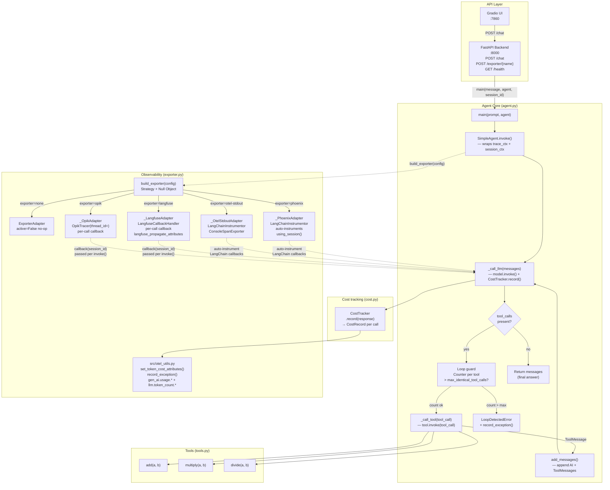

# Simple Agent

A single-LLM arithmetic agent used as the **Round 1 subject** for tool evaluations.
One ReAct loop with three tools (`add`, `multiply`, `divide`), instrumented with a pluggable observability exporter.

---

## Architecture



### How it fits together

| File | Role |
|---|---|
| `config.py` | `AgentConfig` dataclass — model, exporter, pricing, loop limit |
| `tools.py` | Three `@tool` functions: `add`, `multiply`, `divide` |
| `prompts.py` / `prompts.yml` | System prompt loaded at import time |
| `agent.py` | `SimpleAgent` ReAct loop; `CostTracker`; `LoopDetectedError` |
| `cost.py` | `CostTracker` — reads `usage_metadata`, writes OTel span attributes |
| `exporter.py` | Strategy + Null Object — one adapter per backend; `build_exporter()` factory |
| `backend.py` | FastAPI `:8000` — `/chat`, `/exporter/{name}`, `/health` |
| `ui.py` | Gradio `:7860` — calls backend over HTTP |

---

## What it does

1. Receives a user prompt (e.g. `"What is 13 + 37?"`).
2. Calls GPT-4o with the arithmetic tools bound.
3. Executes tool calls and feeds results back until a final answer is reached.
4. Emits traces and cost records to the configured observability platform.

**Safety guards:**
- **Loop detection** — aborts after `max_identical_tool_calls` repeated calls to the same tool (`LoopDetectedError`).
- **Cost tracking** — token usage accumulated per-call via `CostTracker`; written to the active OTel span under both `gen_ai.usage.*` (OTel semconv) and `llm.token_count.*` (OpenInference).

---

## Setup

```bash
# From the project root
python3 -m venv .venv
source .venv/bin/activate
pip install -r requirements.txt
```

Copy `.env.example` to `.env` and fill in `OPENAI_API_KEY` plus the keys for whichever exporter you want to use. The agent loads `.env` automatically via `python-dotenv`.

---

## Start the backend

```bash
source .venv/bin/activate
uvicorn src.simple_agent.backend:app --reload
```

Backend API at **http://localhost:8000** — logs every request and exporter activation.  
Swagger docs at **http://localhost:8000/docs**.

## Start the UI

In a separate terminal:

```bash
source .venv/bin/activate
python -m src.simple_agent.ui
```

Gradio UI at **http://localhost:7860**.  
Select a tracing exporter from the dropdown — the backend activates it and checks the collector endpoint before accepting requests.

---

## Observability backends

Start the desired backend before activating its exporter in the UI:

| Exporter | Start command | UI |
|---|---|---|
| Langfuse | `bash infra/langfuse/langfuse-run.sh` | http://localhost:3000 |
| Arize Phoenix | `cd infra/phoenix && docker compose up -d` | http://localhost:6006 |
| Comet Opik | see `infra/opik/OPIK-SETUP.md` | http://localhost:5173 |
| otel-stdout | — (no service needed) | terminal |
| none | — | — |

Stop commands: append `--stop` to the Langfuse script; `docker compose down` for Phoenix; `./opik.sh --stop` for Opik.

See per-tool setup guides in `infra/`.

---

## Run the tests

```bash
pytest tests/simple_agent/ -v
```

All 18 tests use a fake model with `exporter="none"` — no API keys required.

---

## Configuration

All options are in `AgentConfig` (`src/simple_agent/config.py`):

| Field | Default | Description |
|---|---|---|
| `model_name` | `"gpt-4o"` | LangChain model identifier |
| `temperature` | `0` | LLM sampling temperature |
| `exporter` | `"none"` | Tracing backend: `langfuse`, `phoenix`, `opik`, `otel-stdout`, `none` |
| `sampling_rate` | `1.0` | Fraction of traces to export (0.0–1.0) |
| `input_token_price_per_million` | `5.0` | USD per 1M input tokens |
| `output_token_price_per_million` | `15.0` | USD per 1M output tokens |
| `max_identical_tool_calls` | `3` | Loop detection threshold |
| `phoenix_project_name` | `"vt1-simple-agent"` | Overridable via `PHOENIX_PROJECT_NAME_SIMPLE_AGENT` |
| `opik_project_name` | `"vt1-simple-agent"` | Overridable via `OPIK_PROJECT_NAME_SIMPLE_AGENT` |
| `langfuse_public_key` | `""` | Overridable via `LANGFUSE_PUBLIC_KEY_SIMPLE_AGENT` |
| `langfuse_secret_key` | `""` | Overridable via `LANGFUSE_SECRET_KEY_SIMPLE_AGENT` |